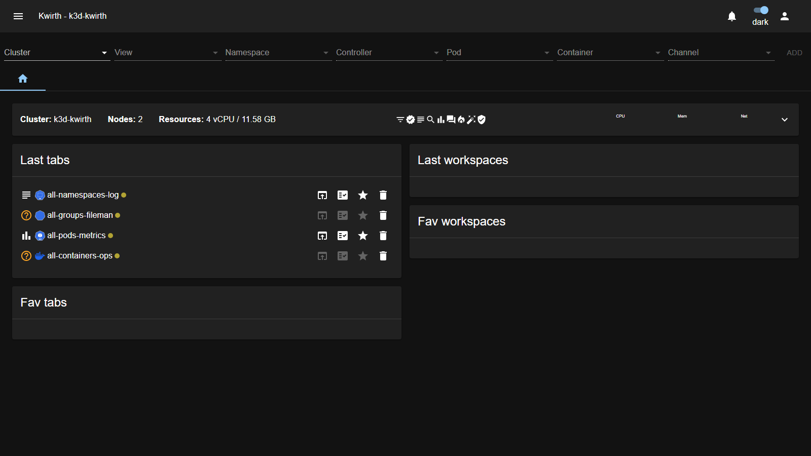
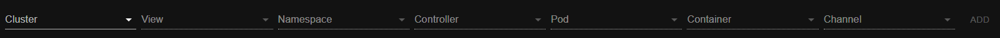
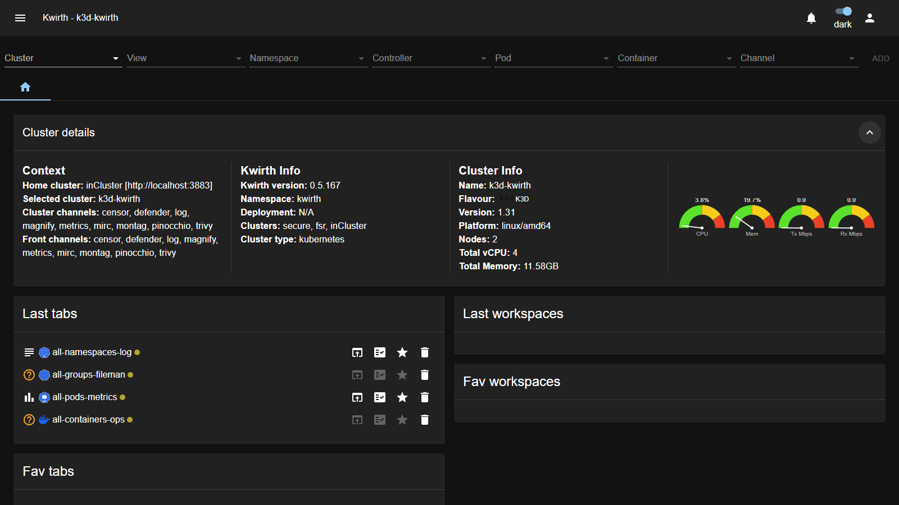

# 3. The Kwirth UI

After you log in, Kwirth opens on the **home screen**. This chapter is a quick tour so you know where everything is before you start working.

## The top bar

Running across the top of every screen:

| Element | What it does |
|---|---|
| **☰ Menu** (top-left) | Opens the main menu (settings, extension management, administration…). Most day-to-day work does **not** need it. |
| **Title** | Shows `Kwirth - <selected cluster>` so you always know which cluster you are looking at. |
| **🔔 Notifications** | Bell icon with in-app notifications. |
| **Theme toggle** | Switches between **light** and **dark** appearance. The label next to it shows the current mode. |
| **Account** (person icon, top-right) | Your account menu: session info and **sign out**. |

## The resource selector

Right under the top bar is the **resource selector** — the row you use to say *what* you want to observe:

You fill these left-to-right to narrow down your target, pick a **Channel**, and press **ADD** to open it as a new tab. This is covered step by step in [Selecting what to observe](04-selecting-resources) and [Working with channels](05-channels).

## The Home tab

The **Home** tab (the 🏠 icon) is your dashboard. It has two areas.

### Cluster details

A panel summarizing the selected cluster. Click the chevron on its right to expand it:

It shows three blocks plus live gauges:

- **Context** — the home cluster, the currently selected cluster, and the channels available on it.
- **Kwirth Info** — Kwirth version, namespace, and the clusters it knows about.
- **Cluster Info** — name, Kubernetes flavour and version, platform, node count and total CPU / memory.
- **CPU / Mem / Tx / Rx gauges** — real-time resource usage of the cluster at a glance.

### Tabs & workspaces shortcuts

Below the cluster details, four panels give you one-click access to your work:

| Panel | What it holds |
|---|---|
| **Last tabs** | The channels you opened most recently. Each row has quick actions: **re-open**, **copy settings**, **favourite** (★) and **delete** (🗑). |
| **Fav tabs** | Tabs you marked as favourite with the ★, so they are always one click away. |
| **Last workspaces** | Recently used workspaces (saved arrangements of tabs). |
| **Fav workspaces** | Your favourite workspaces. |

> Saving and reusing tabs and workspaces is explained in [Workspaces](06-workspaces).

## Where to go next

- To start observing something right now, go to [Selecting what to observe](04-selecting-resources).
- For the meaning of each channel, see [Working with channels](05-channels).

Next: [Selecting what to observe →](04-selecting-resources)
