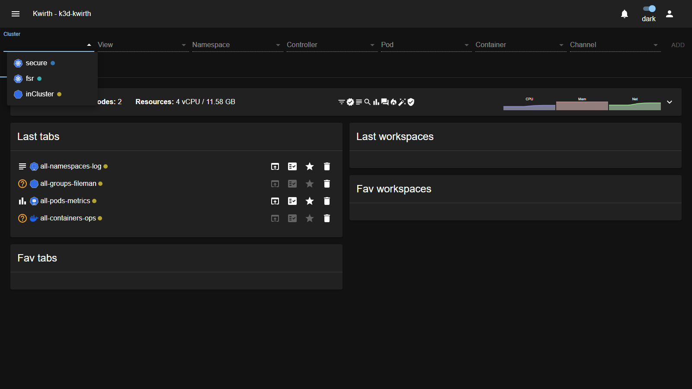
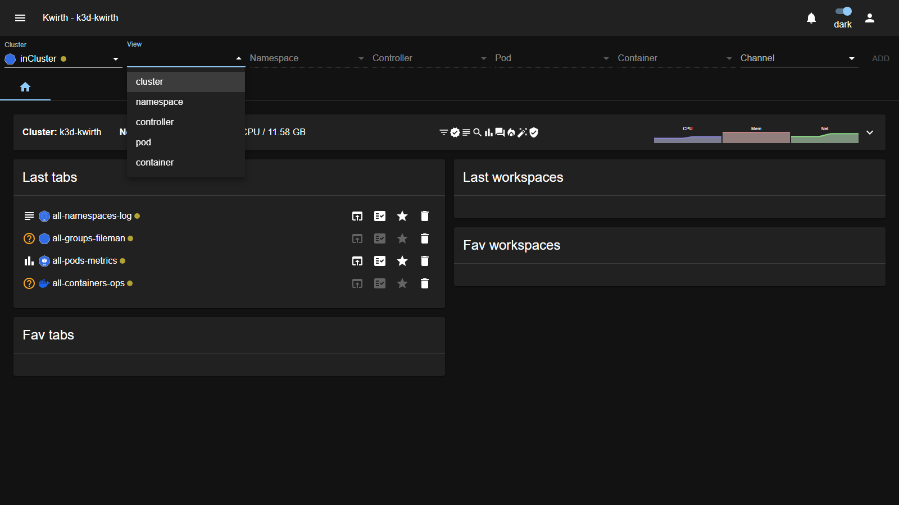
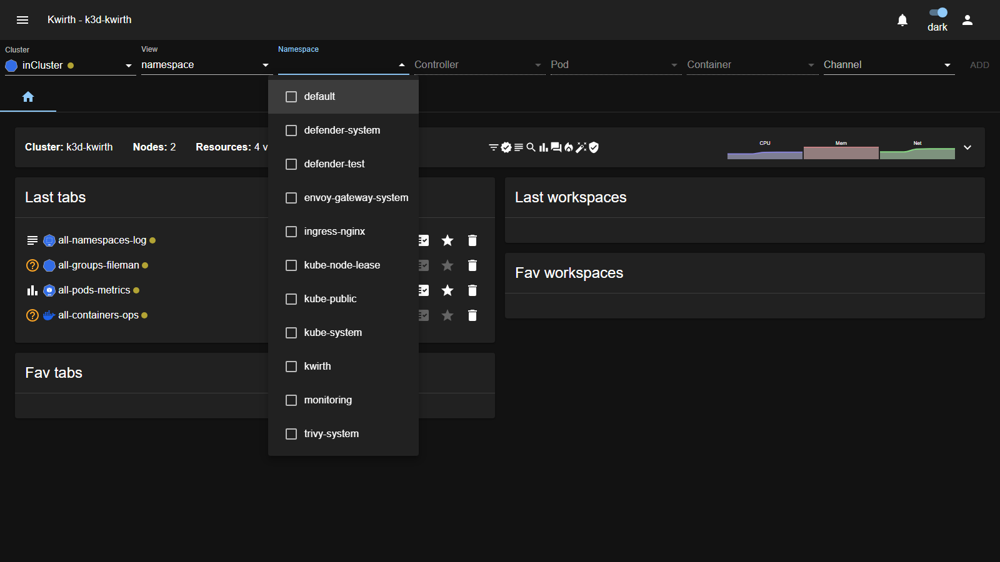
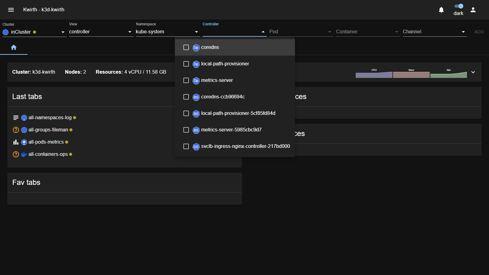
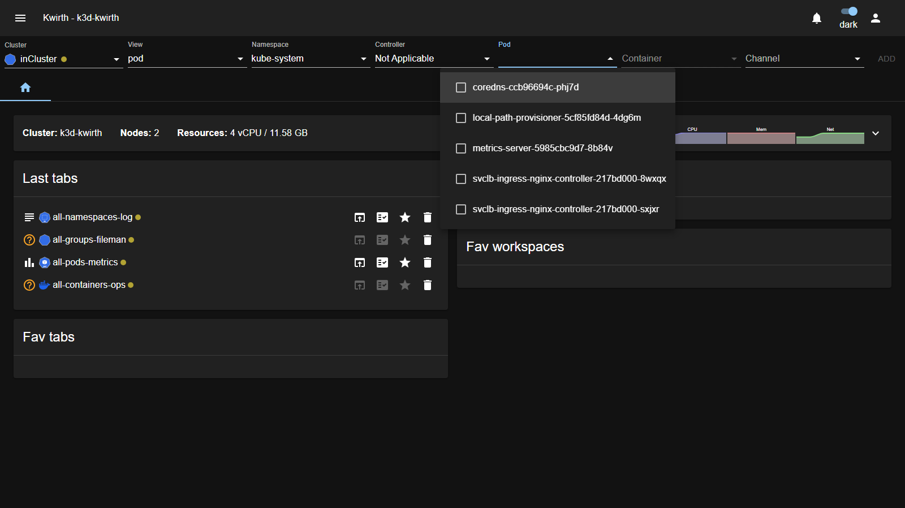
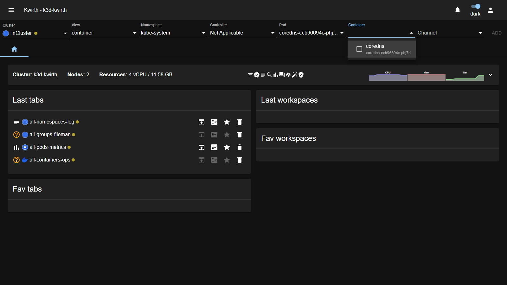

# 4. Selecting what to observe

Before you can open a channel you have to tell Kwirth **what** you want to look at. You do this with the **resource selector** — the row of dropdowns under the top bar:

```
Cluster · View · Namespace · Controller · Pod · Container · Channel   [ ADD ]
```

You always fill it **left to right**. Each dropdown stays **disabled until the one before it has a value**, so the selector guides you through a valid selection and then lets you press **ADD**.

## Step 1 — Cluster

Pick the cluster you want to observe. This is the only dropdown enabled when you arrive, because everything else depends on it.



Each entry has a small **status dot**: a coloured dot means Kwirth is connected to that cluster and can stream from it. If you only manage one cluster you will just see one entry here.

### The source cluster: `inCluster` and `inDesktop`

There is always **one special entry** representing the cluster you are actually connected to — the *source cluster* Kwirth itself is running against. Its name depends on **how Kwirth is running**:

| Name | When you see it | Meaning |
|---|---|---|
| **`inCluster`** | Kwirth is **deployed inside a Kubernetes cluster** (as a pod). | The source cluster is the very cluster Kwirth lives in — the one you pointed your browser at. |
| **`inDesktop`** | Kwirth is running as a **desktop application** (Windows/Mac/Linux app). | The source cluster is the local cluster the desktop app is configured to talk to (via your kubeconfig). |

This source entry is **special**: it is always present, it is the one you are guaranteed to reach, and — unlike the clusters you add yourself — you **cannot rename or delete it** from cluster management.

### Observing more than one cluster

Any **additional** clusters in this dropdown are ones added to **your profile**: each is another Kwirth instance (running on another cluster) that you registered by name + URL + API key. Selecting one lets you observe that remote cluster from the same screen, so you can consolidate several clusters in one place.

> Clusters live in **your profile**, not in a global Kwirth setting — the list is personal to you. To add, edit or remove clusters (everything except the source `inCluster` / `inDesktop` entry), see [Cluster management](../admin/06-cluster-management).

## Step 2 — View

The **View** decides *at what level your data is grouped*. It is the single most important choice in the selector, so it is worth understanding well.



| View | You get data… | Typical use |
|---|---|---|
| **cluster** | for the **whole cluster** | a bird's-eye view across everything |
| **namespace** | grouped by the **namespace(s)** you choose | watch one team / one environment |
| **controller** | grouped by a **controller** (Deployment, StatefulSet…) | follow one workload and all its pods |
| **pod** | grouped by individual **pods** | zoom into specific pods |
| **container** | grouped by individual **containers** | the finest level — one container |

The View also controls **which of the next dropdowns you need to fill**. If you choose the *namespace* view, you select namespaces; if you choose the *pod* view, you drill down to pods, and so on.

> **Example — same channel, different View.** If you open the **Log** channel with the View set to **namespace** and select `production`, you receive the log lines of **every pod in `production`** merged into one stream. If instead you set the View to **container** and drill down to a single container, you receive **only that container's** log lines. Same channel, very different amount of data.

## Step 3 — Narrow down the resources

The View decides **how far down you drill**. Kwirth then enables exactly the dropdowns that level needs, one at a time, and **fills each one live from the cluster** based on your previous choice. This is the cascade:

```
View → Namespace → Controller → Pod → Container
       (loads       (loads        (loads     (finest
        namespaces   controllers   pods)      level)
        of cluster)  of the ns)
```

Every one of these is a **multi-selection** (a checklist), so at any level you can pick several items at once.

### Namespace

Available for the *namespace*, *controller*, *pod* and *container* views. Tick one or more namespaces:



Choosing namespaces makes Kwirth fetch the **controllers** living in them.

### Controller

Available for the *controller*, *pod* and *container* views. A **controller** is the Kubernetes workload object that owns pods — a **Deployment**, **ReplicaSet**, **StatefulSet**, **DaemonSet**, **ReplicationController** or **Job**. Kwirth shows an icon for each type:



> In the *pod* and *container* views you are not required to filter by a real controller — Kwirth offers a **Not Applicable** entry so you can jump straight to picking pods.

Choosing controllers makes Kwirth fetch their **pods**.

### Pod

Available for the *pod* and *container* views. Pick the individual pods you want:



Choosing pods makes Kwirth fetch their **containers**.

### Container

Available for the *container* view only — the finest level. Each entry shows the container name and, underneath, the pod it belongs to:



### Why some dropdowns are greyed out

You never have to guess which fields to fill: Kwirth **disables the ones that don't apply** to your View, and keeps the next one disabled until the previous has a value. So:

| View | You must fill… | Disabled (not applicable) |
|---|---|---|
| **cluster** | *(nothing — just Channel)* | Namespace, Controller, Pod, Container |
| **namespace** | Namespace | Controller, Pod, Container |
| **controller** | Namespace → Controller | Pod, Container |
| **pod** | Namespace → Controller → Pod | Container |
| **container** | Namespace → Controller → Pod → Container | — |

The **ADD** button only lights up once the fields required by your View are filled.

## Step 4 — Channel

Finally pick the **Channel** — the kind of observability you want (Log, Metrics, Alert, Ops…). The list offered here is **not fixed**; it depends on two things:

- **Your View.** Some channels only make sense at some levels. In particular, the **cluster** view only offers channels that support a cluster-wide scope, so you will see **fewer** channels there than in, say, the *container* view. Channels that don't apply are greyed out.
- **Your permissions.** Your administrator can restrict which channels your account may use, so two users may see different lists for the same selection.

If a channel you expect is missing, it is almost always one of these two reasons.

## Step 5 — ADD

Press **ADD**. Kwirth opens your selection as a **new tab**, ready to be configured and started — that is the subject of the next chapter.

---

## Worked examples

**A) Stream the logs of a whole namespace**

1. **Cluster** → `inCluster`
2. **View** → `namespace`
3. **Namespace** → tick `kwirth`
4. **Channel** → `log`
5. **ADD**

You now have a tab that will stream the logs of every pod in the `kwirth` namespace.

**B) Watch the metrics of a single pod**

1. **Cluster** → `inCluster`
2. **View** → `pod`
3. Drill down and select the pod you care about
4. **Channel** → `metrics`
5. **ADD**

**C) Observe two namespaces at once**

1. **Cluster** → `inCluster`
2. **View** → `namespace`
3. **Namespace** → tick both `production` and `staging`
4. **Channel** → `log`
5. **ADD**

**D) Follow one Deployment (controller view)**

1. **Cluster** → `inCluster`
2. **View** → `controller`
3. **Namespace** → `kube-system`
4. **Controller** → tick `coredns` (the Deployment)
5. **Channel** → `log` · **ADD**

You get the logs of **every pod owned by the `coredns` Deployment**, and as pods come and go with rollouts, the stream follows the controller.

**E) A single container (container view)**

1. **Cluster** → `inCluster`
2. **View** → `container`
3. **Namespace** → `kube-system`
4. **Controller** → `Not Applicable` (or a specific controller)
5. **Pod** → pick a pod
6. **Container** → tick the container
7. **Channel** → `log` · **ADD**

This is the narrowest possible target: exactly one container.

> **A note on what you can see.** The clusters, namespaces and channels available in the selector are exactly the ones your **scopes** allow. If something you expect is missing, it is almost always a permissions matter — ask your administrator (see [Security & permissions](../admin/04-security-and-permissions)).

Next: [Working with channels →](05-channels)
