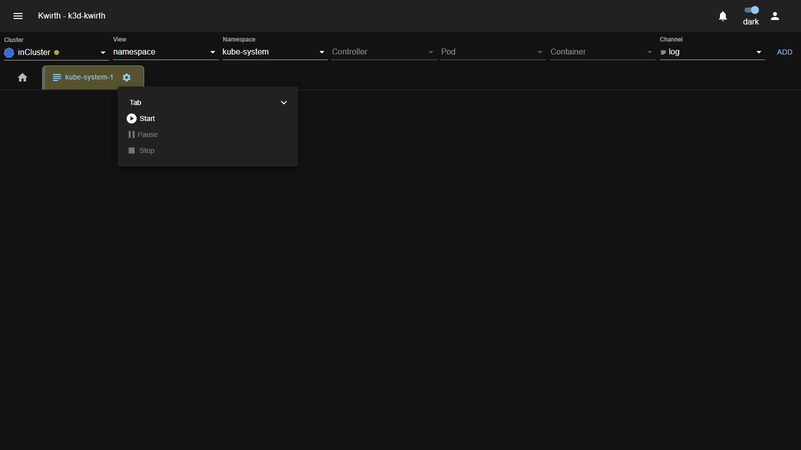
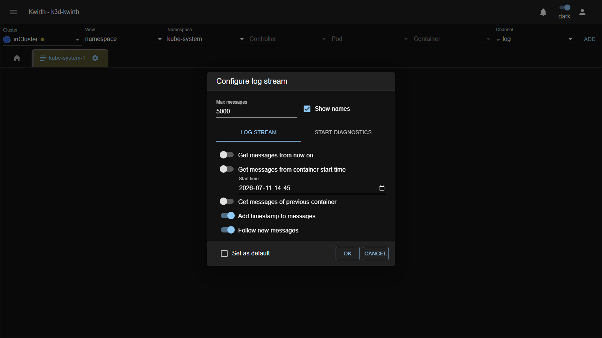
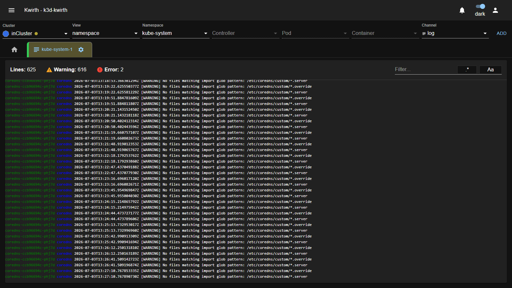

# 5. Working with channels

A **channel** is what actually brings data to your screen — logs, metrics, alerts, operations, and so on. In this chapter you learn the **lifecycle every channel shares**: open it, configure it, start it, read it, and stop it. Once you know this pattern, every channel feels the same.

## The channel lifecycle

```
Select resources + Channel  →  ADD  →  tab created (stopped)
        →  ▶ Start  →  configure  →  streaming  →  ⏸ Pause / ⏹ Stop
```

### 1. Open the channel

Fill the [resource selector](04-selecting-resources) and press **ADD**. Kwirth creates a **new tab** named after your selection (for example `kube-system-1`). The tab appears **next to the Home tab** but it is **not streaming yet** — it starts in a stopped state.

Each tab shows two things: an **icon** telling you which channel it is, and a **gear** (⚙) that opens the tab's controls.

### 2. Start, pause and stop

Click the **gear** on the tab to open the **Tab menu**:



| Action | What it does |
|---|---|
| **▶ Start** | Begins the channel. The first time, it opens the channel's configuration (see next step). |
| **⏸ Pause** | Temporarily stops updating the view without tearing down the stream. |
| **⏹ Stop** | Stops the channel completely. |

### 3. Configure the channel

The first time you **Start** a channel, Kwirth shows its **configuration dialog**. Each channel has its own options; the **Log** channel, for instance, looks like this:



For the Log channel you can set, among others:

- **Max messages** — how many lines to keep in the buffer (e.g. `5000`).
- **Show names** — prefix each line with its pod/container name.
- **Get messages from now on** — only stream new lines from this moment.
- **Get messages from container start time** — pull the log history from a given time (turn this on to see *existing* logs, not just new ones).
- **Get messages of previous container** — include logs from the container's previous run (useful after a crash/restart).
- **Add timestamp to messages** — prefix each line with its timestamp.
- **Follow new messages** — auto-scroll as new lines arrive.
- **Set as default** — remember these options for next time.

Set what you need and click **OK**. (Use **CANCEL** to keep the tab stopped.)

> **Tip:** to inspect what *already* happened — not just what happens next — enable **Get messages from container start time**. To watch a live tail, leave **Follow new messages** on.

### 4. Read the running channel

Once started, the channel streams into the tab. The Log channel shows a live, colour-coded stream with a summary bar and a filter box:



Common elements you will recognise across channels:

- **Counters** — at a glance totals such as **Lines**, **Warning** and **Error**.
- **Filter box** — narrow what you see; the **`.*`** and **`Aa`** buttons toggle **regular expression** and **case-sensitive** matching.
- **Timestamps and source names** — so you know *when* and *where* each line came from.

### 5. Stop when you are done

Open the gear again and choose **⏹ Stop**, or simply close the tab. Stopping a channel frees the underlying stream on the server.

---

## The channel catalog

These are the channels you may find in the **Channel** dropdown. Which ones appear depends on your [selection](04-selecting-resources) and your permissions. Each has a **full manual** (user + admin) in [Part III](../extensions/index).

| Channel | What it gives you | Manual |
|---|---|---|
| **Log** | Real-time log streaming from containers, pods or whole namespaces. | [Log](../extensions/plugins/log) |
| **Metrics** | Live CPU / memory / network / I/O metrics for your selection. | [Metrics](../extensions/plugins/metrics) |
| **Alert** | Alerts triggered when log lines match patterns you define. | [Alert](../extensions/plugins/alert) |
| **Ops** | Day-to-day operations: shell, restart, inspect resources. | [Ops](../extensions/plugins/ops) |
| **Fileman** | Browse container filesystems and volumes from one place. | [Fileman](../extensions/plugins/fileman) |
| **Trivy** | Security / vulnerability findings from the Trivy scanner. | [Trivy](../extensions/plugins/trivy) |
| **Magnify** | Full cluster management (Lens/K9s-style). | [Magnify](../extensions/plugins/magnify) |
| **Topology** | Interactive 3D visualization of cluster resources. | [Topology](../extensions/plugins/topology) |
| **Censor** | LLM-assisted noise filtering for logs. | [Censor](../extensions/plugins/censor) |
| **Pinocchio** | AI/LLM features on top of your observability data. | [Pinocchio](../extensions/plugins/pinocchio) |

> The catalog above lists the channels most users work with. Depending on your installation you may also see **mIRC**, **News** and **Echo** — all documented in [Part III](../extensions/index). Some deployments add **commercial** channels (e.g. **Defender**, **Montag**); those are covered separately, not in this open-source guide.

---

## Worked example — read a namespace's logs from the beginning

1. **Cluster** `inCluster` · **View** `namespace` · **Namespace** `kube-system` · **Channel** `log` · **ADD**.
2. Click the tab's **gear** → **Start**.
3. In *Configure log stream*, turn on **Get messages from container start time**, keep **Follow new messages** on, click **OK**.
4. Watch the lines stream in; type `error` in the **Filter** box and enable **`.*`** to see only error-like lines.
5. When finished, gear → **Stop**.

Next: [Workspaces →](06-workspaces)
