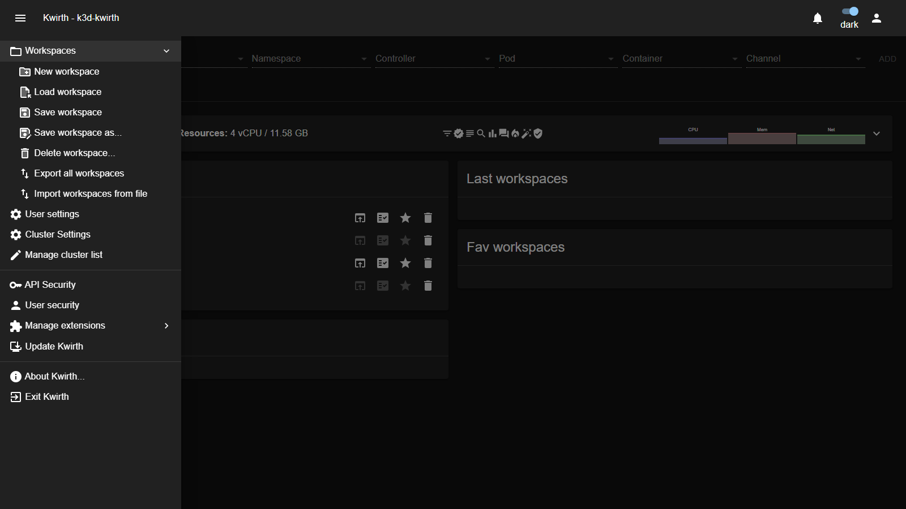
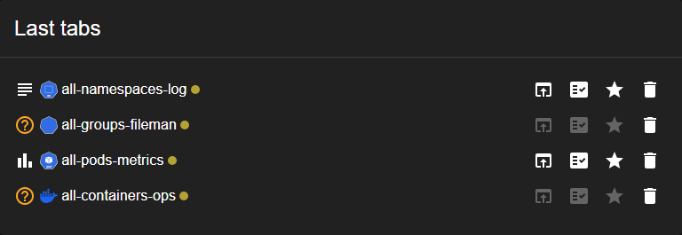

# 6. Workspaces

As you open channels, each one becomes a **tab**. A **workspace** is a **named, saved set of tabs** — so instead of rebuilding the same five tabs every morning, you save them once and bring them all back with a single click.

> **Terminology:** what other tools call a "dashboard" or a "board", Kwirth calls a **workspace**.

## The Workspaces menu

Everything workspace-related lives under **☰ → Workspaces**:

| Option | What it does |
|---|---|
| **New workspace** | Start from a clean slate — closes the current tabs so you can build a fresh set. |
| **Load workspace** | Open a previously saved workspace (replaces your current tabs with the saved ones). |
| **Save workspace** | Save the current set of tabs into the **currently loaded** workspace. |
| **Save workspace as…** | Save the current set of tabs under a **new name**. |
| **Delete workspace…** | Remove a saved workspace. |
| **Export all workspaces** | Download all your workspaces to a file (backup / sharing). |
| **Import workspaces from file** | Load workspaces from a previously exported file. |

## Saving your work

1. Open and arrange the tabs you want (see [Working with channels](05-channels)).
2. Go to **☰ → Workspaces → Save workspace as…**.
3. Give it a memorable name (for example `prod-firefighting`).
4. It now appears in **Last workspaces** on the Home tab and can be reloaded any time.

Once a workspace is loaded, use **Save workspace** (without *as…*) to update it in place after you add or remove tabs.

## Reopening a workspace

You have two ways:

- **From the menu:** **☰ → Workspaces → Load workspace** and pick it.
- **From the Home tab:** click it under **Last workspaces** (recently used) or **Fav workspaces** (your favourites).

## Reusing individual tabs

You don't always need a whole workspace. The Home tab keeps your recent and favourite **tabs** too, each with quick actions:

| Action | What it does |
|---|---|
| **Re-open** | Open this tab again with the same selection. |
| **Copy settings** | Copy the tab's configuration (handy to create a similar tab). |
| **★ Favourite** | Pin the tab to **Fav tabs** for one-click access. |
| **🗑 Delete** | Remove it from the list. |

Mark a tab or a workspace as favourite with the **★** so it is always one click away on the Home tab.

## Sharing and backing up workspaces

Workspaces can be moved between users or Kwirth instances:

- **Export all workspaces** writes them to a file you can keep as a backup or hand to a teammate.
- **Import workspaces from file** loads that file back in.

> **Example — hand a ready-made setup to a teammate.**
> 1. Build the tabs you want them to have and **Save workspace as…** `oncall-starter`.
> 2. **☰ → Workspaces → Export all workspaces** → save the file.
> 3. Send the file to your teammate.
> 4. They open **☰ → Workspaces → Import workspaces from file**, pick it, and then **Load workspace → `oncall-starter`**. They now have the exact same tabs you did.

Next: [Everyday tasks →](07-everyday-tasks)
