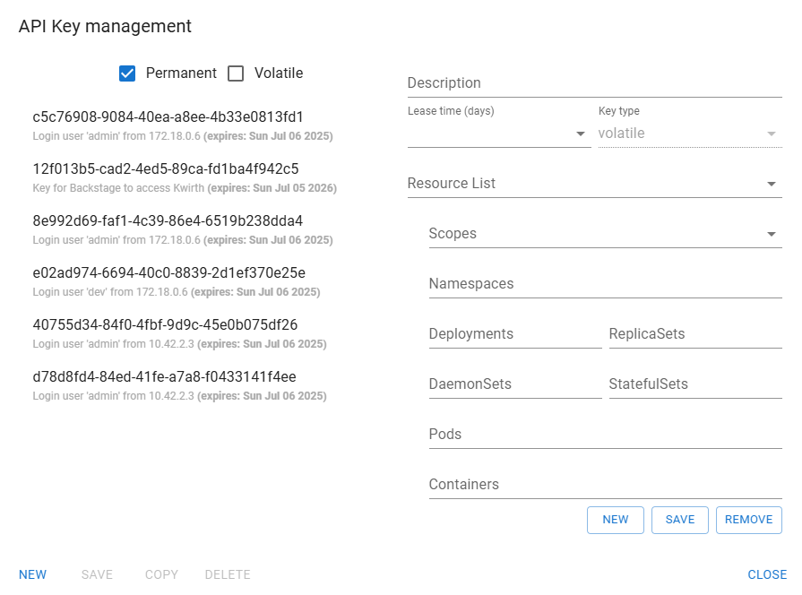
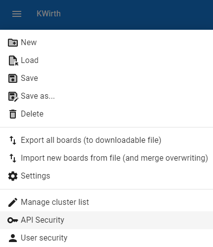

# API Management
Access to kwirth can be performed by using APIs that are secured. When you access kwirth via its own frontend application, this **React** application obtains an API key for you to work with kwirth on your very first login.

But there are situations in which you may want to create and share an API key for another external use, like integrating [Backstage Kubelog](https://github.com/jfvilas/kubelog) or [Backstage plugin KwirthMetrics](https://github.com/jfvilas/plugin-kwirth-metrics), for example. In this case, you need to use the API Management tool that is part of kwirth.

The API management tool (named **API Security**) is accessible from the main menu (the burger icon) but it is only visible to admins and users holding a *scope* of type 'API'.

