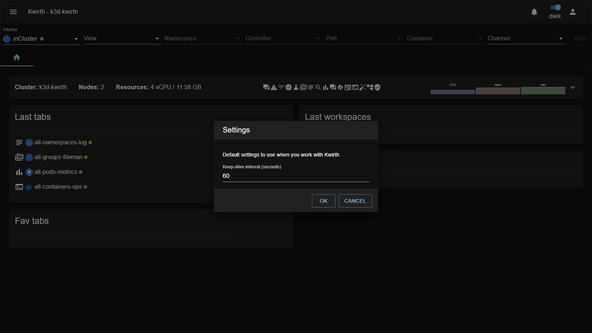
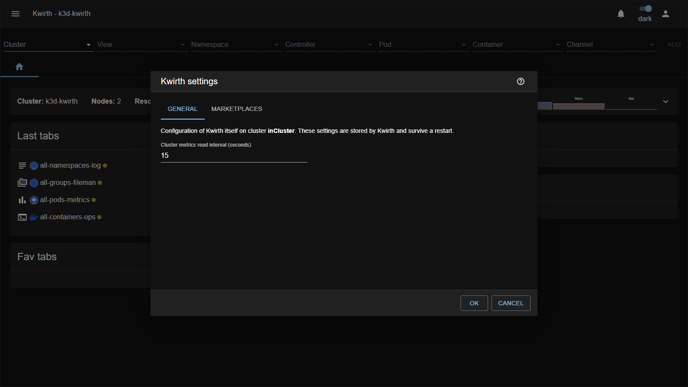
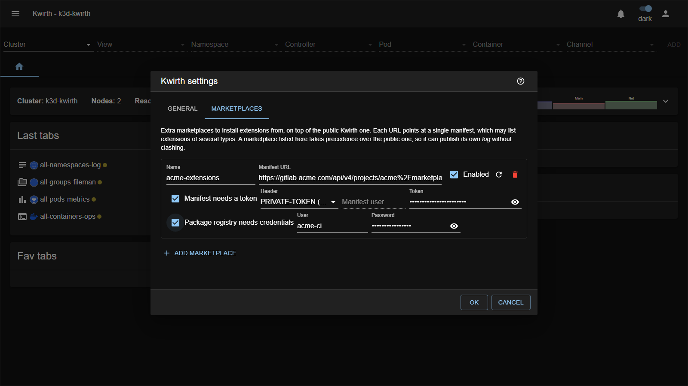

# 2. Initial configuration

Once Kwirth is [deployed](01-deployment), a few things need attention before you hand it to users: the **admin account**, the **master key**, and a couple of **base settings**.

## First login and the admin account

Kwirth ships with a single built-in **admin** account:

- **User:** `admin`
- **Password:** `password`

The **first time** you log in, Kwirth **forces you to change this password** — you cannot proceed until you do. Do it immediately.

> **Example — first boot.**
> 1. Open Kwirth and log in as `admin` / `password`.
> 2. Kwirth refuses to continue and asks for a new password.
> 3. Set a strong password and confirm. You are now in, and the default credentials no longer work.

The built-in admin account is special mainly because it exists from the start: it carries the **`admin` scope** (which unlocks all the security menus — user, API and IdP management) plus the **`cluster` scope** (which some channels require). "Admin" is a **scope**, though — you can grant it to other users too, so you can have **several administrators** (see [User management](03-user-management)). Users without the `admin` scope never see the security menus.

## The master key

The **master key** is the secret Kwirth uses to **sign the access keys** it issues to clients. Anyone who knows it could forge access keys, so it matters.

- Its default value is **`Kwirth4Ever`** — fine for a quick test, **never** for anything real.
- Set your own at deploy time: Helm `masterkey`, External `--masterkey`, or the corresponding environment variable.

> **Security:** treat the master key like a signing secret. Set a strong, unique value **before** exposing Kwirth to users, and store it somewhere safe (a Kubernetes secret / your secrets manager). Changing it later invalidates access keys already issued.

## Base settings from the UI

Two small settings are worth knowing, both reached from the **☰ main menu**.

### User settings (personal)

**☰ → User settings** holds *your own* preferences — currently the **keep-alive interval** used while you work with Kwirth:



### Kwirth settings

**☰ → Kwirth Settings** configures **Kwirth itself** on the selected cluster, as opposed to your personal preferences. The main option is the **metrics read interval** — how often (in seconds) Kwirth samples cluster metrics:



What you save here is **stored by Kwirth and survives a restart**. Changing it also retimes the running metrics provider immediately, so you do not need to restart anything for it to take effect.

Managing these settings requires the **`admin`** scope; without it the dialog will tell you so instead of loading.

> The interval can also be set at deploy time (Helm `metricsinterval` / `--metricsinterval`). Precedence is: what you save in this dialog wins; otherwise the deploy-time value; otherwise 15 seconds. So the Helm value acts as the starting point until somebody changes it here.

### Adding your own marketplace

Kwirth installs extensions from the public marketplace. In the **Marketplaces** tab of the same dialog you can register **additional** ones — your organisation's own plugins, senders, themes and so on — without replacing the public one.

Two things are worth understanding before you configure it.

**A registered marketplace takes precedence over the public one.** Resolution happens per extension id: the first marketplace in the list that publishes an id serves it, and the public marketplace is always consulted last. This is what lets you publish your own plugin called `log` without clashing with the public one of the same name. The winner supplies its **whole version list** — versions are never mixed between marketplaces, so if your marketplace serves `log`, only your `log` versions are offered. Cards show a badge naming the marketplace an extension came from, which with shadowing is the only way to tell which `log` you are looking at.

**One URL is one manifest, and it may list several extension types.** Every entry declares its own type, so a single file can hold a plugin, two senders and a theme; each manager dialog picks out what belongs to it. You do not need one URL per type.

The manifest is a JSON array. Each entry carries the full tarball `url`, exactly as the public one does:

```json
[
  {
    "extensionType": "plugin",
    "id": "myplugin",
    "version": "1.0.0",
    "name": "My Plugin",
    "url": "https://my-registry.example.com/.../kwirth-plugin-myplugin-1.0.0.tgz",
    "description": "What it does",
    "icon": "Extension"
  }
]
```



Each row is one marketplace: a name of your choosing, the manifest URL, and whether it is consulted at all. The **⟳** button checks the manifest can actually be read, and **🗑** removes the row.

#### Credentials

A marketplace has **two independent** sets of credentials, because they are usually two different servers:

| | Protects | Configured as |
|---|---|---|
| **Manifest** | Reading the manifest file | *Manifest needs a token* |
| **Package** | Downloading the tarball | *Package registry needs credentials* |

Either can be off — a public manifest pointing at a private registry is a perfectly normal setup, and it is the one we recommend: the manifest holds only names, versions and URLs, nothing worth protecting.

Both secrets are stored encrypted by Kwirth, **outside** the settings themselves, and are used by the backend when it talks to your servers.

When you reopen the dialog each secret comes back **already filled in**, masked, and the eye button next to it reveals what is actually stored — so you can check a password without retyping it, and correct a single character instead of pasting the whole token again. Reading them requires the `admin` scope, like the rest of the dialog.

> **Clearing the field deletes the stored secret.** Since the field always shows what is saved, an empty field means "no secret", not "leave it as it was". To keep a secret untouched, simply leave it alone.

> Kwirth reads manifests from the **backend**, not from your browser. A manifest reachable from the cluster works even if your own machine cannot see it, and no CORS configuration is needed on your server.

#### Hosting the manifest in a private repository

Three hosts are supported, each with its own URL shape and header. Pick the matching entry in the **Header** dropdown once you tick *Manifest needs a token*:

| Host | Header to pick | URL to register |
|---|---|---|
| GitLab | `PRIVATE-TOKEN` | Files API — `…/api/v4/projects/<path>/repository/files/<file>/raw?ref=<branch>` |
| GitHub | `Authorization: Bearer` | Contents API — `https://api.github.com/repos/<owner>/<repo>/contents/<path>?ref=<branch>` |
| Azure DevOps | `Authorization: Basic` | Items API — `…/_apis/git/repositories/<repo>/items?path=<path>&$format=text&api-version=7.0` |

In all three cases it is the **API** URL, never the one you copy from the browser's address bar. Each detail below matters; they were verified one by one, because every one of them fails in a way that points somewhere else.

##### GitLab

Register the **Files API** URL rather than the web URL:

```
https://<your-gitlab>/api/v4/projects/<group>%2F<project>/repository/files/manifest.json/raw?ref=main
```

The project path is URL-encoded, so `myorg/marketplace` becomes `myorg%2Fmarketplace`.

Then tick **Manifest needs a token**, leave the header as **PRIVATE-TOKEN**, and paste a **Project Access Token** created under *Settings → Access tokens* of that project. It needs **both**:

- the **`read_repository`** scope, and
- a role of **Reporter** or higher, in the *Select a role* dropdown.

> Three traps, all of which fail in ways that point somewhere else:
>
> **The role matters as much as the scope.** A token created as **Guest** — the default in that dropdown — cannot read repository files no matter which scopes it carries: every `/repository/` call answers **403** while the project itself reads fine. If the token looks correctly scoped and is still rejected, this is almost certainly why.
>
> **`read_api` is not the scope you want.** It grants project metadata but not file contents; the Files API lives under `/repository/`, which needs `read_repository`.
>
> **Use the API URL, not the repository's web URL.** GitLab ignores the `PRIVATE-TOKEN` header on its web raw path (`/-/raw/…`) and answers with the sign-in page — and with **HTTP 200**, so it looks like it worked until you notice the body is HTML rather than your manifest. Kwirth detects this case and says so.
>
> A **deploy token** does not work at all here: those cover `git clone` and the package registries, not the REST API.

##### GitHub

Register the **Contents API** URL, and pick **Authorization: Bearer** as the header:

```
https://api.github.com/repos/<owner>/<repo>/contents/manifest.json?ref=main
```

The token is a **fine-grained personal access token** with *Contents: Read-only* on that repository, or a classic token with the `repo` scope. For GitHub Enterprise Server the host is `https://<your-github>/api/v3/repos/…` instead.

> **Why the browser URL does not work here.** `github.com/<owner>/<repo>/blob/…` returns an HTML page. And `raw.githubusercontent.com` serves the file plainly, but ignores the token, so it only works for a **public** repo — which rather defeats the purpose.
>
> **Kwirth asks for the raw media type for you.** Left to itself, the Contents API answers with a JSON envelope carrying the file **base64-encoded**, which would be rejected as "not a list of extensions". Kwirth always sends `Accept: application/vnd.github.raw` with a wildcard fallback, so this needs no configuration — and does not disturb the other hosts.

##### Azure DevOps

Register the **Items API** URL, and pick **Authorization: Basic** as the header:

```
https://dev.azure.com/<org>/<project>/_apis/git/repositories/<repo>/items?path=/manifest.json&$format=text&api-version=7.0
```

The token is a **Personal Access Token** with *Code: Read*. Azure DevOps expects the PAT as the **password** of an HTTP Basic pair and ignores the user part, so leave **Manifest user** empty — it is there for other hosts that do use Basic with a real username.

> `$format=text` is what makes it return the file itself; without it you get a JSON envelope, the same trap as GitHub.
>
> ⚠️ The Basic header is built exactly as Azure DevOps documents it and is covered by tests, but unlike the other two this path **has not been validated against a live Azure DevOps server**. If your manifest is rejected there, please report it.

##### Checking it worked

Use the **refresh** button on the row: it reports how many entries the manifest holds and which extension types it declares, and says specifically whether the token was rejected rather than just failing. Note that it exercises the *manifest* credentials only — the package ones come into play at install time, so a wrong registry password will not surface until somebody installs something.

## What to configure next

With the admin account secured and the master key set, continue with:

1. [User management](03-user-management) — create accounts for your team.
2. [Security & permissions](04-security-and-permissions) — understand scopes and what each user can do.
3. [API management](05-api-management) — issue keys for external tools and cross-cluster access.
4. [Cluster management](06-cluster-management) — add more clusters.
5. [Identity Provider integration](07-idp-integration) — enable SSO.
6. [Extending Kwirth](08-extending-kwirth) — install the channels and other extensions you need.

Next: [User management →](03-user-management)
