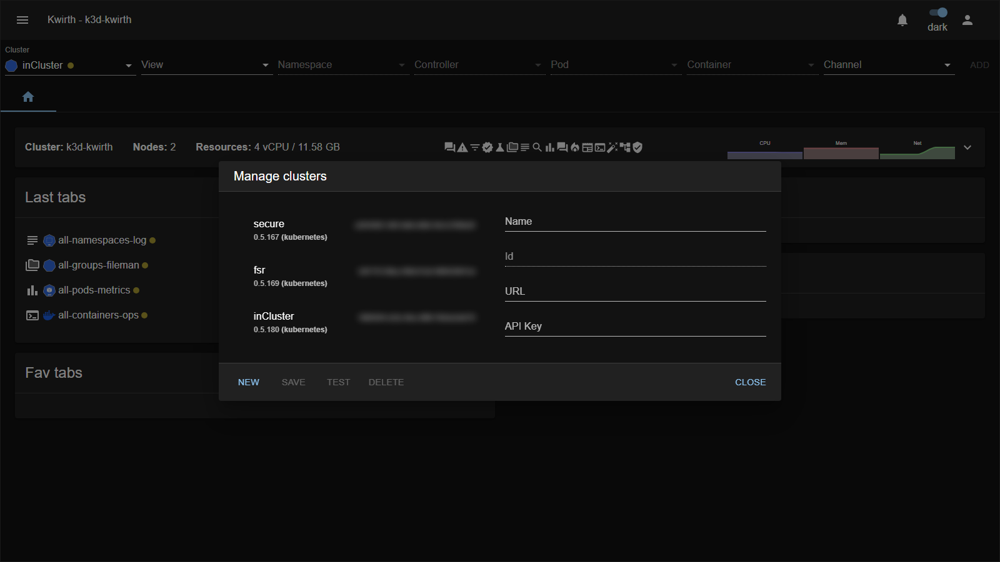

# 6. Cluster management

A single Kwirth can act as the **front door to many clusters**. You add the extra clusters yourself, and — importantly — **clusters belong to your profile**, not to a global Kwirth setting: the list is personal to the logged-in user.

Open it from **☰ → Manage cluster list**.



## The source cluster

The cluster Kwirth itself runs against is **always present** and is named **`inCluster`** (Kubernetes deployment) or **`inDesktop`** (desktop app). You **cannot rename or delete** it — it's the one you reached by pointing your browser (or desktop app) at this Kwirth. Every other entry is a **remote** cluster you added.

## The cluster's own name

`inCluster` is the *entry* name in the cluster list. Separately, Kwirth works out the **real name of the cluster** it is running on, and that is what you see in the **title bar** (`Kwirth - <cluster>`), in the **tab labels** and on the **Homepage** (together with an icon for the distribution).

Here is the thing: **Kubernetes has no cluster name**. There is no object in the API holding it, so Kwirth has to work it out from the clues each distribution happens to leave on its nodes:

| Distribution | Where the name comes from |
|---|---|
| **AKS** | Node label `kubernetes.azure.com/cluster` (the node resource group prefix is stripped). |
| **EKS** | The `karpenter.sh/discovery` tag of the node, or the `alpha.eksctl.io/cluster-name` label if the cluster was created with eksctl. |
| **GKE** | The node name inside `providerID` (`gke-<cluster>-<nodepool>-…`). |
| **k3d** | The node name, which k3d builds as `<cluster>-server-N` / `<cluster>-agent-N`. |
| **k3s** | Nothing: a k3s node is just the machine's hostname. Kwirth uses the **hostname of the control-plane node**, which is a recognisable name but is the machine's, not the cluster's. |
| **Anything else** | No clue at all. |

When no name can be worked out, Kwirth falls back to the **UID of the `kube-system` namespace** — unique and stable across restarts, so the cluster is always identifiable, just not pretty to read.

### Naming it yourself

Because the detection is best-effort, you can state the name and skip the guessing entirely — set **`KWIRTH_CLUSTER_NAME`** on the deployment:

```yaml
env:
  - name: KWIRTH_CLUSTER_NAME
    value: 'shop-prod'
```

It **takes precedence over every heuristic**, so it is also the way to fix a managed cluster whose derived name you don't like (an AKS name carrying its region, or a GKE name carrying its nodepool). Use it on **k3s and bare clusters**, where there is nothing to detect, and whenever you consolidate several clusters here and want names that mean something to your team. The distribution icon keeps being detected either way.

## Add a remote cluster

To observe another cluster from here, that cluster must be running its **own** Kwirth, and you need an **API key** from it.

1. On the **remote** Kwirth, create an API key with the scopes you need (see [API management](05-api-management)) and copy it.
2. Back on **this** Kwirth: **☰ → Manage cluster list → NEW**.
3. Fill:
   - **Name** — any unique name *for your convenience* (it need not match the cluster's real name).
   - **URL** — where the remote Kwirth is published.
   - **API Key** — the key you copied from the remote Kwirth.
4. Click **TEST** to check connectivity, then **SAVE**.

The new cluster now appears in the **Cluster** dropdown of the [resource selector](../user/04-selecting-resources), and you can build tabs against it without logging out of this one.

> Fields shown per cluster: **Name**, **Id**, **URL**, **API Key**. Buttons: **NEW**, **SAVE**, **TEST** (connectivity check), **DELETE**, **CLOSE**. You cannot edit or delete the source `inCluster` / `inDesktop` entry.

## Multi-cluster: one screen, many clusters

The whole point of adding clusters is that **each tab is bound to the cluster it was created against** — so a single Kwirth screen can show **several clusters at the same time**.

- When you [open a channel](../user/05-channels), the tab remembers the **Cluster** you picked in the resource selector. It keeps streaming from *that* cluster regardless of what the Cluster dropdown shows afterwards.
- To watch a different cluster, just change the **Cluster** dropdown and **ADD** another tab. The new tab streams from the new cluster; the previous tabs keep streaming from theirs.
- So you can, for example, have `production-logs` from **cluster A** next to `staging-logs` from **cluster B** and `metrics` from your local `inCluster`, all side by side.
- Tabs are colour-tagged by cluster, so it's easy to tell at a glance which cluster each one belongs to.
- You can then [save that mix as a workspace](../user/06-workspaces) and bring the whole multi-cluster view back with one click.

This is what makes Kwirth a **single pane of glass**: you don't switch context or log in again per cluster — you assemble one view that spans them.

## How cross-cluster access works

When you select a remote cluster in the resource selector, Kwirth transparently uses the **API key you stored** for it — you don't log in again. So a single session can span clusters:

1. You log in to Kwirth on cluster **A**.
2. An admin on cluster **B** gave you an API key, which you added under **Manage cluster list**.
3. Selecting cluster **B** in the resource selector makes Kwirth use that key automatically to stream from **B**.

## Worked example — consolidate a second cluster

1. On cluster **B**'s Kwirth, create a `view,stream` key limited to the namespaces you care about, lease `365` days, and **COPY** it.
2. On cluster **A**'s Kwirth: **Manage cluster list → NEW** → Name `cluster-b`, URL `https://b.example.com/kwirth`, API Key `<paste>`.
3. **TEST** → **SAVE**.
4. In the resource selector, pick **`cluster-b`** and open a Log tab — you are now watching cluster B from cluster A.

> **Desktop note.** In the desktop app you can also pick clusters from your local `kubeconfig` (shown as LOCAL contexts) in addition to remote Kwirth servers. See [Deployment → Desktop](01-deployment).

Next: [Identity Provider integration →](07-idp-integration)
