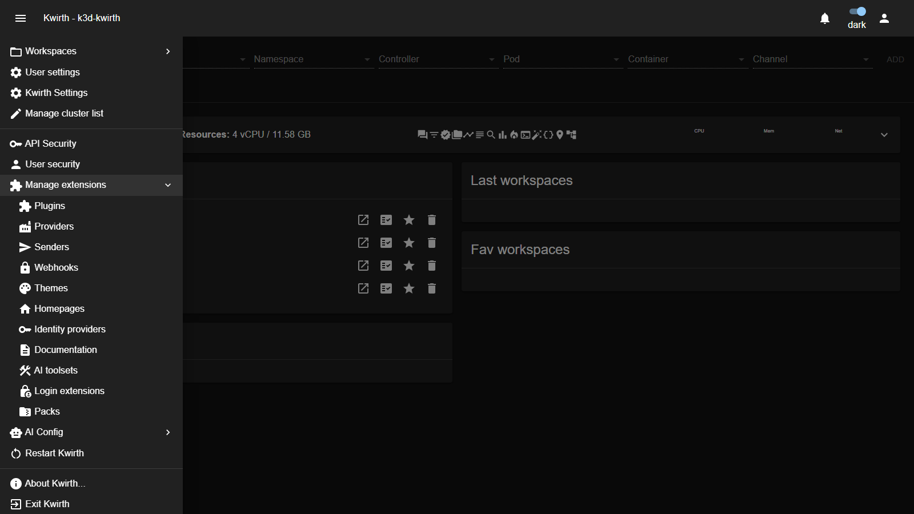

# 8. Extending kwirth

Almost everything in kwirth is an **extension**. Channels, data sources, alert destinations, the look and feel, even the login providers — all are packaged units you install, configure and enable from one place, and **most of them take effect immediately**. A few need the core restarted, and they say so: see [When a restart is needed](#when-a-restart-is-needed).

## Extension families

| Family | What it is | Manuals |
|---|---|---|
| **Plugins** | The **channels** — Log, Metrics, Alert, Ops, Fileman, Trivy… | [Plugins](../extensions/index) |
| **Providers** | **Data sources** that feed channels (metrics, events, kafka, otel…). | [Providers](../extensions/index) |
| **Senders** | **Destinations** for output (console, file, email, Teams…). | [Senders](../extensions/index) |
| **Themes** | Visual **appearance** of the UI. | [Themes](../extensions/index) |
| **Homepages** | Custom **landing dashboards**. | [Homepages](../extensions/index) |
| **Identity providers** | **SSO connectors** (Google, GitLab, GitHub). | [IdPs](../extensions/index) — see also [IdP integration](07-idp-integration) |
| **Login extensions** | Custom **branded login pages** with per-extension channel enforcement. | [Login extensions](../extensions/logins/index) |
| **Documentation** | **Docsify sites** served by kwirth itself (this guide is one). | [Documentation packages](../extensions/docs/index) |
| **Packs** | **Bundles** of multiple extensions installed in one shot. Members cannot be removed individually. | [Packs](../extensions/packs/index) |

Each **individual** extension has its own user + admin manual in [Part III](../extensions/index).

## Where to manage them

All families live under **☰ → Manage extensions**:

Pick a family (e.g. **Plugins**) to open its **manager**.

## The manager (same pattern everywhere)

Every family uses the same manager UI, so once you learn one you know them all:

| Element | What it does |
|---|---|
| **Installed *(family)*** | The extensions currently installed. Each card shows the **name**, **version** badge, a short **description**, and its **source** — an npm/registry URL, or a **`dev`** badge for one loaded in local development mode. |
| **Filter** | Narrow the list by name. |
| **Card / List view** | Toggle between card grid and compact list. |
| **Per-item icons** | **Open website** (extension homepage), **Settings ⚙** (configure it — providers/senders/IdPs open a typed form; **plugins** open a generic **JSON installation-config editor**), and **delete/uninstall** (🗑). |
| **Install *(family)*** | Add a new one: paste a package **URL** and download it, or **BROWSE…** for a local package file. |
| **Available *(family)*** | A browsable catalog of extensions you can install with one click. |

## Install, configure, remove

1. **Install** — from **Available** click an item, or paste its URL / **BROWSE…** a file under **Install**.
2. **Configure** — click **⚙ Settings** on the card. Providers, senders and identity providers show a **typed form** (fill the fields and **enable** it); **plugins** open a **JSON installation-config editor** for that plugin's install-time config. Configuration (including secrets, shown masked) is stored in Kubernetes secrets/configmaps.
3. **Enable / disable** — many extensions have an enabled toggle in their settings; disabled ones stay installed but inactive.
4. **Remove** — click the delete icon on the card.

> **Channels are plugins.** Installing a plugin is exactly how you add or remove the channels users see in the [resource selector](../user/04-selecting-resources). Install the Log plugin and the **Log** channel appears; remove it and it's gone.

> **`dev` mode.** Extensions shown with a **`dev`** badge are being loaded from a local development build rather than a published package — useful while authoring an extension.

> **Pack-owned extensions.** Extensions installed via a pack show a **`via pack`** badge and have their uninstall button disabled. To remove them, uninstall the parent pack from **☰ → Manage extensions → Packs**.

## When a restart is needed

Most extensions are live the moment you install them. Some are not, and **kwirth tells you**: the extension declares `requiresRestart`, and the manager prompts you after installing, updating or removing it. **Take the prompt seriously** — the extension is installed but not yet running.

**Why.** Installing writes the extension's files and registers it. What it cannot do is reach into a server that is already running and add things to it. Two kinds of extension are affected:

- **Anything that owns an HTTP route** — a provider with its own ingestion endpoint or its own configuration endpoint. The core wires routes into its web server while it starts up.
- **Anything that opens a listener** — a provider bound to a UDP or TCP port, for instance. That happens when the provider is instantiated, which the core also does at startup.

**What it looks like if you skip the restart.** Nothing is corrupt, and nothing needs reinstalling — the extension is simply not wired in yet:

| Extension | Symptom |
|---|---|
| a provider with a configuration endpoint | its **⚙ dialog answers `HTTP 404`** on every action — for example `Failed to create key: Error: HTTP 404` |
| a provider with an ingestion endpoint | whatever pushes to it gets a **404**, so nothing arrives |
| a provider that listens on a port | **the port is not open** and nothing says so — the quietest of the three |

Restart the core and it works. A useful distinction while diagnosing: a **404** means the route is not mounted, while a **403** means it *is* mounted and your accessKey was rejected — two very different problems.

## Developing your own

This guide covers *using and administering* extensions. If you want to **build** one (a new channel, provider, sender, theme or IdP connector), see the reference developer documentation ([Developing plugins](../../plugins/developing), [providers](../../providers/developing), [senders](../../senders/developing)).

---

That completes Part II. For a per-extension reference — what each plugin, provider, sender, theme, IdP and homepage does and how to configure it — continue to **[Part III — Extension manuals](../extensions/index)**.
