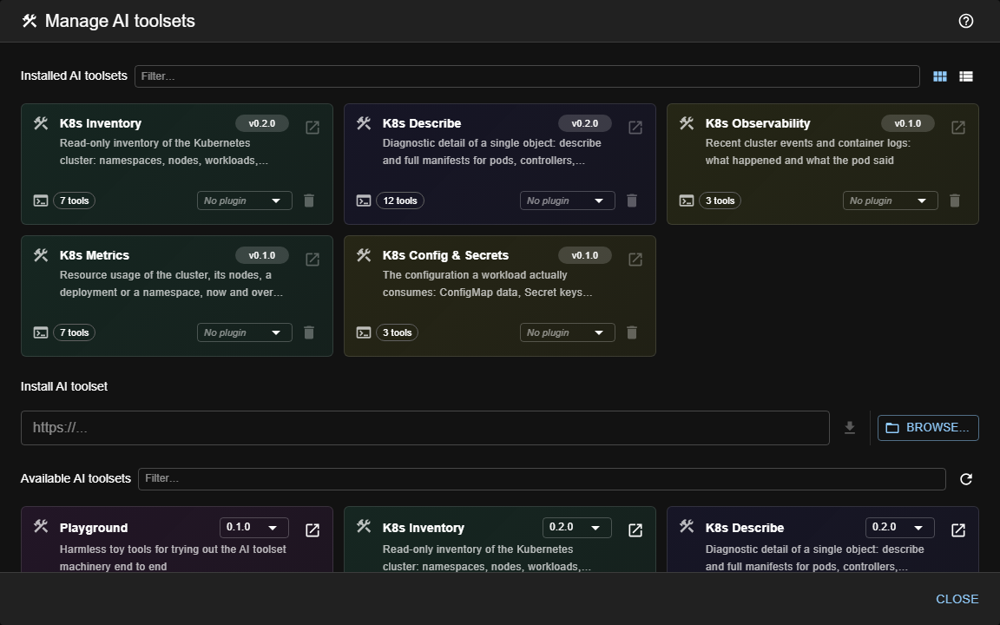

# AI toolsets (tools for the LLM)

> **Type:** AI toolset  
> **Managed from:** ☰ → Manage extensions → AI toolsets

## What an AI toolset is

Channels that talk to an LLM — Pinocchio, Censor and any plugin you write — don't just send it text. They also
offer it **tools**: functions the model can decide to call, such as *list the pods of a namespace* or *read the
last lines of a log*. The model chooses **whether** to call one and **with what arguments**; kwirth runs it and
hands back the result.

An **AI toolset** is a packaged, installable group of those tools. It is an extension like any other: it has an
id, a version, a description, and it is installed, listed and removed from its own manager.

Why a group and not individual tools? Because a tool on its own has no useful boundary — *delete a pod* only
makes sense next to *list pods* and *describe pod*. Toolsets are **thematic**: a Kubernetes toolset, a source
repository toolset, a metrics toolset. If you ever need to govern one single tool, package a toolset that
contains exactly that tool: **there is no such thing as a loose tool** in kwirth.

## What a toolset declares

Every tool carries, besides its name and description, two independent pieces of information:

| Field | Values | What it is for |
|---|---|---|
| `effect` | `read` · `write` | Whether the tool only observes, or changes something. |
| `sensitivity` | `public` · `internal` · `secret` | How dangerous the **result** is, regardless of the effect. |

They are two different axes on purpose, and confusing them is how dangerous tools get treated as harmless.
One axis says *what it touches*, the other *what it reveals* — and the real toolsets show how far apart they
can be:

- Every tool in **K8s Ops** is `write` and **`public`**: deleting a pod changes the cluster and its answer
  reveals nothing. All the danger is in the effect.
- **`get_configmap`** is `read` and **`secret`**: it changes nothing and returns the raw values — and a
  ConfigMap is exactly where credentials end up when somebody skips the Secret.
- **`get_secret`**, despite the name, is only `internal`: it returns the **keys** and when they last changed.
  It never returns the values.

The toolset itself also declares **what it needs from the host** (`requires`): cluster access, metrics, events,
source repositories. kwirth provisions only what is declared, so a toolset that only does arithmetic never
receives a Kubernetes client.

## What a tool receives when it runs

Each tool is called with its arguments **and a host object** built from its toolset's `requires`:

```ts
execute: async (args, host) => {
    host.trace('list_namespaces', {})            // always available; it is not a capability
    const cluster = host.k8s                     // only because the toolset declared ECapability.K8S
    return await cluster.coreApi.listNamespace()
}
```

| Declared | The tool receives |
|---|---|
| *(nothing)* | `host.trace` only |
| `ECapability.K8S` | `host.k8s` — cluster name, flavour, vCPUs, memory, the node map, and the `CoreV1Api`, `AppsV1Api` and `NetworkingV1Api` clients |
| `ECapability.METRICS` | `host.metrics` — the metric samples kwirth keeps in memory |
| `ECapability.EVENTS` | `host.events` — the recent cluster-event buffer |
| `ECapability.REPOS` | `host.repos` — source repository credentials |

The Kubernetes clients are **the ones kwirth itself uses** — the same authenticated instances, not new
connections. What a toolset does *not* get is equally deliberate: the other API clients kwirth holds, the
service-account token, senders, webhooks and the Docker client stay out. The set can be widened later, but
it is widened on purpose rather than handed over wholesale.

> **A tool that needs a capability it was not given should say so.** If `host.k8s` is missing, fail with a
> message that names the tool and the reason — an error deep inside a client call tells nobody anything.

## Built-in and installed toolsets

Two kinds of toolset live side by side:

- **Built-in** — shipped inside the kwirth core. They are always available and **cannot be installed or
  uninstalled**, because they are not packages: they come with the image.
- **Installed** — packaged extensions you add yourself, from the catalog, a URL or a file.

A third-party toolset **cannot take the id of a built-in one**. The attempt is rejected at install time, before
anything is written — an entry that could never be registered is worse than a failed install, because the
manager would list something that does not work.

## The AI toolsets manager

Open **☰ → Manage extensions → AI toolsets**.


*Each card carries the number of tools it really loaded and the selector saying **who may use it** — here
every toolset has been granted to one plugin. A new installation starts the other way round: toolsets
present, selectors empty, nothing reachable by anybody.*

The layout is the one every extension family uses — see [Extending kwirth](../../admin/08-extending-kwirth) for
the common flow. Three details are specific to this family:

| Element | What it shows |
|---|---|
| **tools chip** | How many tools the toolset actually **brought into the running core**, not how many its package claims. A toolset whose code failed to load shows **no** chip rather than an inflated number. |
| **plugin selector** | **Who may use this toolset.** Empty means nobody: an installed toolset that has been granted to no one is inert. This is the only decision taken in this dialog. |
| **No ⚙ settings** | A toolset has nothing to configure at install time. *Which* of the granted toolsets a channel actually uses, in what order, and which of their tools are switched off, is decided per channel — not here. |

Installing from a URL or a local file works exactly as in the other families: paste the package URL and click
⬇, or use **Browse…** to upload a `.tgz`.

## Granting: installing is not giving

Installing a toolset and **granting** it are two different acts, and keeping them apart is the whole point of
the design. Installing puts the tools in the building; granting hands someone the key.

| | Where | Who decides | Answers |
|---|---|---|---|
| **Grant** | this dialog, the selector on each card | an **admin** — the only route of this API that demands the `admin` scope | *may this plugin use this toolset at all?* |
| **Configuration** | inside each channel | whoever configures that channel | *of what it may use, what does it use, in what order, and with which tools switched off?* |

A plugin needs **both**. The grant is the ceiling and the configuration is what is picked from underneath it:
a channel that asks for a toolset nobody granted it simply does not receive those tools, and the core traces
the fact rather than failing silently.

> **The question this answers.** *"Who can change my cluster through an LLM?"* is a question you must be able
> to answer in seconds, and here you answer it by looking at **who has been granted `k8s-ops`** — one line,
> one dialog. That is why the grants are held per toolset and not scattered across each channel's settings.

Two consequences worth knowing before you grant:

- **A freshly installed AI channel has no tools.** It can reason and write prose, but it cannot see your
  cluster until someone grants it a toolset. This is deliberate — capability is given, never assumed — but it
  means granting is part of setting up such a channel, and a plugin that suddenly answers worse after an
  upgrade is usually a plugin whose grants nobody has set.
- **Revoking is immediate and needs no restart.** Take the grant away and the next bot run is offered fewer
  tools. Nothing is cached behind your back.

## Where tools are switched on

Installing a toolset makes it **available** and granting it makes it **reachable** by one plugin. What the
channel then *uses* is the third step: each AI-enabled channel is assigned an **ordered list** of toolsets —
picked from those granted to it — and may switch off individual tools inside them:

```
effective tools = (the assigned toolsets, in order) − (the tools switched off)
                  with the first toolset that provides a name winning it
```

So the granularity you get is: **pick the toolsets, order them, then turn off the tools you don't want**. A
channel with no configuration has **no** tools.

### When two toolsets bring the same tool name

Nothing is renamed. **The order decides**: the first assigned toolset that provides a name is the one that
serves it, and the other one is *shadowed*.

```
ts1 provides:  ta tb tc td          assigned to the channel:  [ts1, ts2]
ts2 provides:  tf td tg

the channel gets:  ta tb tc  td (from ts1)  tf tg
                             ↑ ts2's td is shadowed
```

**Switching a tool off does not kill the name — it lets the next one surface.** You switch off a specific
tool of a specific toolset, not a name. Switch off `ts1/td` and the channel gets `ts2`'s `td` instead; to
lose `td` altogether, switch it off in both.

> **The order is configuration, not decoration.** Reordering the list changes *which code runs* for a
> shadowed name. Two consequences worth knowing: a tool shown as shadowed is doing nothing, so switching it
> off changes nothing; and if a toolset later publishes a version that adds a name another toolset was
> serving, the shadowing changes **without anyone editing the configuration**. Every invocation is traced
> with the toolset that served it, precisely so this is never a guess.

## Packaging a toolset

A toolset package is a plain `.tgz` with two files:

```
package/
├── package.json      # metadata (extensionType: "aitoolset")
└── back.js           # bundled code that EXPORTS the toolset
```

### `package.json`

```json
{
    "id": "my-toolset",
    "name": "@yourscope/kwirth-aitoolset-my-toolset",
    "displayName": "My Toolset",
    "version": "0.1.0",
    "description": "What these tools are for",
    "extensionType": "aitoolset"
}
```

> **`id` must match** the id of the toolset the module exports. If they differ, kwirth **refuses to register
> either of them**: the index would say one thing and the registry another, and uninstalling would not find it.

### `back.js`

The module **exports** its definition as the default export. It does **not** register itself — the host does
that, which is what keeps a single registry and makes reserved ids enforceable:

```ts
import { IAiToolset, z } from '@kwirthmagnify/kwirth-common-ai/back'
import { EToolEffect, EToolSensitivity } from '@kwirthmagnify/kwirth-common-ai'

const myToolset: IAiToolset = {
    id: 'my-toolset',
    version: '0.1.0',
    displayName: 'My Toolset',
    description: 'What these tools are for',
    requires: [],                       // nothing from the host
    tools: [
        {
            name: 'times_two',
            description: 'Multiplies a number by two.',
            effect: EToolEffect.READ,
            sensitivity: EToolSensitivity.PUBLIC,
            inputSchema: z.object({ data: z.number() }),
            execute: async (args) => (args.data as number) * 2
        }
    ]
}

export default myToolset
```

The `description` of each tool is not decoration: it is what the **model** reads to decide whether to call the
tool, so write it for the model, not for a developer.

Common packages (`kwirth-common`, `kwirth-common-ai`, `zod`) must **not** be bundled — the core serves them
through its back global, so that the toolset uses exactly the same registry and the same `zod` as kwirth
itself.

### Developing one

Point `kwirth-dev.json` at the build folder, as with any other extension:

```json
{
    "aitoolsets": {
        "my-toolset": "../aitoolsets/my-toolset/dist"
    }
}
```

A toolset loaded this way shows a **`dev`** badge, cannot be uninstalled from the manager (the file governs it,
not the dialog), and disappears when you remove it from `kwirth-dev.json` and restart the core.

## Available toolsets

Each one has its own page, with the full list of its tools and the effect and sensitivity of every one:

| Toolset | Tools | Needs | What it is for |
|---|---|---|---|
| **[K8s Inventory](k8s-inventory)** (`k8s-inventory`) | 7 | `K8S` | What there is: namespaces, nodes, workloads, services, ingresses, and the ConfigMaps/Secrets a Deployment consumes. |
| **[K8s Describe](k8s-describe)** (`k8s-describe`) | 12 | `K8S` | What is wrong with one object: `describe` and full manifests for pods, controllers, services, ingresses and namespaces, plus the rollout history. |
| **[K8s Observability](k8s-observability)** (`k8s-observability`) | 3 | `K8S` + `EVENTS` | What happened and what the pod said: recent cluster events and container logs. |
| **[K8s Metrics](k8s-metrics)** (`k8s-metrics`) | 7 | `K8S` + `METRICS` | How much it consumes, now and over the recent readings — cluster, node, deployment or namespace. |
| **[K8s Config & Secrets](k8s-secrets)** (`k8s-secrets`) | 3 | `K8S` | The configuration a workload really consumes: ConfigMap data, Secret keys (never values) and TLS certificate details. |
| **[K8s Ops](k8s-ops)** (`k8s-ops`) | 8 | `K8S` | 🔴 **The write operations**: scale, restart, delete a pod, manage nodes. Every tool here changes the cluster. |
| **[Source Repos](source-repos)** (`source-repos`) | 1 | `REPOS` | Reads a source file from GitHub or GitLab at a given revision, to inspect the code actually running. |
| **[Playground](playground)** (`playground`) | 2 | *(nothing)* | Two harmless toy tools (`times_two`, `father_of`). Install it to watch the machinery work end to end before writing your own. |

Together they are the 43 tools kwirth has always had, now split so they can be granted separately. Two of
them deserve a second look before you hand them out:

- **K8s Ops is exactly the write set.** Denying a channel this toolset denies it *all* writing, in one move,
  without depending on anyone getting a per-tool flag right.
- **Source Repos is the only one that talks outside the cluster** and the only one that needs credentials of
  its own — which is why it declares `REPOS` and nothing else does.

> **Where to start reading.** `k8s-inventory` is the worked example for writing your own: every tool is
> `read`, the package is small, and one of them (`get_workload_config_refs`) is `read` but `internal`,
> which shows why effect and sensitivity are separate fields.

---

← Back to [Extension manuals](../index)
