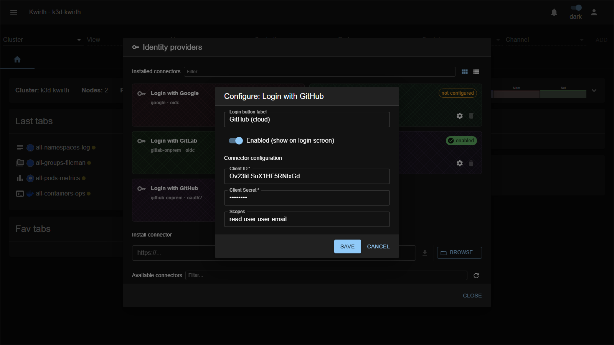

# GitHub Cloud (IdP connector)

> **Type:** Identity provider connector 
> **Protocol:** OAuth2 
> **Provider id:** `github-cloud`

## What it does

Lets users **sign in with a GitHub.com account** via **OAuth2**. Adds a **"Login with GitHub"** button to the sign-in screen.

## Configuration

Open **☰ → Manage extensions → Identity providers → Login with GitHub (github-cloud) → ⚙️**:

| Field | What it does |
|---|---|
| **Login button label** | Text on the login-screen button. |
| **Enabled (show on login screen)** | Toggle the connector on/off. |
| **Client ID** * | The GitHub OAuth App **client ID**. |
| **Client Secret** * | The OAuth App **client secret**. |
| **Scopes** | OAuth scopes (leave empty for default `read:user user:email`). |

## Setup

### Step 1 — Register Kwirth as an OAuth App in GitHub

> ⚠️ It must be an **OAuth App**, not a *GitHub App*. They are different things. A GitHub App uses per-app permissions instead of OAuth scopes, so `user:email` is never granted and login fails. OAuth App client IDs do **not** start with `Iv…`.

In GitHub, go to **Settings → Developer settings → OAuth Apps → New OAuth App** (or an organization-owned OAuth App):

| GitHub field | Value |
|---|---|
| **Application name** | `Kwirth` |
| **Authorization callback URL** | `https://<your-kwirth-host>/core/auth/github-cloud/callback` |

> The callback URL uses the **provider id** `github-cloud` — this is fixed and is not an admin-assigned identifier.

Register the app and then **generate a Client Secret**. Copy both **Client ID** and **Client Secret**.

### Step 2 — Configure the connector in Kwirth

As admin, open **☰ → Manage extensions → Identity providers**, find the **GitHub Cloud** card and click **⚙️ Settings**:

1. **Client ID**: paste the value from Step 1.
2. **Client Secret**: paste the secret from Step 1.
3. **Scopes**: leave empty for the default `read:user user:email`.
4. Enable the toggle and save.

### Step 3 — Create users in Kwirth

From **User security** (admin only): create a user whose **Id is the person's primary verified GitHub email**, set **IdP** to `github-cloud`, assign resources, and save.

## Notes

- For **GitHub Enterprise Server** use the **[GitHub Enterprise Server](github-onprem)** connector (it adds base/API URL fields).
- The client secret is a credential — protect it.

---

← Back to [Identity providers](index)
