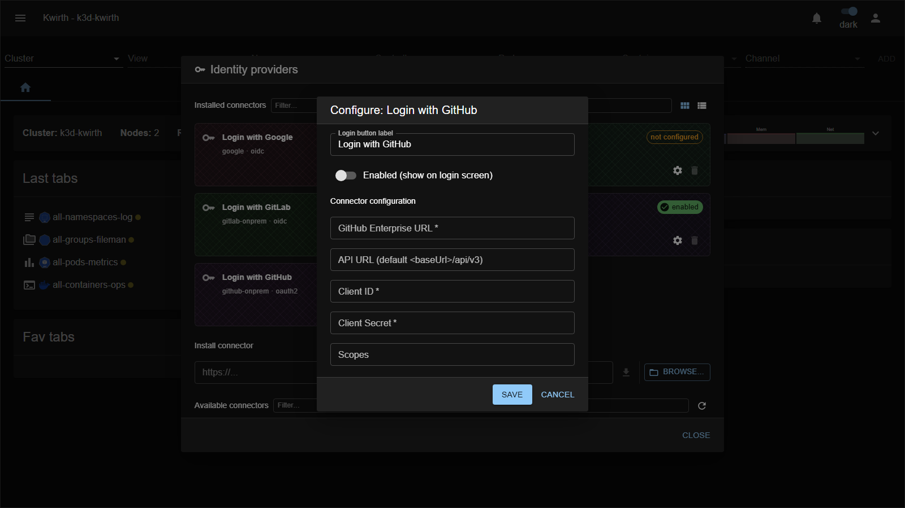

# GitHub Enterprise Server (IdP connector)

> **Type:** Identity provider connector 
> **Protocol:** OAuth2 
> **Provider id:** `github-onprem`

## What it does

Lets users **sign in with a GitHub Enterprise Server** (self-hosted) instance via **OAuth2** — same as the cloud connector, pointed at **your** GitHub Enterprise URLs.

## Configuration

Open **☰ → Manage extensions → Identity providers → Login with GitHub (github-onprem) → ⚙️**:

| Field | What it does |
|---|---|
| **Login button label** | Text on the login-screen button. |
| **Enabled (show on login screen)** | Toggle the connector on/off. |
| **GitHub Enterprise URL** * | Base URL of your GHES (e.g. `https://github.example.com`). |
| **API URL** | API base — defaults to `<baseUrl>/api/v3`. |
| **Client ID** * | The OAuth App **client ID**. |
| **Client Secret** * | The OAuth App **client secret**. |
| **Scopes** | OAuth scopes (leave empty for default `read:user user:email`). |

## Setup

### Step 1 — Register Kwirth as an OAuth App in GitHub Enterprise

> ⚠️ It must be an **OAuth App**, not a *GitHub App*. See the [GitHub Cloud](github-cloud) connector notes for the difference.

In your GitHub Enterprise instance, go to **Settings → Developer settings → OAuth Apps → New OAuth App** (or an organization-owned OAuth App):

| GitHub field | Value |
|---|---|
| **Application name** | `Kwirth` |
| **Authorization callback URL** | `https://<your-kwirth-host>/core/auth/github-onprem/callback` |

> The callback URL uses the **provider id** `github-onprem` — this is fixed and is not an admin-assigned identifier.
>
> For local development point it at the backend directly:
> `http://localhost:3883/core/auth/github-onprem/callback`

Register the app and then **generate a Client Secret**. Copy both **Client ID** and **Client Secret**.

> The Kwirth backend exchanges the code for a token and calls the GitHub API server-side, so the machine running the backend must be able to reach your GitHub Enterprise instance (relevant when GHE is behind a VPN).

### Step 2 — Configure the connector in Kwirth

As admin, open **☰ → Manage extensions → Identity providers**, find the **GitHub Enterprise Server** card and click **⚙️ Settings**:

1. **GitHub Enterprise URL**: enter your instance base URL (e.g. `https://github.mycompany.com`).
2. **API URL**: leave empty to use the default `<baseUrl>/api/v3`, or set it explicitly.
3. **Client ID**: paste the value from Step 1.
4. **Client Secret**: paste the secret from Step 1.
5. **Scopes**: leave empty for the default `read:user user:email`.
6. Enable the toggle and save.

### Step 3 — Create users in Kwirth

From **User security** (admin only): create a user whose **Id is the person's primary verified GitHub email**, set **IdP** to `github-onprem`, assign resources, and save.

## Notes

- Differs from **[GitHub Cloud](github-cloud)** by the **Enterprise URL** and **API URL** fields.
- The client secret is a credential — protect it.

---

← Back to [Identity providers](index)
