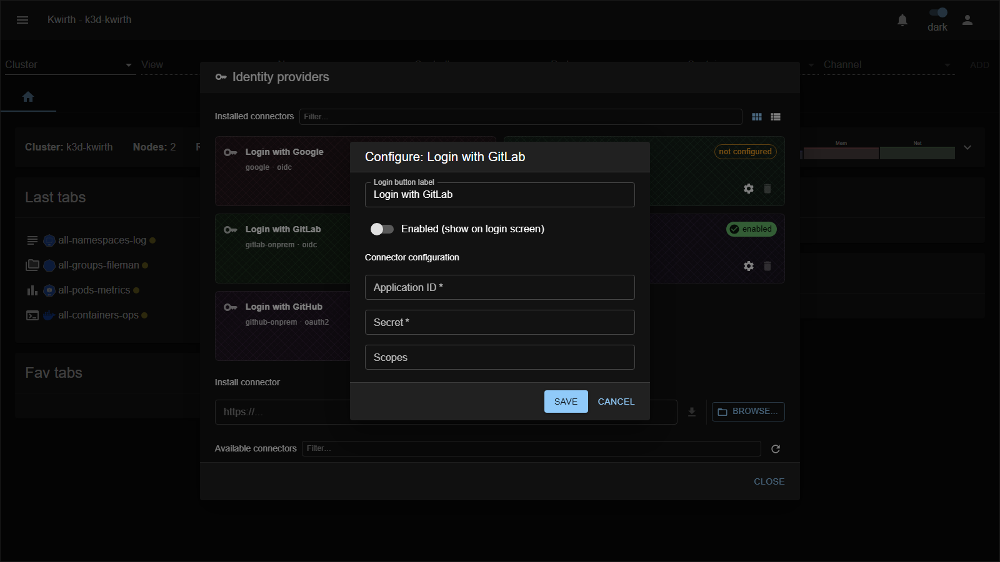

# GitLab Cloud (IdP connector)

> **Type:** Identity provider connector 
> **Protocol:** OIDC 
> **Provider id:** `gitlab-cloud`

## What it does

Lets users **sign in with a GitLab.com account** via **OpenID Connect**. Adds a **"Login with GitLab"** button to the sign-in screen.

## Configuration

Open **☰ → Manage extensions → Identity providers → Login with GitLab (gitlab-cloud) → ⚙️**:

| Field | What it does |
|---|---|
| **Login button label** | Text on the login-screen button. |
| **Enabled (show on login screen)** | Toggle the connector on/off. |
| **Application ID** * | The **Application ID** of your GitLab OAuth application. |
| **Secret** * | The application **secret**. |
| **Scopes** | OIDC scopes (leave empty for default `openid email profile`). |

## Setup

### Step 1 — Register Kwirth in GitLab.com

In GitLab.com, create an **OAuth Application** (user avatar → Preferences → Applications, or a group's Settings → Applications):

| GitLab field | Value |
|---|---|
| **Name** | `Kwirth` |
| **Redirect URI** | `https://<your-kwirth-host>/core/auth/gitlab-cloud/callback` |
| **Confidential** | ✅ Yes |
| **Scopes** | `openid`, `email`, `profile` |

> The redirect URI uses the **provider id** `gitlab-cloud` — this is fixed and is not an admin-assigned identifier.

Click **Save application**. GitLab shows an **Application ID** and a **Secret** — copy both.

### Step 2 — Configure the connector in Kwirth

As admin, open **☰ → Manage extensions → Identity providers**, find the **GitLab Cloud** card and click **⚙️ Settings**:

1. **Application ID**: paste the value from Step 1.
2. **Secret**: paste the secret from Step 1.
3. **Scopes**: leave empty to use the default `openid email profile`.
4. Enable the toggle and save.

### Step 3 — Create users in Kwirth

From **User security** (admin only): create a user whose **Id is the person's GitLab verified email**, set **IdP** to `gitlab-cloud`, assign resources, and save.

## Notes

- For **self-managed** GitLab use the **[GitLab Self-Managed](gitlab-onprem)** connector instead (it adds a GitLab URL field).
- The application secret is a credential — protect it.

---

← Back to [Identity providers](index)
