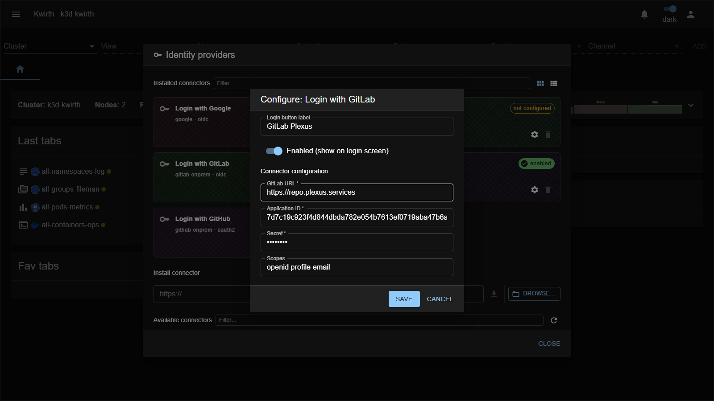

# GitLab Self-Managed (IdP connector)

> **Type:** Identity provider connector 
> **Protocol:** OIDC 
> **Provider id:** `gitlab-onprem`

## What it does

Lets users **sign in with a self-managed (on-prem) GitLab** instance via **OpenID Connect** — same as the cloud connector, but pointed at **your** GitLab URL.

## Configuration

Open **☰ → Manage extensions → Identity providers → Login with GitLab (gitlab-onprem) → ⚙️**:

| Field | What it does |
|---|---|
| **Login button label** | Text on the login-screen button. |
| **Enabled (show on login screen)** | Toggle the connector on/off. |
| **GitLab URL** * | Base URL of your self-managed GitLab (e.g. `https://gitlab.example.com`). |
| **Application ID** * | The OAuth application's **Application ID**. |
| **Secret** * | The application **secret**. |
| **Scopes** | OIDC scopes (leave empty for default `openid email profile`). |

## Setup

### Step 1 — Register Kwirth in GitLab

In your GitLab instance, create an **OAuth Application**. You can do this as:

- **Instance application** — GitLab admin area → Applications (recommended for org-wide use).
- **Group application** — Group → Settings → Applications.
- **User application** — User avatar → Preferences → Applications.

Fill in:

| GitLab field | Value |
|---|---|
| **Name** | `Kwirth` (or any descriptive name) |
| **Redirect URI** | `https://<your-kwirth-host>/core/auth/gitlab-onprem/callback` |
| **Confidential** | ✅ Yes |
| **Scopes** | `openid`, `email`, `profile` |

> The redirect URI uses the **provider id** `gitlab-onprem` — this is fixed for this connector and is **not** an admin-assigned identifier.
>
> For local development point it at the backend directly:
> `http://localhost:3883/core/auth/gitlab-onprem/callback`
>
> If Kwirth is served under a sub-path (`ROOTPATH`), include it in the URL.

Click **Save application**. GitLab shows an **Application ID** and a **Secret** — copy both.

> The Kwirth backend performs OIDC discovery (`<gitlab-url>/.well-known/openid-configuration`) and the token exchange server-side, so the machine running the Kwirth backend must be able to reach your GitLab instance (relevant when GitLab is behind a VPN).

### Step 2 — Configure the connector in Kwirth

As admin, open **☰ → Manage extensions → Identity providers**, find the **GitLab Self-Managed** card and click **⚙️ Settings**:

1. **GitLab URL**: enter your instance base URL (e.g. `https://gitlab.mycompany.com`). No trailing slash, no `/.well-known` suffix.
2. **Application ID**: paste the value from Step 1.
3. **Secret**: paste the secret from Step 1 (stored encrypted, shown masked afterwards).
4. **Scopes**: leave empty to use the default `openid email profile`.
5. Enable the toggle and save.

A **"Login with GitLab"** entry now appears on the login screen.

### Step 3 — Create users in Kwirth

GitLab only proves identity — each person must have a matching Kwirth account. From **User security** (admin only):

1. Create a **New** user.
2. Set the **Id** to the user's **GitLab verified email address** — this is how Kwirth matches the identity coming from GitLab.
3. Set the **IdP** field to `gitlab-onprem`.
4. Assign **resources** (scopes, namespaces, …) that define what the user can access.
5. **Save**.

## Notes

- The only difference from **[GitLab Cloud](gitlab-cloud)** is the **GitLab URL** field.
- The **provider id** (`gitlab-onprem`) is fixed and shared by everyone using this connector — it is not per-user or per-installation.
- The application secret is a credential — protect it and rotate it if it leaks.
- If you enable both `gitlab-cloud` and `gitlab-onprem`, users see separate "Login with GitLab" buttons; bind each Kwirth user to the correct connector.

---

← Back to [Identity providers](index)
