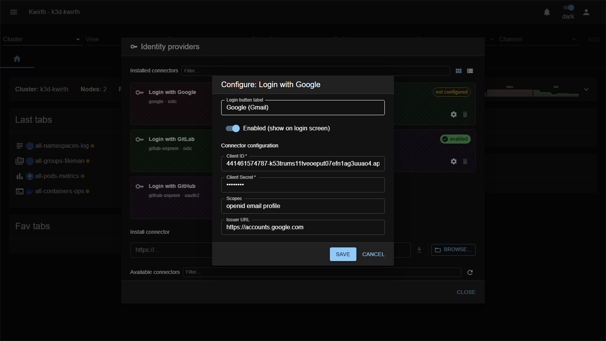

# Google (IdP connector)

> **Type:** Identity provider connector 
> **Protocol:** OIDC 
> **Provider id:** `google`

## What it does

Lets users **sign in to Kwirth with a Google / Google Workspace account** via **OpenID Connect**. Once configured and enabled, a **"Login with Google"** button appears on the sign-in screen.

## Configuration

Open **☰ → Manage extensions → Identity providers → Login with Google → ⚙️**:

| Field | What it does |
|---|---|
| **Login button label** | Text shown on the login-screen button (e.g. *Google (Gmail)*). |
| **Enabled (show on login screen)** | Toggle the connector on/off for users. |
| **Client ID** * | The OAuth **client ID** from your Google Cloud OAuth credentials. |
| **Client Secret** * | The corresponding **client secret**. |
| **Scopes** | OIDC scopes to request (leave empty for default `openid email profile`). |
| **Issuer URL** | The OIDC issuer (leave empty for default `https://accounts.google.com`). |

## Setup

### Step 1 — Register Kwirth in Google Cloud Console

1. Open [console.cloud.google.com](https://console.cloud.google.com) and create or select a project (it is free).
2. Open **APIs & Services → OAuth consent screen**:
   - **User type: External** — needed so `@gmail.com` accounts can sign in. Use *Internal* only if every user belongs to your own Google Workspace org.
   - Fill in the app name and support email.
3. Open **APIs & Services → Credentials → Create credentials → OAuth client ID**:
   - **Application type: Web application**.
   - **Authorized redirect URIs**: add your Kwirth callback URL:

| Environment | Redirect URI |
|---|---|
| Production | `https://<your-kwirth-host>/core/auth/google/callback` |
| Local development | `http://localhost:3883/core/auth/google/callback` |

> The redirect URI uses the **provider id** `google` — this is fixed and is not an admin-assigned identifier.
>
> If Kwirth is served under a sub-path (`ROOTPATH`), include it in the URL.

4. On save, Google gives you a **Client ID** and a **Client Secret**. Copy both.

> Only `openid`, `email` and `profile` scopes are needed — these are non-sensitive and require no Google app verification/review.

#### Testing vs Production

- **Testing** mode: only accounts you add as *test users* (up to 100) can authenticate. Ideal for a pilot.
- **Production** mode: any Google account can authenticate. No Google review is needed because only non-sensitive scopes are used.

### Step 2 — Configure the connector in Kwirth

As admin, open **☰ → Manage extensions → Identity providers**, find the **Google** card and click **⚙️ Settings**:

1. **Client ID**: paste the value from Step 1.
2. **Client Secret**: paste the secret from Step 1.
3. **Scopes**: leave empty to use the default `openid email profile`.
4. **Issuer URL**: leave empty (defaults to `https://accounts.google.com`).
5. Enable the toggle and save.

No restart or environment variables are needed — the configuration is stored in the `kwirth-idps` secret.

### Step 3 — Create users in Kwirth

From **User security** (admin only): create a user whose **Id is the person's Google email address**, set **IdP** to `google`, assign resources, and save.

## Notes

- **Client Secret** is a credential — protect the connector configuration.
- Even in Google Production mode, only users you explicitly created in Kwirth (bound to Google) can enter — any other Google account is rejected at the Kwirth level.

---

← Back to [Identity providers](index)
