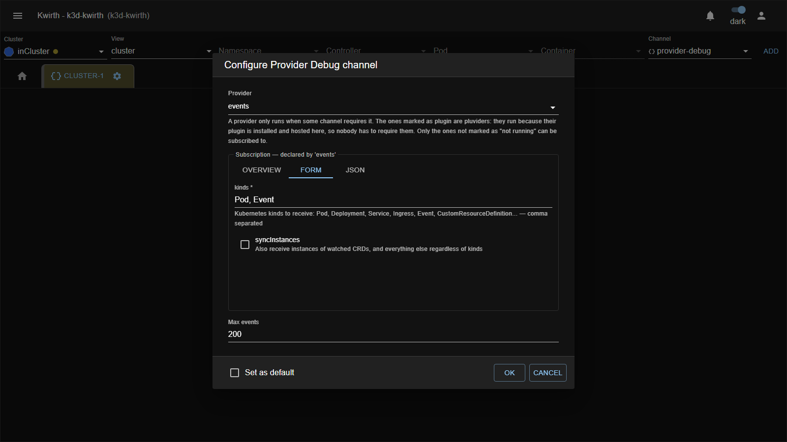
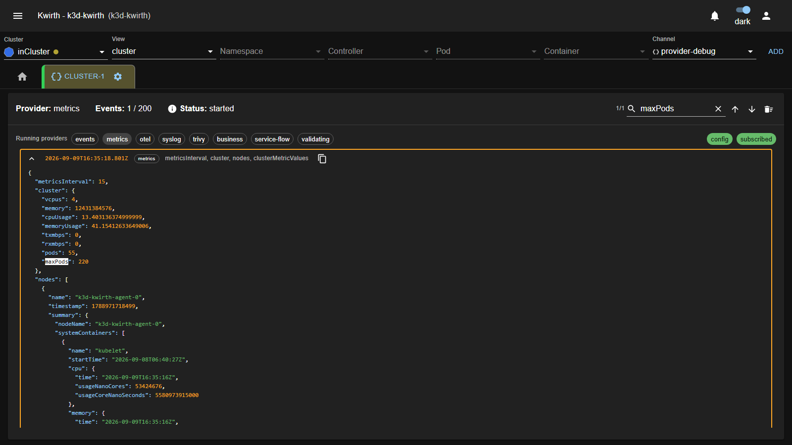

# 🧩 Provider Debug (plugin)

> **Type:** Plugin (channel) 
> **Package:** `@kwirthmagnify/kwirth-plugin-provider-debug` 
> **Icon:** 🧩

## Overview

**Provider Debug** subscribes to a **provider** and shows you every event it dispatches, **exactly as the provider emits it** — no parsing, no reshaping, no filtering.

It answers the question you always end up asking when you write a provider, or a plugin that consumes one: *what is actually arriving at `processProviderEvent`?* Instead of guessing from a README or adding `console.log` to the backend, you open a tab and read the JSON.

## When to use it

- **Writing a provider** — confirm your events reach subscribers, and in the shape you intended.
- **Writing a plugin that consumes a provider** — see the real payload before you code against it.
- **A channel receives nothing** — check whether the provider is emitting at all, or whether your subscription payload is wrong.
- **Learning a provider you did not write** — read its usage notes and copy a working example payload.

## What it can see

Kwirth only instantiates a provider when **some channel declares it** in its requirements. Provider Debug deliberately declares **none**: a debugger must not open syslog sockets or connect to Kafka just by being installed.

So the dropdown lists every provider the core knows — installed extensions plus the built-in ones — and marks the ones that are **not running**. Those are installed but nobody is using them, so there is nothing to subscribe to. Install or enable a plugin that requires the provider and it will come up.

## Getting started

1. Choose **Cluster**, set **View** to `cluster` (Provider Debug is cluster-scoped, it does not attach to pods), pick the **provider-debug** channel and click **ADD**.
2. Open the tab's **⚙️ → Start** and configure it.

## Configuration

| Control | What it does |
|---|---|
| **Provider** | Which provider to attach to. Entries marked *not running* cannot be subscribed to. Choose *(none)* to start without subscribing and just list what is alive. |
| **Form / JSON** | How to write the subscription payload. **Form** appears only for providers that describe their payload field by field; **JSON** is always available. |
| **USE EXAMPLE** | Fills the payload with the example the provider publishes. |
| **Subscription payload** | Passed verbatim to the provider when subscribing. Validated before the dialog closes. |
| **Max events** | Size of the ring buffer. Older events are dropped. |

> **Most providers deliver nothing with an empty payload.** It is the single most common reason for a silent tab. The `events` provider, for instance, only delivers objects whose kind you list in `kinds`.

To change provider afterwards, use **⚙️ → Stop** and then **Start** again — the menu disables *Start* while the channel is running.

## Reading the help

Providers can publish how to subscribe to them. When they do, the dialog shows their notes above the payload editor, offers the **USE EXAMPLE** button, and — if the payload is flat — builds a **form** so you do not have to write JSON by hand.

If a provider shows *"does not publish subscription help"*, it simply has not implemented that (it is optional); check its README for the payload it expects.

## The output

The header shows the provider, how full the buffer is, the status, the **search box**, and a **🗑 clear** button.

Below it, **Running providers** lists what is alive right now. On the right of that same row, two chips track the start-up: **config** turns green when the core accepts the instance configuration, and **subscribed** when the provider confirms the subscription. If one of them stays grey, that is where the start-up stopped.

Anything that actually needs reading — *provider not running*, *malformed payload* — still appears as a text line under the chips.

Each event is one collapsed card: **timestamp · provider · top-level keys**. Expand it for the full JSON, coloured by type, and use the **copy** button to put that JSON on your clipboard.

Cards open and close **without animation**, and a collapsed card renders nothing at all. That is deliberate: a single event can carry thousands of lines, and animating that much content makes it unreadable while it grows.

### Searching

Type in the search box and the counter tells you how many events contain that text — it looks inside the whole event, not just the summary. **↑ / ↓** (or **Enter** / **Shift+Enter**) walk the matches, wrapping around at the ends.

Jumping to a match expands its card, outlines it, and scrolls straight to the **highlighted text** rather than to the card — with a long event, centring the card would leave the hit off screen. Every occurrence is painted in inverse video, so it is easy to spot while you scroll through the rest of the JSON.

Matching events also show their timestamp in the highlight colour, so you can see which cards are worth opening without expanding them.

## Related

- [Providers](../providers/index) — what a provider is and which ones ship with kwirth.
- [Developing providers](/0.5.287/providers/developing) — including how to publish subscription help from your own provider.
