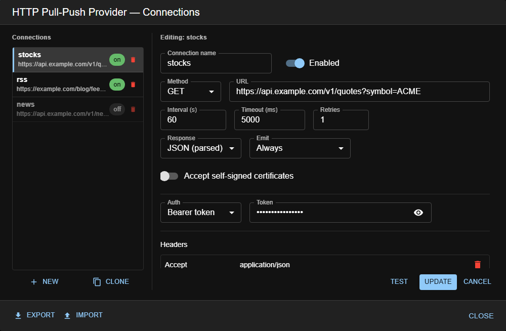

# HTTP Pull-Push (provider)

> **Type:** Provider (installable) 
> **Package:** `@kwirthmagnify/kwirth-provider-http-pull-push`

## What it does

The **HTTP Pull-Push** provider turns any HTTP endpoint into a Kwirth data source. You declare a set of
**connections** — a URL, how often to call it and how to authenticate — and the provider **pulls** each one
on its own schedule and **pushes** the result to the channels that subscribed to it.

It is the answer to "I want this API inside Kwirth" when the external system has no way of pushing data to
you: instead of waiting for an OTLP exporter or a business event, Kwirth goes and fetches it.

## When to use it

- Bring in a **third-party API** (quotes, weather, an inventory service, a status page).
- Watch an endpoint that has no webhook: an **RSS feed**, a health endpoint, a metrics summary.
- Poll a **legacy system** that only speaks HTTP request/response.

## Two layers, and why it matters

This provider separates **what is fetched** from **who wants it**, and the two are configured in different
places by different people.

| | Layer 1 — connections | Layer 2 — subscriptions |
|---|---|---|
| Who defines it | The admin, in this dialog | Each channel, in its own code/config |
| Where it lives | Persisted by the provider | In memory, while the channel runs |
| What it says | *what* to fetch, how often, with what credentials | *which* connections that channel wants |

The practical consequence: **one connection is fetched once per cycle**, no matter how many channels are
listening. Three channels subscribed to the same quotes API produce one request every cycle, not three.
That is the whole point of the provider layer — the remote endpoint sees Kwirth as a single client.

## Configuration

Set it from the card's **⚙️ gear** in **☰ → Manage extensions → Providers**. The card itself tells you how
many connections the provider has, the same way a sender's card does.

The dialog works like the sender configuration dialog: your connections on the left, the selected one being
edited on the right.

- **New** starts an empty connection; **Clone** duplicates the one you are editing (handy for a second
  endpoint of the same API, with the same auth).
- **Update** — or **Add** for a new one — saves **that** connection and applies it immediately. **Cancel**
  discards what you were editing, not the rest.
- The **🗑️** on each row deletes that connection on the spot.
- **Export** / **Import** move connections as JSON, which is how you carry a set-up between clusters.
- **Close** leaves the dialog. There is no global save: every action has already been applied.

## Test — before saving anything

**Test** fires the request **once, right now**, and tells you the HTTP status, how long it took, how many
bytes came back and the beginning of the response. It works on what you have on screen, so you can try a
url before saving it.

The important part: the request is made **by the Kwirth backend**, not by your browser. That is the only
test worth trusting — the backend has the network the polling will really use, its own DNS and egress
rules, and its own certificate store. An endpoint that answers from your laptop may be unreachable from
inside the cluster, and the other way round.

A few things you can read from the result:

- **HTTP 401 / 403** means the connection got through but your credentials are wrong — a different problem
  from a timeout.
- **`body is not valid JSON`** on a connection set to *Response: JSON* warns you that subscribers will
  receive raw text.
- A duration close to your **timeout** is a sign that the timeout is too tight.

The test does not save the connection, does not start polling it, and ignores **Retries** — a test reports
the first outcome instead of insisting.

| Field | What it does |
|---|---|
| **Name** | Identifies the connection. Channels subscribe by this name, and it travels with every event so a channel listening to several can tell them apart. |
| **Enabled** | Off = the connection is **stored but not operative**: no polling, no events. Useful to park a connection without losing it. |
| **URL** | `http://` or `https://`. |
| **Method** | GET / POST / PUT / PATCH / DELETE. |
| **Interval** | Seconds between pulls. |
| **Timeout** | Per request. It cannot exceed the interval, or one pull would still be running when the next is due. |
| **Retries** | Extra attempts inside the same cycle before giving up and reporting an error. |
| **Response** | **JSON** parses the body before delivering it; **Text** delivers it raw. |
| **Emit** | **Always** delivers every cycle; **Only when it changes** stays quiet while the answer is identical. |
| **Accept self-signed certificates** | Only available on `https://`. |
| **Auth** | **None**, **Basic** (user + password), **Bearer token**, or **Custom header** (name + value). |
| **Headers** | Extra headers sent verbatim. The authentication header is not set here — the provider adds it from the Auth section. |
| **Body** | Only for POST / PUT / PATCH. |

Changes apply **immediately on save**: enabling, disabling, editing or deleting a connection takes effect
without restarting Kwirth.

## Two behaviours worth knowing

**Nothing is polled until somebody listens.** A connection can be enabled and still generate zero traffic:
the polling starts when the first channel subscribes and stops when the last one leaves. So *Enabled* really
means "available to be subscribed to". This is deliberate — it avoids hammering an endpoint nobody is
reading, and it stops a forgotten connection from burning the quota of a paid API.

**Where your credentials end up.** The provider splits what you type: URLs, intervals and headers go to a
**ConfigMap** (so you can audit with `kubectl` what Kwirth is querying), while passwords, tokens and custom
header values go to a **Secret**. You do not have to do anything for this — it is how the provider stores
its own configuration.

## Exporting and importing

**Export** asks you which connections to take and whether to **include credentials**, which is off by
default. Left off, the file carries urls, intervals, headers and the auth *mode*, but the password, token or
header value come out empty and whoever imports it has to type them — so a file that ends up in a ticket or
a chat is not a leak. Turned on, the file contains those secrets in clear text and becomes a secret itself;
the dialog says so.

**Import** lets you pick what to bring in from the file, and flags with **replaces** any connection whose
name already exists, so you can see what you are about to overwrite before confirming.

## Security notes

- A connection is an **outbound call made by Kwirth**, with Kwirth's network identity. Anything reachable
  from the pod is reachable from here, internal services included.
- **Accept self-signed certificates** disables certificate verification for that connection. Use it for
  internal endpoints with their own CA, never against the public internet.
- The response is delivered to the subscribed channels **as it comes**. If the endpoint is untrusted, treat
  its payload accordingly.

---

← Back to [Providers](index)
