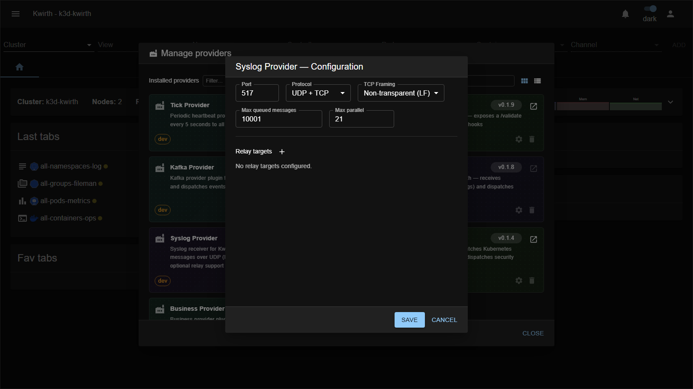

# Syslog (provider)

> **Type:** Provider (installable) 
> **Package:** `@kwirthmagnify/kwirth-provider-syslog`

## What it does

The **Syslog** provider makes kwirth a **syslog receiver**. It accepts **RFC 3164 / RFC 5424** messages over **UDP** and **TCP** and streams them into subscribing channels — so appliances, network gear and legacy apps that emit syslog can feed the kwirth event model, with optional relaying onward.

## When to use it

- Ingest logs from **devices/apps that only speak syslog**.
- Centralise syslog into channels (e.g. analyse it with **[Censor](../plugins/censor)** / **[Pinocchio](../plugins/pinocchio)**).

## Configuration

Set it from the card's **⚙️ gear** in **☰ → Manage extensions → Providers**:

| Field | What it does |
|---|---|
| **Port** | Listen port (default syslog is 514). |
| **Protocol** | **UDP**, **TCP**, or both. |
| **TCP framing** | How TCP messages are delimited — e.g. **Non-transparent (LF)** or octet-counting. |
| **Max queued messages** | Backpressure buffer size. |
| **Max parallel** | Max messages processed concurrently. |
| **Relay targets** | Optionally **forward** received syslog on to other destinations. |

## Notes

- **Restart the core after installing it.** kwirth prompts you. The listener is opened when the provider is instantiated, and the core does that while it starts up — so until you restart, **the port simply is not open, and nothing says so**. This provider's failure mode is silent: no error, no traffic. See [When a restart is needed](../../admin/08-extending-kwirth#when-a-restart-is-needed).
- The listen port is network-facing — expose it deliberately and protect it.
- UDP is fire-and-forget (may drop under load); TCP is reliable but needs correct **framing** to split messages.

---

← Back to [Providers](index)
