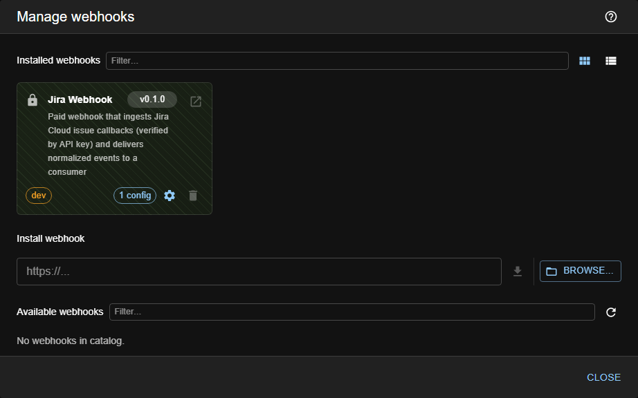
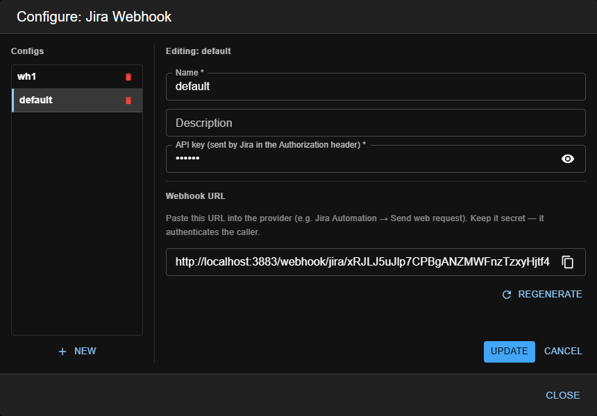

# Webhooks (inbound event sources)

> **Type:** Webhooks 
> **Managed from:** ☰ → Manage extensions → Webhooks

## What a webhook is

A **webhook** is an **input adapter** — the **inbound counterpart of a [sender](../senders)**. Where a sender delivers a message *out* of Kwirth (fire-and-forget), a webhook receives HTTP callbacks *into* Kwirth from an external system (a ticketing tool, a SCM, an alerting service), **verifies** and **parses** them, and hands a **normalized event** to whoever is interested.

The key ideas:

- Each webhook has an **id** (e.g. the provider it understands) and holds one or more **named configurations** — each one gets its **own public URL** with an **opaque token**: `…/webhook/<id>/<token>`.
- That **token is a capability**: it both routes the callback and authenticates the caller (the URL is unguessable). On top of it, each webhook applies its **own verification** (a shared secret in a header, an HMAC signature…) — the core is auth-agnostic and hands the raw request to the artifact's `verify()`.
- Delivery is **consumer-driven, like providers**: a webhook doesn't target anyone. A channel/plugin **subscribes** to a webhook by id (the same way it subscribes to a provider's events) and receives its events; **anything that doesn't subscribe receives nothing**.

## The public URL (token)

When you save a webhook config, the manager shows its **Webhook URL** — copy it and paste it into the external system's outbound-callback configuration (e.g. an automation rule's "send web request"). Two controls matter:

- **Copy** — the URL includes the opaque token; treat it as a secret and always serve it over **HTTPS**.
- **Regenerate** — mints a **new token** (new URL) and invalidates the old one. Use it if the URL leaks; remember to repaste the new URL into the provider.

## Managing & configuring webhooks

Open **☰ → Manage extensions → Webhooks**. Each installed webhook is a **card** showing its description, how many **configs** it holds, and a **⚙️ gear** / **🗑️ delete**:

1. Click a webhook's **gear** to open its config manager. Each webhook keeps a **list of named configs** — pick one to edit or **New** to add. Kwirth renders the form from the **webhook's own field schema** (e.g. the secret it expects), so every field is typed (text / password / select).
2. **Save** the config. The manager then shows the **Webhook URL** with its token, plus **Copy** and **Regenerate**:

3. Paste that URL into the external provider so it calls back on the events you care about, adding whatever **verification** the webhook expects (typically a secret in an `Authorization` header that must match the config).

## Using webhooks from a channel

A channel/plugin consumes a webhook by **subscribing** to it — there is **no destination picker** on the webhook side. At startup the consumer registers for a webhook id; from then on it receives that webhook's verified, parsed events. This mirrors how channels subscribe to a **[provider](../providers)**'s events.

## Admin guide

- **Install / enable / remove:** from **☰ → Manage extensions → Webhooks**, using the common flow in [Extending Kwirth](../../admin/08-extending-kwirth).
- **Exposure:** the receiver is a single public endpoint on the Kwirth server; the token in the URL + the webhook's own verification are what protect it. Serve Kwirth over **HTTPS** and keep the URLs secret.
- **Secrets:** the shared secret / signing key a webhook expects is stored as webhook config — treat it as a credential (it's a masked field).

## Notes

- Webhooks are **backend-only** — there's no per-webhook channel tab; you configure them centrally and channels **subscribe** to them.
- Unlike senders, a webhook config's URL/token is **per-instance and unguessable**, so webhook configs are **not** exportable/importable (exporting would leak the capability and importing couldn't recreate the URL already registered in the provider).

---

← Back to [Extension manuals](../index)
