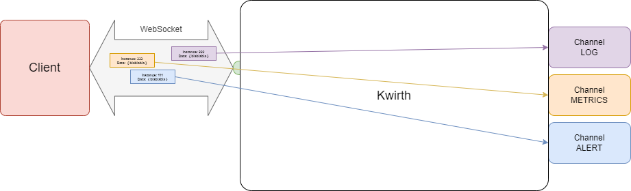
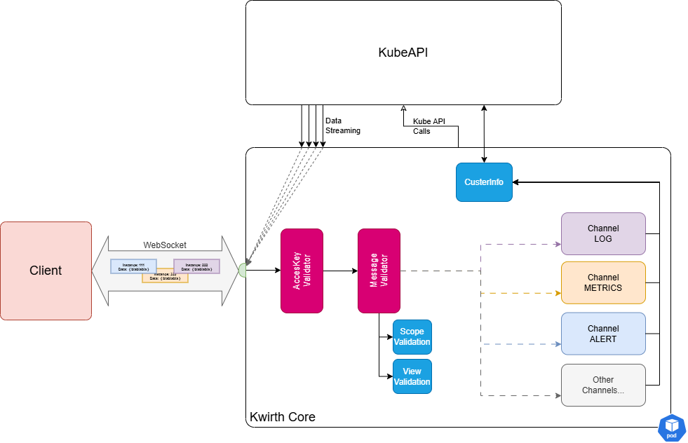

# Channels
On the very first versions of Kwirth all its capabilities were implemented inside Kwirth core. That is, log streaming or the ability to restart pods or deployments were in fact TypeScript modules co-developed and integrated into Kwirth core, the were built next to it, creating one only piece which contains the core backend functionalities (connection to kubernetes cluster, managing security, serving as a storage system for profiles, etc.), the Kwirth capabilities (log streaming, cluster basic operations) and serving the front application (the React module).

Starting with Kwirth 0.3.160 the core has been split into 2 separate blocks:

  1. The core in itself, that is, the Kwirth component that handles WebSockets, security, connections to cluster or HTTP serving.
  2. The interface for implementing features in Kwirth, that is what we call **back channels**, where each channel is a feature (logs, metrics, alerts...)

Starting with Kwirth 0.4, the React front application has also been rearchitected to reflect the way Kwirth core is build:

  1. Having a core front application with minimum functionalities, like security, store, etc...
  2. Add capabilities via **front channels**, that correspond in fact to the above mentioned back channels .

According to this structure, the different features that users expect to use with Kwirth are what we call **channels**. For example, receive real-time log streams is just one feature, so there exists a **channel** that implements this feature in the backend and also in the frontend.

Or, for example, since Kwirth 0.3.160 you can receive cluster metrics via a real-time metrics-stream. You can receive information about CPU usage for containers, pods, groups or namespaces. Metrics is another different **channel**. In fact, you can start your Kwirth instance deciding what channels to enable or disable and what other external channels you want to add to your Kwirth instance.

We have plans to integrate channels into **'plugins'**, exactly the way [Backstage plugins](https://backstage.io/plugins) work.


## What are channels?
A **channel** is the implementation of a specific feature. For example you can create a channel for receiving info on ConfigMap in such a way that any change to ConfigMaps can be streamed in real-time for somebody to be informed of such changes. Or you can build a channel for exporting log streams in real-time (the original idea behind Kwirth).

That is, a channel is in fact an implementation of a feature that must be built according to a specification (that we will explain afterwards) and does not need to be linked nor built with Kwirth core, a channel can be even loaded at runtime.


### Instances
For being flexible enough to accommodate a big volume of workload without consuming too much resources of the backend or an excessive amount of resources of your clients (typically browsers), web sockets (where real-time data streaming takes place) do support exchanging information with clients using a subchannel-like mechanism, that's what we call an **instance**.

?> You can have different instances (with different config) exchanging info over the same websocket.


### Summarizing
The main concepts to keep in mind when thinking in a Kwirth way are: features (i.e., channels), web sockets (communication with clients) and instances (services the clients use). All this stuff is shown on next figure.



### Kwirth Core
With the introduction of channels, all the specific logic for handling and serving Kubernetes data has been moved to channel implementations, so, what remains inside Kwirth is what we call **Kwirth core**, and that comprises:

  - Access Key validation, receiving access keys and ensuring they are valid.
  - Scoping, that is, ensuring that AccessKey presented by clients can perform the actions that they are requesting.
  - Messaging validation and distribution (to channels). Core is in charge of receiving requests, validating them, and sending them away to the proper channel.
  - Access to Kubernetes API. Kubernetes API is a key part of the process, and Kwirth Core is the only responsible of accessing Kubernetes for executing different actions, like retrieving metrics from cAdvisor, creating log streams, etc.

What follows is a zoomed view of Kwirth core.



## Existing channels
Channel subsystem started in Kwirth 0.3.160, and these are the channels you will find integrated inside Kwirth core in current version:

  - **Log**. You can open log streams for receiving container/pod/group/namespace aggregated log streams in real time.
  - **Metrics**. You can receive metrics information related to container/pod/group/namespace aggregated objects.
  - **Alert**. Client can configure alerts for filtering aggregated log streams at origin.
  - **Echo**. This is a reference channel for channel implementers, it is not useful for real kubernetes operations.
  - **Trivy**. This is a very interesting channel for knowing your vulnerabilities exposure based on Trivy. Trivy is fully integrated into Kwirth through this channel.
  - **Ops**. This is a channel you cna use for performing common operations on your cluster, like launching a shell to a pod or restarting a pod. But Ops channels includes some interesting features like restarting a namespace, or keeping shell terminals connected for a lifetime.
  - **Fileman**. *Fileman is an unprecedented* channel that allows users to *work with container filesystems exactly the same way they would work with its PC filesystem*. Forget about `kubectl exec mypod -- /bin/sh -c ls`, "kubectl cp", JUST navigate on your browser with this powerful visual file explorer!!
  - **Magnify**. This is a *factotum* channel. Magnify consolidates all existing channels in Kwirth into *one only web experience* for managing all Kubernetes aspects and objects, exactly the same way you would do with K9s, Headlamp or Lens.

It is important to note that **Kwirth always includes a basic front React application**, but you can integrate Kwirth with your own clients by using Kwirth API.

For getting specific information on each channel follow [this link](./list).

## Back channels and front channels: two parts of the same thing
Starting in Kwirth 0.3 and ending in Kwirth 0.4, Kwirth features are implemented via channels, understanding a channel is an extension to Kwirth where capabilities are implemented.

When you create a Kwirth channel you must understand that the channel is split into two different artifacts:

  - **Back channel**, that is, a Kwirth core extension that receives requests from clients and interacts with your source (Kubernetes, Docker or whatever it be).
  - **Front channel**, is an extension artifact to be loaded into front application, it handles user interaction and communicates with backend. Please keep in mid Kwirth core is not strongly coupled to Kwirth front end, you can implement your own Kwirth clients. When we talk about front channels, we are referring to plugins to be added to **Kwirth front React application**.

Front channels communicate with back channels through an open websocket that Kwirth front app and Kwirth core use for data streaming.

## Back Channel development
The channel system has been designed to allow **an ordered evolution of Kwirth core** and, at the same time, to serve as a basis for other developers to create its own channels, that is, its own data-streaming services for Kubernetes.

Creating a channel involves the following processes:

  1. Design your channel.
  2. Implement the channel interface.
  3. Configure your Kwirth.

### The channel interface
When you create a new channel, the first thing you should do is to review the interface you must implement for your channel to be integrable with Kwirth. This is how the channel system has been defined for the 0.3.160 version of Kwirth:

```typescript
interface IChannel {
    getChannelData(): BackChannelData
    getChannelScopeLevel(scope:string) : number

    endpointRequest(endpoint:string,req:Request, res:Response, accessKey?:AccessKey) : void
    websocketRequest(newWebSocket:WebSocket, instanceId:string, instanceConfig:IInstanceConfig) : void

    processObjectEvent(type:string, obj:any) : void

    addObject (webSocket:WebSocket, instanceConfig:IInstanceConfig, podNamespace:string, podName:string, containerName:string) : Promise<boolean>
    deleteObject (webSocket:WebSocket, instanceConfig:IInstanceConfig, podNamespace:string, podName:string, containerName:string) : Promise<boolean>
    
    pauseContinueInstance (webSocket: WebSocket, instanceConfig: IInstanceConfig, action:EInstanceMessageAction) : void
    modifyInstance (webSocket: WebSocket, instanceConfig: IInstanceConfig) : void
    containsInstance (instanceId:string) : boolean
    containsAsset (webSocket: WebSocket, podNamespace:string, podName:string, containerName:string) : boolean
    stopInstance (webSocket:WebSocket, instanceConfig:IInstanceConfig) : void
    removeInstance (webSocket:WebSocket, instanceId:string) : void

    processCommand (webSocket:WebSocket, instanceMessage:IInstanceMessage, podNamespace?:string, podName?:string, containerName?:string) : Promise<boolean>

    containsConnection (webSocket:WebSocket) : boolean
    removeConnection (webSocket:WebSocket) : void
    refreshConnection (webSocket:WebSocket) : boolean
    updateConnection (webSocket:WebSocket, instanceId:string) : boolean
}
```

Please be aware of the difference that exists between an instance and the real communications transport (a web socket). When a client starts an instance, a web socket must be created and connected previously. And remember, **a web socket can carry multiple instances of the same channel**.
