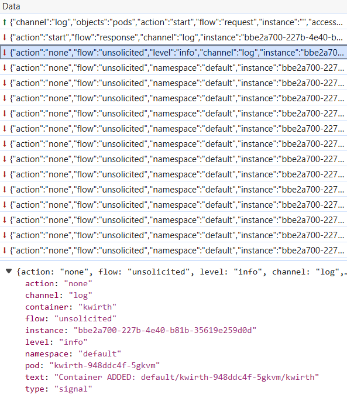

# Data streaming
Kwirth, originally a log exporting system, can export Kubernetes data in real time. In the very first versions only log data was exported from Kubernetes (through Kwirth streaming mechanisms). Starting with version 0.3, Kwirth can also export:

  - Signaling data, that is, events related to contrl of the streams (info messages, error messaes and so on)
  - Metrcis data, that is, Kwirth can export Kubernetes metrics (container related metrics) in real time.
  - Security reports
  - Kubernetes objects related information
  - In general, Kwirth provides a secure way to connnect to a Kubernetes and export information in real-time using data streams over web sockets.

## How it works
As you may know, it's up to Kwirth clients to open connections to Kwirth server, I mean, opening web sockets for requesting data. Opening a websocket from a client to Kwirth is free, there are no security requirements for opening the web socket. Security comes into action once the web socket is open and you want to receive a stream of data, wherever it be log, metrics, alerts, CVE's or anything else. It's important to note that a web socket is a non-dedicated transport, this means that an open web socket can be used to stream different kinds of data. For sending data from server to client in an ordered way, a web socket can be used as a transport for different **services**.

!> A service is a stream of data with a common scope and a common view from a specific channel.

This is waht *scope* and *view* mean:

  - **scope** is a spec of the kind of action you want to perform with the stream of data, for example:
    - View log lines
    - View pod status (obtaining real-time status streamed)
    - Receive metrics in real-time (a stream of metics in real-time)
    - Receive a metrics snapshot (just instant values with no streaming) 
  - **view** means what group of data you want to receive, that is, if your scope states a namespace and group of pods, you can decide what data you want to receive, for example:
    - Receive data for a set of pods (selected, for example, via a regex)
    - Receive data for a whole namespace
  - **channel** is a module inside Kwirth core that extracts data for your selected Kubernetes objects and send it to the client.
    - Each channels implements a specific feature of Kwirth (losg, alert, Trivy, metrics...).
    - Each channel requires some spsecific scopes from the client to send him back information on the objects identified in the view. 

It is important to undertand what a **view** really means:

  - If you use open and start an streaming log service, and your view is set to **namespace**, you will receive a stream of log lines including all the pods in the namespace.
  - Using the same scope, if your view is set to **container** you will receive a stream of log lines that are produced by all the containers that fulfill your scope declaration.

## Messaging
When a client opens a web socket, the next action is to send an 'start instance' message, that is, te client sends a message to the Kwirth server explaining what kind of streaming **service** the client wants to use.

When the server receives a message like that, it performs the following actions:

  - Extracts **access key** in order to evaluate if that access key is suitable for this Kwirth server.
  - If everything is ok, next step is to check if the access key allows client to use the service that the client wants to start (log streaming, for example)
  - If the client is not allowed, a negative response is sent.
  - If the client is allowed, the streaming service is started, sending messages through the web socket according to scope and the channel indentified in the 'start instance' message.
  - Streaming continues until web socket is closed (obiously). 

Streaming data **messages** (log lines, metrics...) contain information relate to the type of data they carry, so one only web socket can be used to receive different kinds of data. On the other side, clients may decide to open a specific web socket for each particular scope or particular kind of data (channel), the server doesn't mind.

A typical 'start instance' would conatin this information:
  - **type** of channel (log, ops, metrics...)
  - **access key**, previously obtained using different methods (manually creating, creating via API...)
  - scope, indicating the action you want to perform (snapshot, stream, view, filter...)
  - the view, indicating how to group streaming data form the objects in scope
  - **the resource spec** (namespace, group, pod, container), that is, several lists of names of objects of these types.
  - specific data for configuring the channel according to the type of service the client is starting, that is, log streaming requires specific configuration that is different from the one used in metrics streaming.

## Channels
These are some samples of channels (they're explained in the Channels section).

### Log Cannel
Log streaming means receiving log data streams at client that are originated at a set of resurces (or an individual one).

A typical 'log start instance' message for receiving all log lines originated at 'production' namespace would be created like this (Typescript sample):

```javascript
var logConfig:LogConfig = {
    type: ServiceConfigTypeEnum.LOG,
    accessKey: 'my-access-key',
    scope: 'view',
    view: 'namespace',
    namespace: 'production', 
    group: '',
    pod: '', 
    container: '',
    timestamp: true,
    previous: false,
    maxMessages: 5000
}                
ws.send(JSON.stringify(logConfig))
```

If everything is ok, the Kwirth server would start sending log messages. What follows is a stream of JSON messages sent by the websocket



### Metrics channel
Metrics streaming means sending resource metrics from server to client.

!> When talking about 'resource metrics' it is very important to note that metrics can be aggregated according to 'start instance' message indications on resource.

A typical metrics 'start instance' for receiving a stream of data about pod 'shopping-cart' would be created like this (Typescript sample):
```javascript
var metricsConfig:MetricsConfig = {
    type: ServiceConfigTypeEnum.METRICS,
    interval: 60,
    accessKey: 'my-access-key',
    scope: 'stream',
    view: 'pod',
    namespace: 'staging',
    group: '',
    pod: 'shopping-cart',
    container: '',
    mode: MetricsConfigModeEnum.STREAM,
    metrics: ['container_fs_writes_total','container_fs_reads_total']
}
ws.send(JSON.stringify(metricsConfig))
```

### Signaling
When a stream of data is open, clients may receive information on that stream related with the events that occur in Kubernetes and impact the resources in scope, for example, new pods created, pods deleted, streaming errors, etc...

What follows are several sample signal messages that could be received at client side.


Instance config has been accepted by server.
```json
{
  "action": "start",
  "flow": "response",
  "channel": "log",
  "instance": "bbe2a700-227b-4e40-b81b-35619e259d0d",
  "type": "signal",
  "text": "Instance Config accepted"
}
```

Container added to stream:
```json
{
  "action": "none",
  "flow": "unsolicited",
  "level": "info",
  "channel": "log",
  "instance": "bbe2a700-227b-4e40-b81b-35619e259d0d",
  "type": "signal",
  "namespace": "default",
  "pod": "kwirth-948ddc4f-5gkvm",
  "container": "kwirth",
  "text": "Container ADDED: default/kwirth-948ddc4f-5gkvm/kwirth"
}
```

As you may see, every message contains a signal category, like 'info', 'warning', or 'error'. Typical Kubernetes events, like pod creating, pod deletion, etc., belong to the 'info category'.
