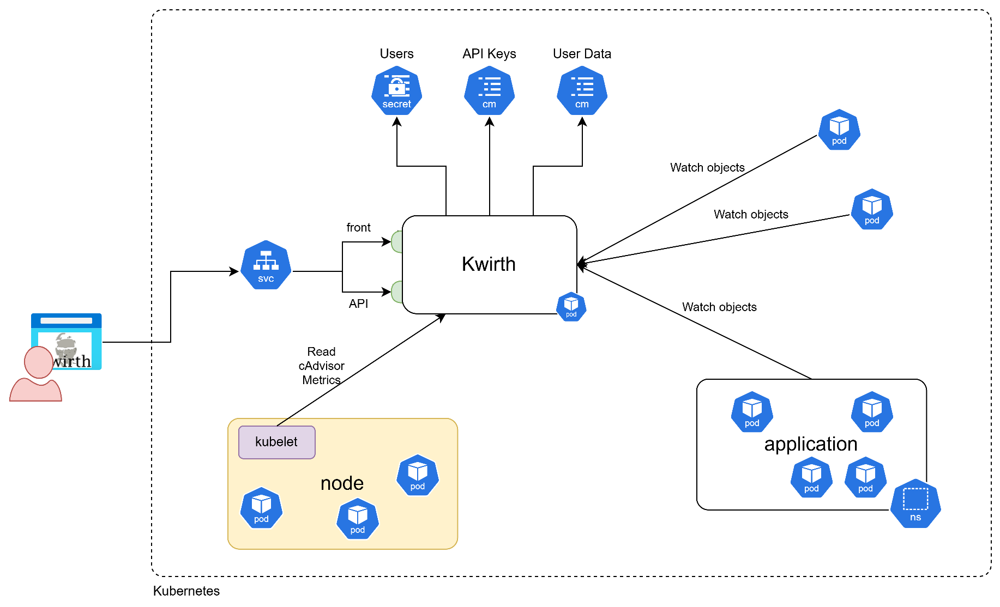
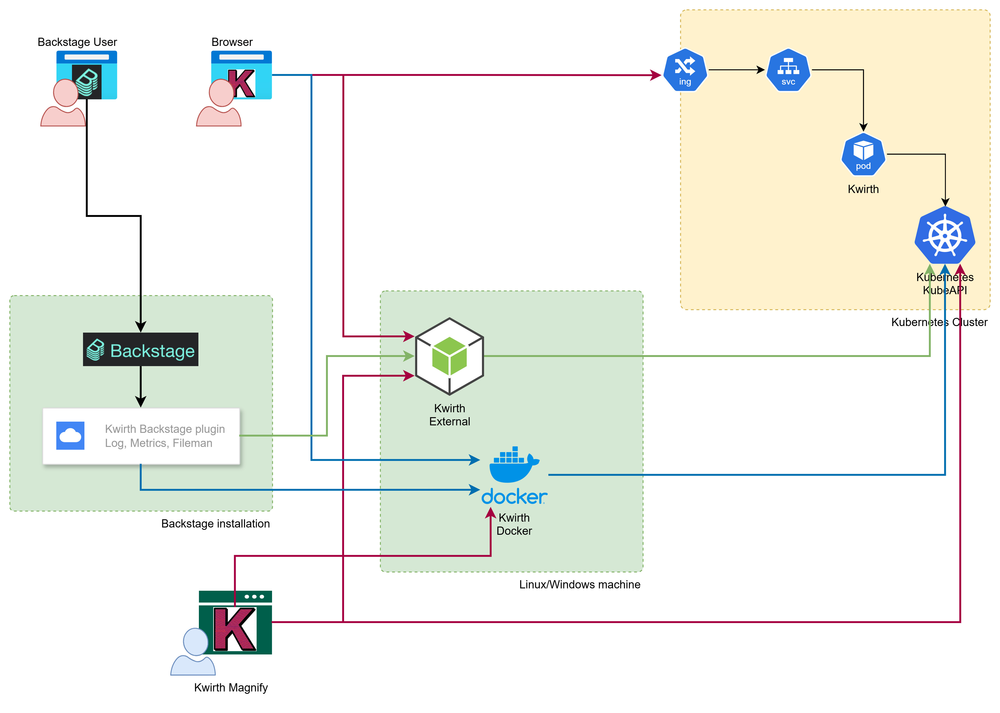

# How it works
Basically, Kwirth receives object information from objects that live in one or more Kubernetes clusters in real-time, and with the data received you can do several thinks depending on your role.

  - Kwirth can be used on Operations areas for detecting exceptional situations.
  - A Security team (a SOC) can also configure alerts on messages received from the source logs.
  - Devops teams can view real-time metrics of kubernetes clusters under control.
  - It can also be used by development teams for reviewing logs of the services deployed to the cluster.

# Kwirth Kubernetes Architecture
As we said before, Kwirth needs just one pod **with no persistence** for running (yes, you don't have to deal with PV's PVC's, NFS, CIFS, local disks and so on). Kwirth stores its identity objects (users) in Kubernetes secrets, that is: **in etcd**. In addition, all user configuration is also stored in config maps, so, **etcd** again.

What follows is a self-explaining architecture of a typical deployment of Kwirth.

# Kwirth deployment options
As of Kwirth 0.5.21 Kwirth can be installed/deployed in several different ways:

  - Kubernetes (explained above)
  - Docker: You can run Kwirth as a Docker container, it is in fact the same docker image you would use for Kubernetes depolyment.
  - External (standalone): If you want to run Kwirth as a standalone service on a host, you can download the binary and run it directly. It will look for your local Kubernetes configuration automatically.
  - Desktop Application

### Desktop
There currently exist two flavours of Kwirth Desktop:

  - **Windows version**
  - **Linux version** (FUSE-compatible)

Kwirth Desktop is an Electron application whose login page is specifically designed for local work (the same you would do with Lens, K9s, or Headlamp). Therefore, Kwirth Desktop does not connect to a specific Kubernetes cluster by default; instead, it shows the user all the contexts available in their local `kubeconfig` file.

!> Please refer to **architectural discussions** on the best way to consume Kwirth data-streams.

# The Kwirth family
What follows is an architectural view of the different ways you can deliver Kwirth capabilities according to your different needs and architecture.

## The ideas:
  - **There exist mainly 2 fronts:**
    - **Web browser**: Access the Kwirth UI from any browser once the backend is deployed.
    - **Magnify**: A native Desktop installation for Windows or Linux specifically designed to use the Magnify channel as a standalone management tool.
  - **There exist several backend options:**
    - **A Node.js application**: A standalone installation (with or without the built-in frontend).
    - **A Docker deployment**: Containerized setup (with or without the frontend) created for serving Kwirth data-streams from **outside your Kubernetes cluster**.
    - **A Kubernetes deployment**: Using manifests or Helm charts to serve data-streams directly from **INSIDE** your Kubernetes cluster.

There exist no functional differences between these options; however, performance is significantly better when accessing the Kube API server from within the cluster (Kwirth Kubernetes Deployment) compared to accessing it from **OUTSIDE** (Magnify, Docker, or External) due to network latency and authentication overhead. Feel free to try them out and ask us for recommendations!

