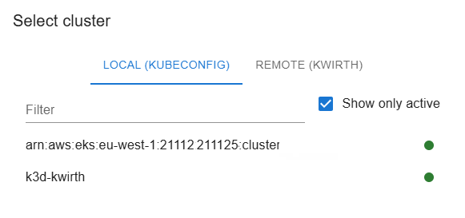
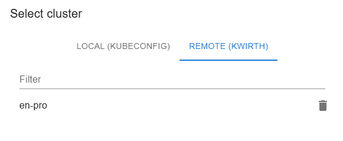

# Kwirth
Kwirth is the final implementation of the idea of having a simple way to manage logging, metrics, and other observability information inside a Kubernetes cluster. Maybe you feel comfortable with your DataDog or your Grafana and the Loki and the Promtrail, or the Prometheus stack, or a full ELK stack. But maybe these (and other tools) are too complex for you, or maybe you just need a **simple realtime observability tool**.

If this is the case, **Kwirth is the answer to your needs**. Just *one pod to access all the observability you need* from your main Kubernetes cluster, or even **consolidate observability information from different clusters**. When we say 'observability' we mean 'logging', 'metrics', 'alerts', 'signals', etc.

You can access the source code [**HERE**](https://github.com/jfvilas/kwirth).

## Get started
Kwirth can be easily deployed using Kubernetes manifests or a Helm chart.

#### Manifests
Yes, **one only command**, just a simple 'kubectl' is enough for deploying Kwirth to your cluster.

```bash
kubectl apply -f https://raw.githubusercontent.com/jfvilas/kwirth/master/test/kwirth.yaml
```

#### Helm chart
Helm is even more simple:

```bash
helm repo add kwirth https://github.com/jfvilas/kwirth/tree/master/deploy/helm
helm install kwirth kwirth/kwirth -n kwirth --create-namespace
```

#### Other ways to deploy Kwirth
As of Kwirth 0.5.21 Kwirth can be installed/deployed in several different ways:

  - Kubernetes (explained above)
  - Docker
  - External (standalone)
  - Desktop Application

##### Docker
To run Kwirth as a Docker container, you can use the following command, ensuring you mount your kubeconfig file so Kwirth can interact with your cluster:

```bash
docker run -d -p 3883:3883 \
  -v ~/.kube/config:/root/.kube/config \
  --name kwirth kwirthmagnify/kwirth:latest
```

##### External
If you want to run Kwirth as a standalone service on a host, you can download the binary and run it directly. It will look for your local Kubernetes configuration automatically:

Install with 'npm' (you need a NodeJS installation at recommended V24, although Kwirth can work with V22 and V20)
```bash
npm i -g @kwirthmagnify/kwirth-external
```

Get some help with `kwirth-external --help`, and launch it just typing:
```bash
kwirth-external start --front
```
!> The `--front` is optional, adding it to your command ensures Kwirth server servers front and API.

##### Desktop
There currently exist two flavours of Kwirth Desktop:

  - **Windows version**
  - **Linux version** (FUSE-compatible)

Kwirth Desktop is an Electron application whose login page is specifically designed for local work (the same you would do with Lens, K9s, or Headlamp). Therefore, Kwirth Desktop does not connect to a specific Kubernetes cluster by default; instead, it shows the user all the contexts available in their local `kubeconfig` file. Cluster status and availability will be refreshed automatically, as shown in the following image:



If you want to connect to a cluster using any other type of Kwirth installation (like Docker, External or Kubernetes), you can add as many clusters as you want in the 'Remote cluster' selection.



!> Please refer to **architectural discussions** on the best way to consume Kwirth data-streams.

For installing a Linux "AppImage" or the Windows MSI, please [follow this link](https://github.com/kwrithmagnify/kwirth/releases) to the GitHub releases page of the project. Kwirth Desktop just needs to be installed as a regular application; no special permissions or actions are needed.

## Access Kwirth (Kubernetes)
If everything is ok, in no more than 8 to 10 seconds Kwirth should be **up and running**. So next step is to access the front application of your fresh new Kubernetes observability system. Several options exist here...

1. You can access just using **command line port forwarding**:
    ```bash
    kubectl port-forward svc/kwirth-svc 3883
    ```

2. **Using the port forwarding** option of your favorite Kubernetes management tool, like Lens, Headlamp, K9S, etc... (etc was not a Kubernetes tool when I wrote this article ;) ).

    - With Headlamp...
      
      

    - With Lens...

      

    - With K9S. Just select the Kwirth pod and press **Caps+F**, then just accept (or change) the port sugegstions from K9s and navigate...

      


3. **Using an Ingress**. It is the best option if you plan to access your Kwirth from Internet and if you also plan to share Kwirth with the development team in your corporate private network. For publishing Kwirth to be accessible from outside the cluster, you must create an Ingress (be sure, you need to deploy an ingress controller before, you have info on how to perform a simple ingress installation [**HERE**](https://jfvilas.github.io/oberkorn/#/ingins)).

    It is a pending job to enable Kwirth to listen in a non-root path, so you could share the Ingress object with other applications, but for the moment Kwirth only works at root path. Next sample is for publishing external access like this (of course, you can rewrite the target URL's in your reverse-proxy or in the Ingress, stripping part of the local path).

    ```yaml
    apiVersion: networking.k8s.io/v1
    kind: Ingress
    metadata:
      name: ingress-kwirth
      namespace: default
    spec:
      ingressClassName: nginx
      # if you want to publish Kwirth securely you would need to add something like this:
      # tls:
      # - hosts:
      #   - www.kwirth-dns.com
      #     secretName: www.kwirth-dns.com.tls
      rules:
      - host: localhost
        http:
          paths:
            - path: /kwirth
              pathType: Prefix
              backend:
                service:
                  name: kwirth-svc
                  port:
                    number: 3883
    ```
    NOTE: You can **change the path** where to publish Kwirth, it is explained in [installation section](installation?id=installation).

## Access Kwirth (Docker and external)
Kwirth External is a standalone deployment of Kwirth that you can start locally inside your Linux/Windows/Mac.

Once installed, you can access kwirth directly and easily from a browser at: http://localhost:3883

Depending on the options you used when starting Kwirth External you may need to change the port or access a specific path, for example: http://localhost:3885/kwirth.

Please review configuration and start options [here](./installation?id=Docker%20&%20External).
