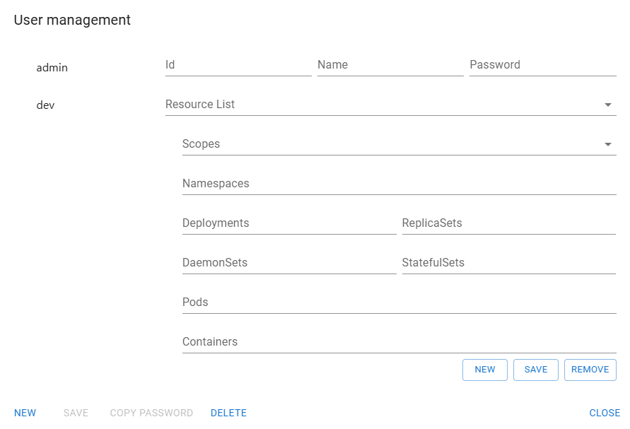

# User management
User management is easy and self-explaining.

There exist always an user named 'admin', the one you used when first entering Kwirth. This 'User management' tool allows you to create new users and assign them some permissions. There exist no integration with any IAM system... yet.

## Create a user
If you need users with specific roles and permissions yo can create it very easily:

1. From the main Kwirth app got to the burger and select "USer management"
2. Click on New to create a new user.
3. Enter user data
   - Id of the user (this will be used for logging in).
   - Name of the user (for your reference)
   - Password
4. Add resources that the user will be abble to access. This is a list, you can add different resources and permissions.
   - Click New (on right side)
   - Select a scope ('cluster' is admin scope)
   - Select namespaces to restrict to, or leave it blank (if blank, the user would be able to access all namespaces). You can add namespaces and namespace regexes separated vy a comma (',').
   - Do the same for controllers, pods and containers.
   - Once the resource is ready click on save (right side) to add the resource premission to the list of resources.
5. Add as many resources as you need.
6. Click on SAVE (left side), this will effectively add the user to Kwirth.

That's all!
