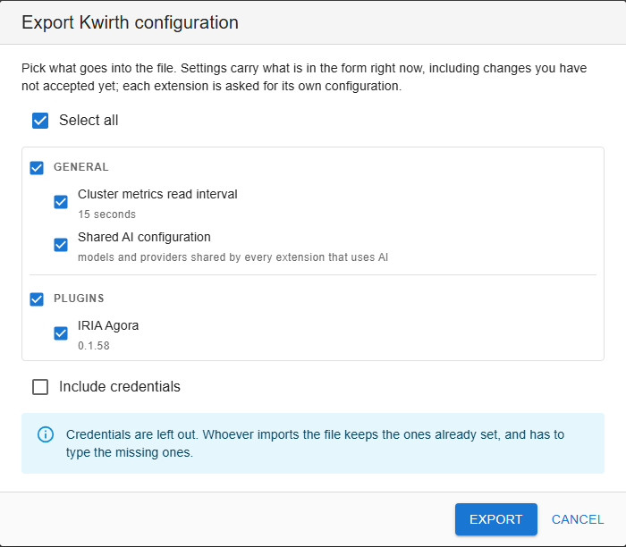

# Configuration portability

Standing up a kwirth is quick. Leaving it **configured** is not: marketplaces and registries with their
credentials, a dozen installed extensions, the recipients of every sender, your IdP instances, the AI
toolset grants, the alert rules of one plugin, the rooms of another. Configuration portability lets you
put all of that in **one file** and bring it up in a different kwirth.

It is meant for four situations that come up in practice:

- **Promoting between environments.** What you tuned on the test cluster has to be repeated, click by
  click, on production — and every repetition is a chance for the two to drift apart.
- **A new cluster.** An organisation running several clusters wants the same kwirth on all of them.
- **Recovery.** Lose the namespace and you lose the configuration. The artifacts can be reinstalled from
  the marketplace; what was inside them cannot.
- **Support and demos.** Reproducing somebody's installation, or handing over a preconfigured one.

## What it is not

- **It is not synchronisation.** It is a one-off copy that somebody triggers and reviews, not two kwirth
  instances keeping themselves in step.
- **It is not a backup.** No working data travels: no messages, no findings, no history, no workspaces.
- **It is not an installer.** It configures the extensions already installed; it never installs one.
- **It does not clone access.** API keys and users stay out, so the destination keeps its own identity. A
  stolen file opens no doors.
- **It does not migrate between versions.** The file records the version it came from and kwirth warns
  you when it differs; transforming the content is up to the extension, if it does it at all.

## Why the core cannot do this alone

This is the one idea that explains every other decision on this page:

!> **The core does not know where an extension keeps its configuration, and it cannot know.**

Some of it does live in storage the core manages. But plugins with a back end of their own keep theirs
wherever they like, and the larger ones keep it **in their own database** — where configuration and
working data sit side by side, and only the plugin knows which is which:

| Plugin | In its database, **configuration** | In the same database, **data** |
|---|---|---|
| A security scanner | its alert rules, its cloud mappings | its findings, its alert history |
| A collaboration plugin | its rooms, members and invitations | its messages, its receipts |

No heuristic in the core separates those. So the split is:

| Who | Decides |
|---|---|
| **The extension** | What counts as *its own* configuration, what it exports, and — when importing — what it keeps and what it discards |
| **The core** | Nothing about that. It contributes only **what it stores itself**, collects the rest, writes the file, and at the other end hands each recipient its part |
| **You** | Which entries travel, both when exporting and when importing |

For the configuration it holds, the core is **transport, not authority**. It does not interpret an
extension's content, decide whether something replaces or merges, or install anything.

### The core does hold part of it

Not everything an extension is configured with belongs to the extension. A good deal of it is kept by
the core, and the extension never even sees it:

| What | Who keeps it |
|---|---|
| A sender's or webhook's **send configurations** | the core |
| An identity provider's **configured instances** | the core |
| An AI toolset's **grants** | the core |
| A plugin's or provider's **installation configuration** | the core |
| Anything the extension stores on its own | the extension |

A sender cannot list its own configurations, and an IdP connector cannot enumerate its instances — one
connector can have several, and each instance points at the connector, not the other way round. So the
core exports those itself, and the extension is not asked.

The upshot is that **almost every extension has something to export from day one**, with no work from
its author. `IExtension` is what lets the ones that *also* keep things of their own — in their own
database, in their own store — join in too, and then both halves travel together.

## Exporting

**Settings → Kwirth → Export.** You get one list with everything that can travel, all ticked:

- **Settings** — metrics interval, marketplaces, package registries. These carry **what is on the form
  right now**, including changes you have not accepted yet.
- **Shared AI configuration** — models and providers. This belongs to no single extension (several share
  it), so it is an entry of its own.
- **One line per installed extension**, with its version and where it came from.

The result is a readable JSON file, `kwirth-config.json`, that you can review, keep in a repository, or
edit by hand before importing it.



The list is grouped in blocks — the core settings first, then one block per extension type — and each
block header ticks or unticks its own block.

### Extensions you cannot tick

Rare, since the core contributes what it keeps about each extension, but it happens. Those lines appear
greyed out with a reason next to them — a short list with no explanation would be worse than a declared
gap:

| What you see | What it means |
|---|---|
| *this extension cannot export its configuration yet* | It is installed, but it has not adopted the contract. Nothing of it goes in the file. |
| *not running here, so there is nothing to ask* | Installed, but with no live instance to ask. Channels are only instantiated when they are needed, and never when they are announced as remote. |

?> Because of the second one, **exporting from a kwirth in use produces a more complete file** than
exporting one that has just started and has not been touched.

## Credentials

The **Include credentials** box is **unticked by default**, and that is on purpose: the file lands in
somebody's downloads folder.

- **Unticked** — secret fields travel **empty**, not missing. The destination can therefore tell you
  which ones need filling in.
- **Ticked** — tokens and passwords are written in clear text. The file declares in its metadata that it
  carries them, so whoever opens it later knows what they are holding. Treat it as a secret.

## Importing

**Settings → Kwirth → Import**, pick the file, and before anything is touched kwirth shows you **what
each line would do**:

| Status | What happens |
|---|---|
| ready | It will be applied |
| *file says X, installed is Y* | It will be applied, but the versions differ — worth a look |
| *not installed here* | Skipped. The core does not install anything |
| *installed, but it cannot import configuration yet* | Skipped |
| *not running here* | Skipped |

Then you tick what you want and press Import. Three rules govern what follows:

1. **Nothing is saved until you press OK** on the settings dialog. Importing loads the settings into the
   form and queues the extensions; OK is what writes both. Cancel and nothing happened.
2. **A line that cannot be applied does not stop the others.** You get a report at the end saying what
   went in and what did not.
3. **Each extension decides what to do with its part.** Whether an imported room replaces the one already
   there, or a rule that references something missing is dropped with a warning, is the extension's call
   — not kwirth's.

!> The core **never installs** an extension during an import. Installing would mean reaching a
marketplace, resolving licences and waiting for restarts in the middle of another process. If the file
mentions something you do not have, install it yourself and import again.

## For extension developers

An extension joins in by implementing **`IExtension`**, from `@kwirthmagnify/kwirth-common-back`. Both
methods are **optional**: an already published extension keeps working untouched, and adopts the contract
whenever its author gets to it.

```ts
export interface IExtension {
    exportConfig?(options: IExtensionExportOptions): Promise<unknown>
    importConfig?(config: unknown): Promise<IExtensionImportResult>
}
```

`IChannel`, `IProvider`, `ISender`, `IWebhook` and `IIdpConnector` all extend it, so whatever you are
building, the two methods are already there for you to fill in.

### What to put in, and what to leave out

This is the part only you can get right:

- **In:** what somebody composed by hand and would hate to redo — rules, named configurations, mappings.
- **Out: working data.** Anything your extension accumulates on its own.
- **Out: what belongs to this installation.** An "auto-start on boot" flag is a local preference, not
  part of the configuration.
- **Out: what is not yours.** If you write to the shared store, that content belongs to everybody; the
  core exports it as its own entry.

### Two obligations

- **Validate.** What arrives may come from another cluster and may have been edited by hand. Do not trust
  the shape, and do not assume the users, namespaces or resources it references exist here.
- **Be idempotent.** Importing what you yourself exported must change nothing. Upserting by a stable key
  is usually enough.

### An example

```ts
exportConfig = async (): Promise<unknown> => {
    const configs = await this.backChannelObject.readStorage!('my-configs', false) ?? []
    return { configs }
}

importConfig = async (data: unknown): Promise<IExtensionImportResult> => {
    const incoming = (data as { configs?: unknown })?.configs
    if (!Array.isArray(incoming)) return { applied: 0, skipped: 0, warnings: ['no configs in the file'] }

    const current = await this.backChannelObject.readStorage!('my-configs', false) ?? []
    const warnings: string[] = []
    let applied = 0, skipped = 0

    for (const raw of incoming) {
        const cfg = raw as IMyConfig
        if (!cfg?.name) { skipped++; warnings.push('a config without a name was discarded'); continue }
        const idx = current.findIndex(c => c.name === cfg.name)
        if (idx >= 0) current[idx] = cfg
        else current.push(cfg)
        applied++
    }

    await this.backChannelObject.writeStorage!('my-configs', false, current)
    return { applied, skipped, warnings }
}
```

The `warnings` are the only thing kwirth can tell the user about your content, so use them: say what you
discarded and why, and flag anything that was applied but references something missing.

?> Implementing only one of the two is not useful: an extension that exports and cannot import produces a
file nobody can use. Do both, or neither.

## The API

Everything above is available over HTTP, which is what makes this usable from a deployment pipeline. All
four routes need an admin key.

| Route | What it does |
|---|---|
| `GET /core/config-bundle/exportable` | What can be exported and the status of each entry |
| `GET /core/config-bundle/export?include=…&credentials=…` | The file. `include` is a comma-separated list of entry keys; omit it for everything |
| `POST /core/config-bundle/preview` | What an import would do. Touches nothing |
| `POST /core/config-bundle/import` | Applies it. Body: `{ bundle, include? }` |

An entry key is `<type>/<id>` — `plugin/censor`, `sender/email` — plus `core/settings` and
`core/sharedAi`.

### The file

```json
{
  "kind": "kwirth-config-bundle",
  "formatVersion": 1,
  "meta": {
    "exportedAt": "2026-09-21T10:14:00.000Z",
    "kwirthVersion": "0.6.31",
    "includesCredentials": false
  },
  "core": { "settings": { }, "sharedAi": { } },
  "extensions": [
    { "type": "plugin", "id": "censor", "version": "0.1.4", "config": { } }
  ]
}
```

`formatVersion` is the version of the **envelope**, not of the content. An older kwirth reading a newer
file says it cannot read it, instead of applying half of something it does not understand.

?> Files exported by earlier versions of kwirth, which carried settings only (`"kwirth":
"kwirth-settings"`), are still accepted on import.
