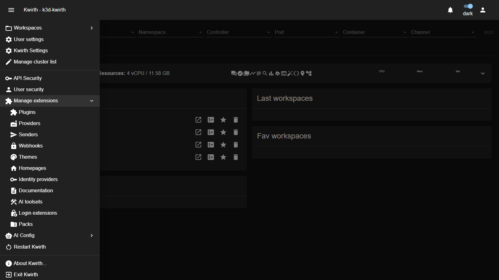
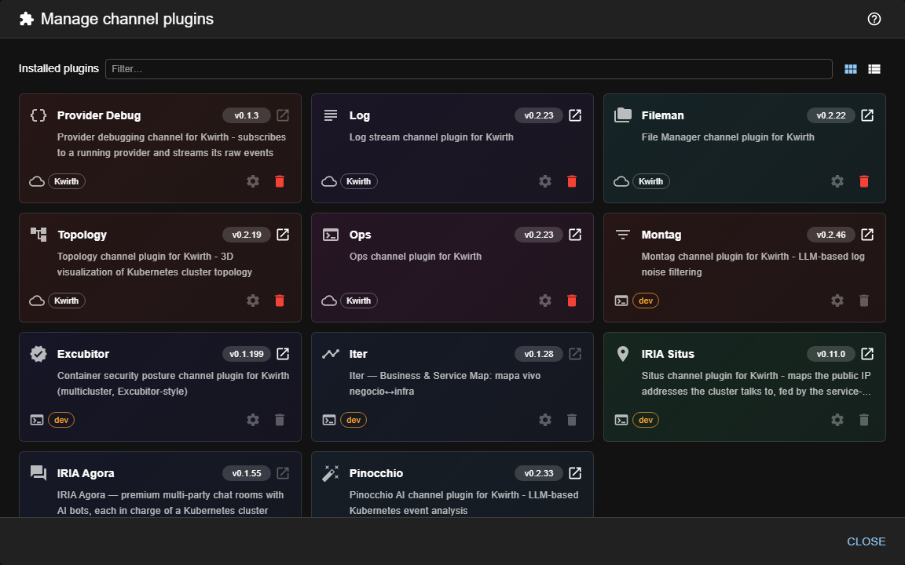

# 8. Extending kwirth

Almost everything in kwirth is an **extension**. Channels, data sources, alert destinations, the look and feel, even the login providers — all are packaged units you install, configure and enable from one place, and **most of them take effect immediately**. A few need the core restarted, and they say so: see [When a restart is needed](#when-a-restart-is-needed).

## Extension families

| Family | What it is | Manuals |
|---|---|---|
| **Plugins** | The **channels** — Log, Metrics, Alert, Ops, Fileman, Trivy… | [Plugins](../extensions/index) |
| **Providers** | **Data sources** that feed channels (metrics, events, kafka, otel…). | [Providers](../extensions/index) |
| **Senders** | **Destinations** for output (console, file, email, Teams…). | [Senders](../extensions/index) |
| **Themes** | Visual **appearance** of the UI. | [Themes](../extensions/index) |
| **Homepages** | Custom **landing dashboards**. | [Homepages](../extensions/index) |
| **Identity providers** | **SSO connectors** (Google, GitLab, GitHub). | [IdPs](../extensions/index) — see also [IdP integration](07-idp-integration) |
| **Login extensions** | Custom **branded login pages** with per-extension channel enforcement. | [Login extensions](../extensions/logins/index) |
| **Webhooks** | **Inbound HTTP endpoints** that feed external events into kwirth. | [Webhooks](../extensions/webhooks/index) |
| **Documentation** | **Docsify sites** served by kwirth itself (this guide is one). | [Documentation packages](../extensions/docs/index) |
| **AI toolsets** | Groups of **tools** an LLM can call from an AI-enabled channel. | [AI toolsets](../extensions/aitoolsets/index) |
| **Packs** | **Bundles** of multiple extensions installed in one shot. Members cannot be removed individually. | [Packs](../extensions/packs/index) |

Each **individual** extension has its own user + admin manual in [Part III](../extensions/index).

## Where to manage them

All families live under **☰ → Manage extensions**:

Pick a family (e.g. **Plugins**) to open its **manager**.

## The manager (same pattern everywhere)

Every family uses the same manager UI, so once you learn one you know them all:

| Element | What it does |
|---|---|
| **Installed *(family)*** | The extensions currently installed, each with its **name**, **version** and a short **description**. |
| **Origin chip** (left) | Where this copy came from: a **cloud** icon for the public catalog, a **padlock** for a private marketplace (the chip names it), or **`dev`** for one loaded from a local development build. |
| **State chips** (right) | What the extension has *now* rather than where it came from — for example **`N configs`** when it holds several named configurations, or **`via pack`** when a pack owns it. |
| **Filter** | Narrow the list by name. |
| **Card / List view** | Toggle between card grid and compact list. The list view is the one to use when you have many of a family: same information, one row each. |
| **Per-item icons** | **Open website**, **Settings ⚙** and **delete/uninstall** (🗑). |
| **Settings ⚙** | Opens whatever *that* extension declares: a typed form, a list of named configurations, a free JSON editor, or a UI the extension brings itself. **The gear is greyed out when the extension has nothing to configure** — and its tooltip says so, instead of opening an empty dialog. |
| **Install *(family)*** | Add a new one: paste a package **URL** and download it, or **BROWSE…** for a local package file. |
| **Available *(family)*** | A browsable catalog of extensions you can install with one click. Already-installed ones are marked as such. |

> **When an extension needs another one.** Some extensions declare what they **require** (for example a plugin
> that only works with a given provider) and what they merely **use**. The manager resolves those against what
> you actually have installed and shows them on the card, so a plugin that will not work until you install its
> provider says so *before* you wonder why it does nothing.

## Install, configure, remove

1. **Install** — from **Available** click an item, or paste its URL / **BROWSE…** a file under **Install**.
2. **Configure** — click **⚙ Settings** on the card. What opens depends on what the extension declares: a **typed form** (one set of fields), a **list of named configurations** (several destinations, several accounts — with a shared *base configuration* when the extension has settings common to all of them, and export/import to carry them to another kwirth), a **JSON editor**, or a **UI the extension provides itself**. If the gear is **greyed out**, that extension has nothing to configure — it is not a failure. Configuration (including secrets, shown masked behind an eye toggle) is stored in Kubernetes secrets/configmaps.

   Two things you will meet in that typed form:

   - **TEST** — some extensions know how to **check their own configuration**, and then the form offers a
     test button. It sends **what you have typed**, without saving it: you find out whether the credentials
     work *before* committing them, and you can correct and retry without leaving the dialog. The answer is
     the extension's own words — *"Authenticated. 3 subscription(s) in scope"*, or exactly what the provider
     complained about. If an extension only knows how to check what is **already saved**, the button says so
     and asks you to save first. No test button means that extension does not offer the check; it says
     nothing about whether your configuration is right.
   - **Fields that take several values** are a dropdown with **checkboxes**: tick as many as you need and the
     field shows them separated by commas. When the extension can find out the valid values it fills the list
     for you — the Azure provider, for instance, offers the regions of your own subscription — and when it
     cannot (no credentials saved yet), the same field falls back to free text, so what you type by hand
     still counts.
3. **Enable / disable** — many extensions have an enabled toggle in their settings; disabled ones stay installed but inactive.
4. **Remove** — click the delete icon on the card.

> **Channels are plugins.** Installing a plugin is exactly how you add or remove the channels users see in the [resource selector](../user/04-selecting-resources). Install the Log plugin and the **Log** channel appears; remove it and it's gone.

> **`dev` mode.** Extensions shown with a **`dev`** badge are being loaded from a local development build rather than a published package — useful while authoring an extension.

> **Pack-owned extensions.** Extensions installed via a pack show a **`via pack`** badge and have their uninstall button disabled. To remove them, uninstall the parent pack from **☰ → Manage extensions → Packs**.

## When a restart is needed

Most extensions are live the moment you install them. Some are not, and **kwirth tells you**: the extension declares `requiresRestart`, and the manager prompts you after installing, updating or removing it. **Take the prompt seriously** — the extension is installed but not yet running.

**Why.** Installing writes the extension's files and registers it. What it cannot do is reach into a server that is already running and add things to it. Two kinds of extension are affected:

- **Anything that owns an HTTP route** — a provider with its own ingestion endpoint or its own configuration endpoint. The core wires routes into its web server while it starts up.
- **Anything that opens a listener** — a provider bound to a UDP or TCP port, for instance. That happens when the provider is instantiated, which the core also does at startup.

**What it looks like if you skip the restart.** Nothing is corrupt, and nothing needs reinstalling — the extension is simply not wired in yet:

| Extension | Symptom |
|---|---|
| a provider with a configuration endpoint | its **⚙ dialog answers `HTTP 404`** on every action — for example `Failed to create key: Error: HTTP 404` |
| a provider with an ingestion endpoint | whatever pushes to it gets a **404**, so nothing arrives |
| a provider that listens on a port | **the port is not open** and nothing says so — the quietest of the three |

Restart the core and it works. A useful distinction while diagnosing: a **404** means the route is not mounted, while a **403** means it *is* mounted and your accessKey was rejected — two very different problems.

## Developing your own

This guide covers *using and administering* extensions. If you want to **build** one (a new channel, provider, sender, theme or IdP connector), see the reference developer documentation ([Developing plugins](../../plugins/developing), [providers](../../providers/developing), [senders](../../senders/developing)).

---

That completes Part II. For a per-extension reference — what each plugin, provider, sender, theme, IdP and homepage does and how to configure it — continue to **[Part III — Extension manuals](../extensions/index)**.
