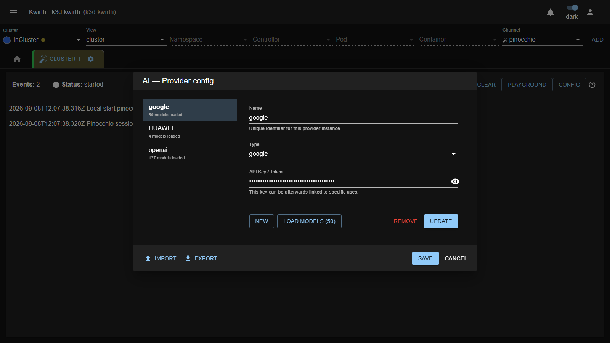
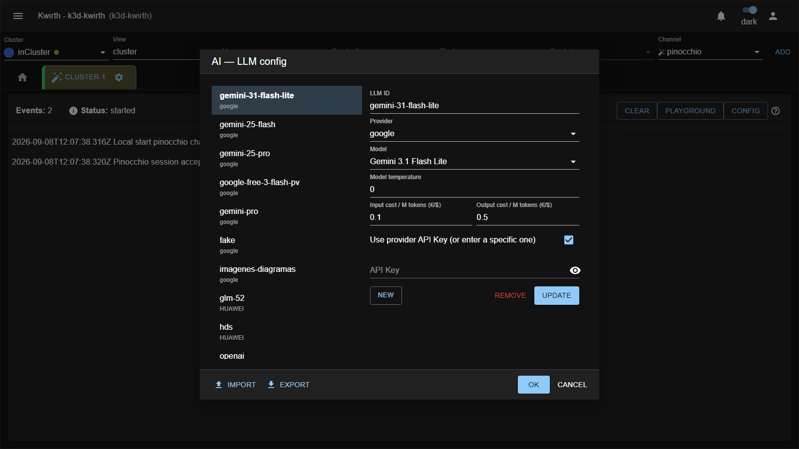

# Providers y modelos de IA

Esta es la configuración que hay que resolver **antes** de que Pinocchio sirva para algo. Y lo primero que
hay que entender es que **no es configuración de Pinocchio**.

## La configuración de IA es de kwirth, no del plugin

Pinocchio no guarda sus propios providers ni sus propios modelos. Los lee del **almacén común de kwirth**,
compartido con todos los demás plugins que usan IA:

| Qué | Clave | Dónde |
|-----|-------|-------|
| Providers (con las API keys) | `kwirth-ai-providers` | **Secret** de Kubernetes |
| LLMs | `kwirth-ai-llms` | **ConfigMap** de Kubernetes |

Las consecuencias prácticas son tres:

1. Si ya configuraste un provider para otro plugin, **Pinocchio lo ve**. No hay que repetir nada.
2. Si lo configuras desde Pinocchio, **lo verán los demás**. Los diálogos del grupo *AI* del menú Config
   (*AI providers* / *AI models*) son literalmente los mismos componentes comunes
   (`AiConfigProvider` / `AiConfigLlm`) que usa el core en sus menús *AI Providers* / *AI Models*.
3. Las claves viven en un **Secret**, no en un ConfigMap. Quien tenga permiso de lectura sobre los Secrets del
   namespace de kwirth puede leerlas.

## Provider

Un *provider* es una cuenta contra un proveedor de IA: el adaptador y la clave.

| Campo | Qué es |
|-------|--------|
| `Name` | Identificador libre de **esta** instancia de provider (`openai-prod`, `huawei-maas`). Es lo que referencian los LLMs. |
| `Type` | El adaptador de SDK. Lista cerrada: `google`, `openai`, `openrouter`, `mistral`, `groq`, `deepseek`, `anthropic`, `openai-compat`. |
| `API Key / Token` | La credencial. Campo de contraseña con botón de ojo para revelarla. |
| `Base URL` | **Sólo para `openai-compat`.** La URL base de la API compatible con OpenAI (Huawei MaaS, vLLM, LM Studio…). Debe apuntar a la raíz; el adaptador añade `/v1` si falta. |



Al elegir un `Type`, si el nombre está vacío se rellena solo con el tipo. **Déjalo así salvo que tengas una
razón** — ver la advertencia del final de la página.

**Load models** consulta al proveedor el catálogo de modelos disponibles y lo cachea en el provider. La
llamada la hace el **core** de kwirth (`POST /core/aiconfig/loadmodels`), no el plugin, porque es el core
quien tiene los adaptadores de cada SDK. Si el botón no aparece o falla, revisa que la clave sea válida.

Sin modelos cargados, el provider aparece **deshabilitado** en el desplegable del diálogo de LLM.

> ⚠️ El botón **Export** de este diálogo descarga `kwirth-providers.json` **con las API keys en claro**.
> Trátalo como un secreto: no lo subas a un repositorio ni lo mandes por correo.

## LLM

Un *LLM* es un modelo concreto de un provider concreto, con sus parámetros. Es lo que referencian los
triggers, por su `LLM ID`.

| Campo | Qué es |
|-------|--------|
| `LLM ID` | El identificador que usarán los triggers. **Elígelo con cuidado**: es lo que viaja en un export de triggers. |
| `Provider` | Uno de los providers configurados. Sólo se pueden elegir los que tienen modelos cargados. |
| `Model` | Desplegable con los modelos cargados del provider; si el provider no tiene catálogo, se convierte en una caja de texto libre. |
| `Model temperature` | Temperatura. ⚠️ Pinocchio la **recorta al rango 0–1** antes de llamar al modelo. |
| `Input / Output cost / M tokens` | Coste informativo por millón de tokens. No lo usa el motor: es para que puedas calcular la factura. |
| `Use provider API Key` | Si está marcado, usa la clave del provider. Si no, puedes darle una clave específica a este LLM. |



Para análisis de seguridad, **temperatura baja** (0 – 0.2). Lo que quieres es un auditor consistente, no uno
creativo.

## Salida estructurada: no todos los modelos valen

Los triggers de tipo `artifact` exigen al modelo una respuesta que cumpla un esquema JSON estricto. Un modelo
pequeño o antiguo que no soporte *structured output* fallará sistemáticamente, y lo verás como un análisis con
dos findings `critical` y el error del proveedor.

Pinocchio añade opciones específicas por proveedor para que esto funcione:

| Proveedor | Opciones que envía |
|-----------|--------------------|
| `google` | `{ google: { structuredOutputs: true } }` |
| `groq` | `{ groq: { structuredOutputs: true } }` |
| `mistral` | `{ mistral: { strictJsonSchema: true, structuredOutputs: true } }` |
| cualquier otro | `{ openai: {} }` |

> ⚠️ **Gotcha importante.** Esa tabla se elige por el **`Name`** del provider, no por su `Type`. El modelo
> sí se construye correctamente por el tipo, pero las opciones de salida estructurada no.
>
> Es decir: un provider de tipo `google` llamado `google` funciona; el **mismo** provider llamado
> `gemini-prod` construye el modelo bien pero **pierde** el `structuredOutputs: true`, y los triggers
> `artifact` pueden empezar a fallar sin motivo aparente.
>
> **Recomendación: deja el `Name` del provider igual que su `Type`** mientras no tengas que crear dos cuentas
> del mismo proveedor. Si necesitas varias, usa una con el nombre canónico para Pinocchio. Está recogido en
> [Límites conocidos](06-limits.md).

## El orden importa

El menú Config va habilitando entradas conforme cumples los requisitos:

```
AI ▸ AI providers   (siempre)
   |
   v  con >= 1 provider
AI ▸ AI models
   |
   v  con >= 1 LLM
Trigger
```

Si un usuario te dice que "Trigger está en gris", no es un fallo del plugin: falta el LLM.

## Cuándo lee el canal esta configuración

**Sólo al arrancar la instancia del canal.** Si creas un provider o un LLM desde los menús *AI Providers* /
*AI Models* del core mientras un usuario tiene el canal abierto, ese usuario no lo verá hasta cerrar y
reabrir el canal.

En cambio, si lo creas **desde el propio menú Config de Pinocchio**, el canal sí se entera al momento: el
plugin manda un `PROVIDERSSET`/`CONFIGSET` que reescribe el almacén y recarga los modelos.

## Multi-clúster

La configuración de IA **no viaja entre clústeres**. Los menús del core escriben en el backend **local**,
pero un canal abierto contra otro kwirth lee el almacén de **ese** clúster. Si operas una federación, tienes
que configurar providers y LLMs en cada clúster, y con los **mismos ids de LLM** si quieres poder mover
triggers entre ellos. Ver [Límites conocidos](06-limits.md).
