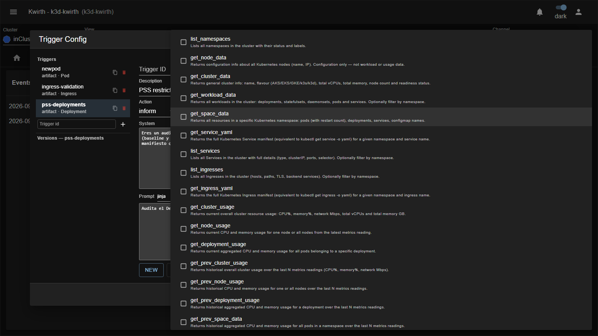

# Tools y pasos del agente

Las **tools** son lo que separa a Pinocchio de un chat al que le pegas un YAML. Son funciones reales,
ejecutadas dentro del clúster, que el modelo puede invocar por su cuenta mientras razona. Esta página
explica el catálogo, cómo se controla el gasto y —lo más importante— **por qué `Auto` es peligroso**.

## Cómo funciona la ejecución con tools

Cuando un trigger se dispara, el backend construye una llamada al modelo con:

- el `system` y el `prompt`,
- el subconjunto de tools que la versión declara,
- un tope de pasos: `stopWhen(stepCountIs(steps))`.

El modelo decide si necesita datos. Si los necesita, llama a una tool; el backend la ejecuta, le devuelve el
resultado, y eso cuenta como **un paso**. El ciclo se repite hasta que el modelo responde o se agotan los
pasos. Cada paso es una llamada de pago, con todo el contexto acumulado en la entrada.

> Si `steps` es 0 o está vacío, el backend **no usa 0**: usa **15**. Es el error de configuración más caro
> que se puede cometer en este plugin.

Todas las llamadas y respuestas de tools se registran como trazas en el log del backend
(`[pinocchio] tool <nombre> ...`), así que se puede auditar qué consultó el modelo.

## El catálogo

El catálogo lo aporta `kwirth-common-ai` y es el mismo para todos los plugins de IA de kwirth. El canal se lo
envía al front al arrancar, así que el selector siempre muestra lo que el backend soporta de verdad.



### Lectura — inventario y configuración

| Tool | Para qué |
|------|----------|
| `list_namespaces` | Namespaces con estado y etiquetas. |
| `get_cluster_data` | Nombre, sabor (AKS/EKS/GKE/k3s/k3d), vCPUs, memoria, nodos. |
| `get_node_data` | Configuración de los nodos (nombre, IP). |
| `get_workload_data` | Todos los workloads del clúster; filtrable por namespace. |
| `get_space_data` | Todo lo que hay en un namespace. |
| `list_services` / `get_service_yaml` | Services del clúster / manifiesto completo de uno. |
| `list_ingresses` / `get_ingress_yaml` | Ingresses / manifiesto completo de uno. |
| `get_pod_yaml` / `get_deployment_yaml` | Manifiesto completo de un Pod o Deployment. |

### Lectura — diagnóstico

| Tool | Para qué |
|------|----------|
| `describe_pod` | Equivalente a `kubectl describe pod`: motivo de espera/terminación, exitCode (OOMKilled, CrashLoop…), reinicios, probes. |
| `get_pod_logs` | Logs del contenedor. Con `previous:true`, los de la instancia que petó — la causa raíz de un CrashLoopBackOff. |
| `get_cluster_events` / `get_object_events` | Eventos de Kubernetes del clúster o de un objeto concreto. |
| `get_rollout_history` | Revisiones de un Deployment: qué imagen y qué env tenía cada una. Para ver **qué cambió** justo antes de romperse. |
| `get_configmap` / `get_secret` | Datos de un ConfigMap / claves de un Secret (**valores redactados**). Un cambio de valor no genera revisión de rollout: por eso hay que mirarlos aparte. |
| `get_workload_config_refs` | Qué ConfigMaps y Secrets consume un Deployment, con su fecha de última modificación. |
| `get_source_file` | Trae un fichero de un repo Git (GitHub/GitLab) en una ref, para seguir un stack trace hasta el fichero:línea culpable. |
| `get_certificate_info` | Detalles del certificado TLS de un host: emisor, validez, SANs, huella. |

### Lectura — uso de recursos

`get_cluster_usage`, `get_node_usage`, `get_deployment_usage` y sus versiones históricas
`get_prev_cluster_usage`, `get_prev_node_usage`, `get_prev_deployment_usage`, `get_prev_space_data`.

Estas tools se alimentan del **buffer de métricas** del canal: las últimas 100 lecturas del provider
`metrics`. Si acabas de abrir el canal, el histórico estará casi vacío.

### Escritura — ⚠️ modifican el clúster

| Tool | Qué hace |
|------|----------|
| `add_replica` / `remove_replica` | Escala un Deployment arriba o abajo (mínimo 1 réplica). |
| `restart_deployment` | Rollout-restart de un Deployment. |
| `delete_pod` | Borra un pod; su controlador lo recrea. |
| `add_node` / `remove_node` | Añade o quita un nodo del clúster (en k3d, vía `k3d node create/delete`). |
| `start_node` / `stop_node` | Arranca o para un nodo. |

### De prueba

`times_two` y `father_of` son tools de juguete para verificar que la cadena de tool-calling funciona. No las
pongas en un trigger real.

## El interruptor `Auto`: léelo antes de usarlo

El selector de tools tiene un interruptor **Auto**. Lo que hace **depende de dónde estés**, y la diferencia
es importante:

**En un trigger real** — `Auto` entrega al modelo el **catálogo completo, sin filtrar**. Sin selección previa
y, sobre todo, **sin quitar las tools de escritura**.

> ⚠️ **Un trigger con `Auto` activado puede escalar, reiniciar, borrar pods y quitar nodos.** El plugin no
> aplica ningún filtro de sólo-lectura. Si el modelo decide que la forma de arreglar lo que ve es reiniciar
> el Deployment, tiene la herramienta para hacerlo.
>
> **Recomendación: no uses `Auto` en triggers.** Marca a mano las tools de lectura que el análisis necesite.
> Es más trabajo una vez y te ahorra una sorpresa en producción.

**En el Playground** — `Auto` hace una **llamada previa** al modelo pidiéndole que elija qué tools necesita, y
sólo le pasa esas. Es más barato en tokens de contexto pero más caro en llamadas, y te muestra la elección
como `[Auto tools] selected: ...`. Sigue sin filtrar las de escritura.

## El coste, con números

El gasto de un trigger es, aproximadamente:

```
coste ≈ (nº de disparos) × (nº de pasos) × (tokens de contexto acumulados)
```

Los tres factores se multiplican, y el primero es el que se dispara sin que te des cuenta:

| Trigger | Disparos al día en un clúster mediano |
|---------|----------------------------------------|
| `Deployment` + `ADDED` | decenas |
| `Deployment` + `MODIFIED` | cientos |
| `Pod` + `ADDED` | cientos |
| `Pod` + `MODIFIED` | **miles** — cada cambio de estado, cada probe, cada reinicio |
| `Pod` + *Any* | lo anterior, por tres |

Reglas prácticas:

1. **Empieza siempre por `ADDED`**, nunca por *Any*. Analiza lo que nace, no lo que respira.
2. **Evita `Pod`.** Analiza el `Deployment`, que es donde está la decisión de diseño; los pods sólo la
   ejecutan, y hay muchos más.
3. **`steps` bajo para empezar** (3–5). Súbelo sólo si el campo `not_visible` de los análisis te dice que al
   modelo le faltó información.
4. **Mira los tokens** en la línea de cabecera de cada análisis (`IN:`/`OUT:`). Es la medida real, no una
   estimación.
5. **Prueba en el Playground.** Un prompt mal calibrado que hace 15 llamadas a tools se detecta gratis ahí,
   no en producción.

Los campos `Input / Output cost per M tokens` del diálogo de LLM existen justo para que puedas traducir esos
tokens a dinero.
