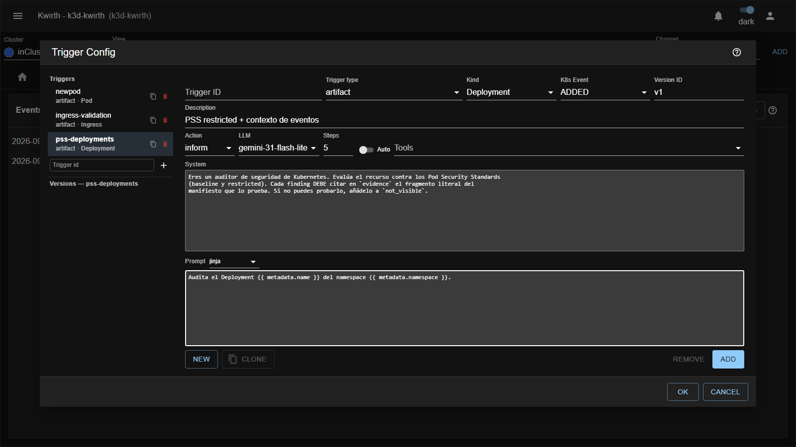

# Pinocchio — análisis agéntico de tu clúster

**Pinocchio** es un plugin de kwirth que pone un **LLM a mirar lo que pasa en tu clúster**. No es un chat:
es un canal que **escucha eventos** —altas y cambios de recursos de Kubernetes, o eventos de negocio que le
manda un sistema externo— y, cuando uno encaja con un **trigger** que tú has definido, invoca al modelo con
tu prompt y tus *tools*, y devuelve **findings** estructurados y un **informe**.

La diferencia con "pegar un YAML en un chat" es que Pinocchio **vive dentro del clúster**: el modelo puede
llamar a herramientas que consultan namespaces, workloads, métricas, logs, eventos, ConfigMaps o el
histórico de rollouts. Analiza el recurso *y su contexto real*, no un fragmento fuera de sitio.

## Qué encontrarás en esta guía

**Guía de usuario** — entender, configurar y explotar el canal:

- [Introducción y modelo mental](user/01-introduction.md) · [Cómo funciona](user/00-how-it-works.md)
- [Triggers, versiones y prompts](user/03-concepts.md)
- [Recorrido por la UI](user/02-ui-tour.md) · [Configurar triggers](user/04-triggers.md)
- [Leer los findings](user/05-findings.md) · [El Playground](user/06-playground.md)
- [Import / Export de triggers](user/07-import-export.md)

**Guía de administrador** — instalar, conectar el LLM y gobernar el acceso:

- [Instalación](admin/01-setup.md) · [Providers y modelos de IA](admin/02-ai-config.md)
- [Tools y pasos del agente](admin/03-tools.md) · [Plantillas de prompt](admin/04-prompts.md)
- [Permisos y acceso](admin/05-rbac.md) · [Límites conocidos](admin/06-limits.md)

## Empieza aquí

1. Lee [Cómo funciona](user/00-how-it-works.md) para tener el bucle completo en la cabeza: evento → trigger →
   prompt → modelo (+ tools) → findings.
2. Pide a tu administrador que configure un **provider** y un **LLM** ([Providers y modelos](admin/02-ai-config.md)).
   Sin eso el menú *Config* no te deja crear triggers.
3. Abre el **Playground** ([El Playground](user/06-playground.md)) y afina un prompt contra un artefacto de
   ejemplo, **sin tocar producción**.
4. Cuando funcione, expórtalo a un trigger real desde el propio Playground y actívalo.

> ⚠️ Pinocchio **gasta tokens de tu proveedor de IA**. Un trigger sobre `Pod`/`MODIFIED` en un clúster vivo
> puede dispararse cientos de veces al día. Lee [Tools y pasos del agente](admin/03-tools.md) antes de
> activar nada en un entorno grande.
