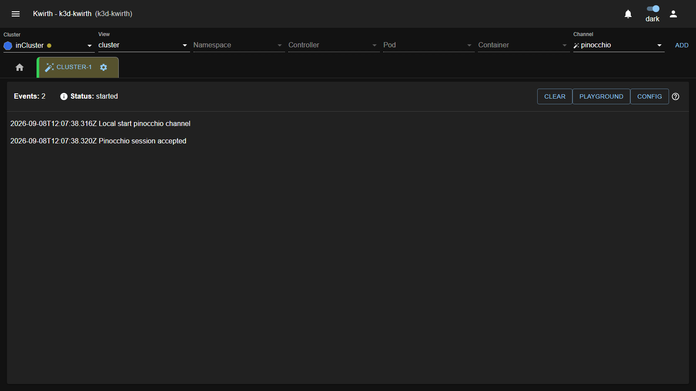
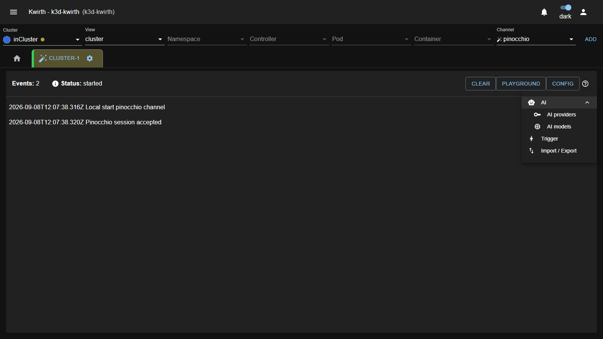
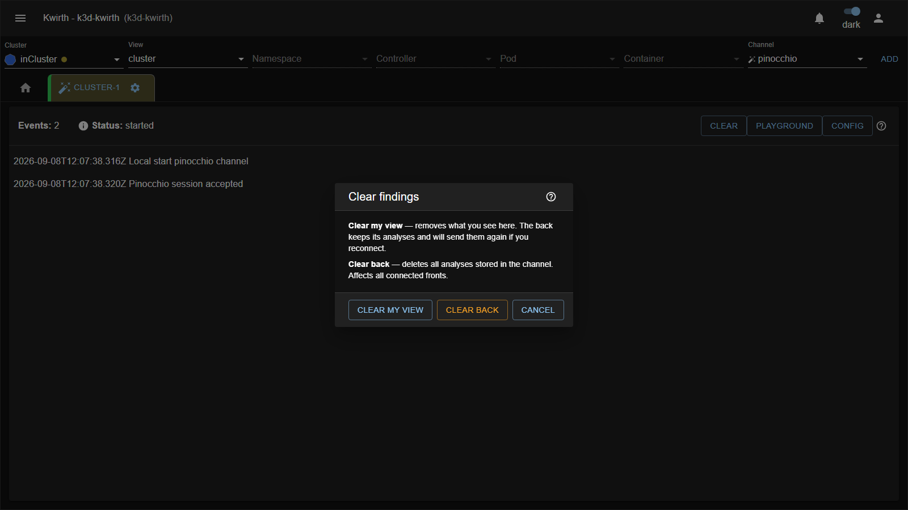

# Recorrido por la UI

Pinocchio es un canal, así que se abre como cualquier otro canal de kwirth: eliges el canal **Pinocchio** en
el selector y lo arrancas. No tiene diálogo de *Setup* — no hay nada que configurar antes de arrancar.

## La pestaña

La pestaña es una única tarjeta con una cabecera y un flujo de mensajes que crece hacia abajo.

**Cabecera**

| Elemento     | Qué es                                                                       |
|--------------|-------------------------------------------------------------------------------|
| `Events: N`  | Número de entradas en el flujo (análisis + mensajes). No es el número de findings. |
| `Status`     | `started`, `paused` o `stopped`, según el estado del canal.                    |
| **Clear**    | Abre el diálogo de limpieza (ver abajo).                                       |
| **Playground** | Abre el banco de pruebas. Ver [El Playground](06-playground.md).             |
| **Config**   | Abre el menú de configuración.                                                 |

**Flujo**

El cuerpo hace autoscroll al final mientras estés abajo del todo; si subes a leer algo, deja de seguirte
hasta que vuelvas al final. Cada análisis se pinta como:

1. Una línea de cabecera con la marca de tiempo, el evento (`ADDED Deployment 'nginx' in namespace 'demo'`),
   el LLM usado y los tokens consumidos, más un botón **Report**.
2. Los **findings**, ordenados de `critical` a `low`, cada uno con su etiqueta de severidad.
3. Una **tira de resumen** con PSS, el recuento por severidad y el riesgo global.

Los findings y la tira de resumen son **clicables** y abren su diálogo de detalle.

## El menú Config

El botón **Config** abre un menú de tres entradas, la primera de ellas un grupo desplegable. El orden no es
casual: cada una depende de la anterior.

| Entrada           | Se habilita cuando…                    | Qué configura                                   |
|-------------------|----------------------------------------|--------------------------------------------------|
| **AI** ▸ **AI providers** | siempre                        | Proveedores de IA (OpenAI, Google, …) y su API key |
| **AI** ▸ **AI models**    | hay al menos un provider       | Modelos concretos, con temperatura y coste        |
| **Trigger**       | hay al menos un LLM                    | Los triggers y sus versiones                      |
| **Import / Export** | siempre                              | Volcado y carga de triggers en JSON                |

**AI** es un grupo plegable —el patrón habitual de kwirth, el mismo que usan Excubitor y Agora— y **arranca
plegado**: hay que clicarlo para ver *AI providers* y *AI models*. Es lo que menos se toca una vez montado,
por eso está recogido.

Si abres Pinocchio por primera vez y **Trigger** está en gris, no es un fallo: es que aún no hay un LLM
configurado. Empieza por **AI ▸ AI providers**. El detalle está en
[Providers y modelos de IA](../admin/02-ai-config.md).

> Los diálogos de **AI providers** y **AI models** no son de Pinocchio: son los diálogos comunes de IA de
> kwirth (`AiConfigProvider` / `AiConfigLlm`), los mismos que usan los demás plugins con IA. Lo que configures
> aquí lo verán también ellos.

## Los diálogos de detalle

**Detalle de un finding** (clic en cualquier finding) — muestra, en dos columnas, todo lo que el modelo
rellenó: Control ID, categoría, confianza, *risk score*, descripción, evidencia e impacto a la izquierda;
remediación y referencias a la derecha. Los campos vacíos no se pintan.

**Detalle del análisis** (clic en la tira de resumen) — el recurso analizado (kind, nombre, namespace,
imágenes), PSS actual y objetivo, riesgo global y recuento por severidad a la izquierda; controles superados,
lo que el modelo **no pudo ver** y los próximos pasos a la derecha.

**Report** (botón *Report* de la cabecera del análisis) — abre el informe en markdown renderizado. El botón
está deshabilitado si ese análisis no trajo informe.

## El diálogo Clear

Hay dos limpiezas distintas y conviene no confundirlas, porque una es local y la otra afecta a todo el mundo:

- **Clear my view** — vacía **tu** pantalla. El backend conserva sus análisis y te los reenviará si
  reconectas.
- **Clear back** — borra los análisis guardados **en el canal**. Afecta a todos los fronts conectados y no
  tiene vuelta atrás.

## Colores de severidad

Los mismos en toda la UI:

| Nivel      | Color    |
|------------|----------|
| `critical` | rojo     |
| `high`     | naranja  |
| `medium`   | verde    |
| `low`      | gris     |

> ⚠️ Sí: `medium` se pinta en **verde**. Es el comportamiento actual del plugin y sorprende la primera vez.
> Guíate por el texto de la etiqueta, no por el color.
