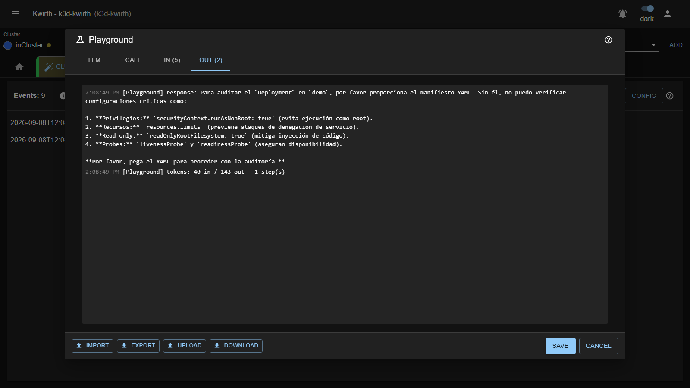

# Triggers, versiones y prompts

Toda la configuración de Pinocchio se reduce a una lista de **triggers**. Esta página explica el modelo de
datos y, sobre todo, **qué hace realmente el backend con cada campo**, que no siempre es lo que el nombre
sugiere.

## Trigger

Un trigger define **cuándo** se dispara el análisis:

| Campo       | Aplica a    | Qué hace                                                                       |
|-------------|-------------|--------------------------------------------------------------------------------|
| `id`        | ambos       | Identificador libre. Es lo que ves en la lista y lo que se usa al importar/exportar. |
| `trigger`   | ambos       | `artifact` (objeto de Kubernetes) o `business` (JSON externo).                   |
| `kind`      | `artifact`  | El kind de Kubernetes a vigilar. Debe coincidir **exactamente** con `obj.kind`.  |
| `k8sEvent`  | `artifact`  | `ADDED`, `MODIFIED`, `DELETED` — o vacío (*Any*) para no filtrar por evento.     |
| `versions`  | ambos       | Lista de versiones. Ver abajo.                                                  |

El matching de un evento de Kubernetes es literal:

```
trigger.trigger === 'artifact'
  && trigger.kind === evento.obj.kind
  && (!trigger.k8sEvent || trigger.k8sEvent === evento.type)
```

Los triggers de tipo `business` **no filtran por espacio ni por tipo en el matching**: cualquier evento de
negocio que llegue al canal dispara **todos** los triggers `business` que tengan una versión activa. El campo
*Spaces* de la versión no se usa para filtrar (ver más abajo).

## Versión

Una versión es **el contenido del análisis**: qué se le pregunta al modelo y con qué medios.

| Campo         | Qué hace                                                                                    |
|---------------|---------------------------------------------------------------------------------------------|
| `id`          | Identificador dentro del trigger. Único por trigger.                                          |
| `description` | Texto libre; se ve bajo el id en la lista de versiones.                                       |
| `enabled`     | Si está activa. **Sólo una versión por trigger puede estar activa a la vez.**                 |
| `llm`         | El id del LLM configurado que se va a usar.                                                   |
| `system`      | El *system prompt*. ⚠️ **Se ignora en los triggers `business`** (ver abajo).                  |
| `promptType`  | `jinja` o `artifact`. Determina cómo se construye el prompt.                                  |
| `prompt`      | La plantilla del prompt. Deshabilitada cuando `promptType` es `artifact`.                     |
| `steps`       | Máximo de pasos del agente. Si es 0 o vacío, el backend usa **15**.                            |
| `tools`       | Lista de tools que el modelo puede llamar.                                                     |
| `autoTools`   | Si está marcado, se le entrega **todo el catálogo** de tools.                                  |
| `spaces`      | Lista `space.type`. Hoy **no filtra nada**; ver [Límites](../admin/06-limits.md).              |
| `action`      | `inform` / `cancel` / `repair`. **Hoy el backend no lo lee**: todo se comporta como `inform`.  |

### Por qué "versiones" y no simplemente "triggers"

Porque afinar un prompt es un proceso iterativo y **quieres conservar el que funcionaba**. El patrón previsto
es: clonas la versión activa, retocas el prompt en la copia, la activas (lo que desactiva la anterior
automáticamente) y comparas resultados. Si empeora, reactivas la vieja con un clic del interruptor.

Al clonar una versión, la copia nace **desactivada** a propósito, para que no te cambie el comportamiento sin
querer.

## Cómo se construye el prompt

Este es el punto donde más gente se equivoca. Depende de la combinación tipo de trigger × `promptType`:

### `artifact` + `promptType: jinja`

El `prompt` se renderiza con **nunjucks** usando el objeto de Kubernetes como contexto:

```
prompt = nunjucks.renderString(version.prompt, evento.obj)
```

Es decir, las variables disponibles son los campos del propio objeto:

```jinja
Audita este {{ kind }} llamado {{ metadata.name }} del namespace {{ metadata.namespace }}.

Imágenes:
- {{ c.image }}

```

El `system` **sí se usa**. Si está vacío, el backend cae a `'You are a very polite AI system'`.

> ⚠️ **El objeto es el contexto de la plantilla, no un adjunto.** El modelo recibe **únicamente el texto
> renderizado**: lo que tu plantilla no interpole, el modelo no lo ve. Un prompt como
> `Audita el Deployment {{ metadata.name }} del namespace {{ metadata.namespace }}.` le llega al modelo como
> `Audita el Deployment api-gateway del namespace demo.` — sin manifiesto, sin imágenes, sin
> `securityContext`. Y el modelo contesta lo único que puede contestar:
>
> 
>
> Si quieres que audite el recurso, **mete el recurso en la plantilla** (`{{ spec | dump(2) }}`) o usa
> `promptType: artifact`, que le pasa el objeto entero.

### `artifact` + `promptType: artifact`

El prompt es, literalmente, **el objeto entero serializado**:

```
prompt = JSON.stringify(evento.obj)
```

El campo `prompt` se ignora por completo (y la UI lo deshabilita). Toda la instrucción tiene que estar en el
`system`. Es la opción cómoda cuando el system ya dice "eres un auditor de PSS, analiza el manifiesto que te
paso".

### `business` (cualquier `promptType`)

```
prompt = nunjucks.renderString(version.prompt, {})
```

⚠️ Dos cosas importantes, ambas comprobables en el código del backend:

1. **El contexto de renderizado está vacío.** Aunque pongas espacios en el campo *Spaces*, los datos del
   evento **no se pasan a la plantilla**. Cualquier `{{ variable }}` que escribas se renderiza como cadena
   vacía. En la práctica, un prompt `business` es texto fijo.
2. **El `system` de la versión se ignora.** El backend usa un system fijo:
   *"Use the tools provided to find information, and once you have the data, format your final response
   strictly as a JSON object according to the schema."*

Por eso un trigger `business` sólo tiene sentido si su valor está en las **tools**: el prompt fijo plantea la
pregunta ("¿está el clúster saturado?") y el modelo la resuelve consultando el clúster.

Ambos comportamientos están recogidos en [Límites conocidos](../admin/06-limits.md).

## Qué devuelve cada tipo

| Tipo       | Esquema de salida                                                                                     |
|------------|--------------------------------------------------------------------------------------------------------|
| `artifact` | Objeto completo: `resource`, `pss_current`, `pss_target`, `score_summary`, `global_risk`, `controls_passed`, `not_visible`, `next_steps`, `report`, `findings[]`, `hardened_yaml`. |
| `business` | Sólo `{ response: string }`, que se muestra como un mensaje de texto en la pestaña.                     |

El detalle de cada campo está en [Leer los findings](05-findings.md).

## Un trigger de ejemplo, entero

```json
{
  "id": "pss-deployments",
  "trigger": "artifact",
  "kind": "Deployment",
  "k8sEvent": "ADDED",
  "versions": [
    {
      "id": "v2",
      "description": "PSS restricted + contexto de eventos",
      "enabled": true,
      "llm": "gemini-flash",
      "promptType": "jinja",
      "system": "Eres un auditor de seguridad de Kubernetes. Evalúa contra los Pod Security Standards y devuelve findings accionables.",
      "prompt": "Audita el Deployment {{ metadata.name }} en {{ metadata.namespace }}.\n\nManifiesto:\n{{ spec | dump(2) }}",
      "action": "inform",
      "steps": 8,
      "tools": ["get_deployment_yaml", "get_object_events", "get_workload_config_refs"],
      "autoTools": false,
      "spaces": []
    }
  ]
}
```
