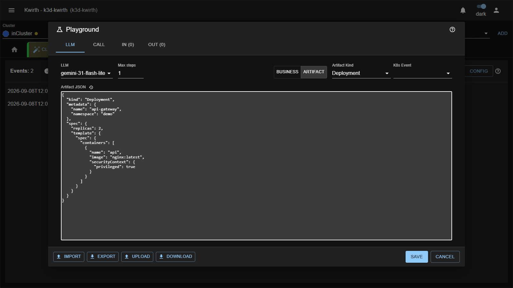
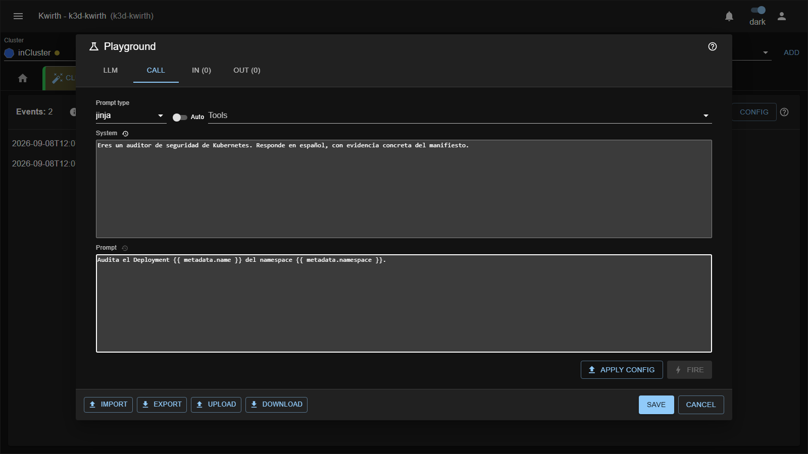
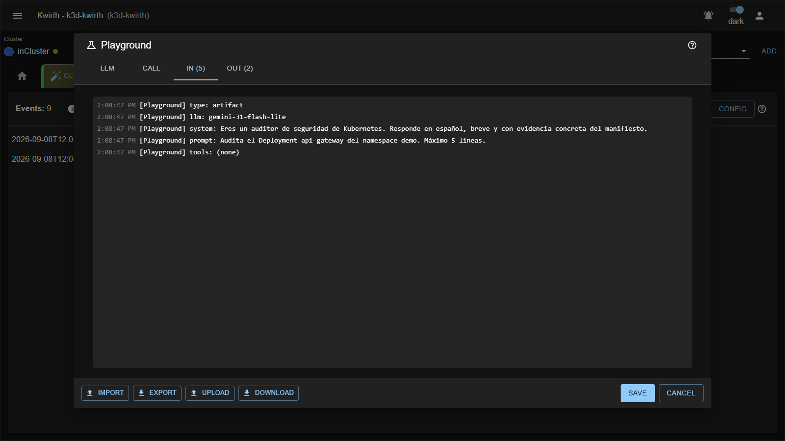

# El Playground

El Playground es el banco de pruebas: te deja **ejecutar la tubería completa** —prompt, modelo, tools— contra
un payload que pegas a mano, sin crear ningún trigger y sin tocar el clúster. Es donde se afinan los prompts.

Se abre con el botón **Playground** de la cabecera de la pestaña.

## El ciclo de trabajo

```
   Pestaña LLM          Pestaña Call             Pestaña IN / OUT
   -----------          ------------             ----------------
   elige modelo   -->   escribe system    -->    Apply Config  -->  Fire  -->  mira la traza
   pega el payload      y prompt, tools           (sube al back)     (inyecta
                                                                     el evento)
```

Dos botones, en este orden obligatorio:

1. **Apply Config** — sube al backend el modelo, los pasos, las tools, el system y el prompt. Mientras no lo
   pulses, **Fire** está deshabilitado. El botón se pone verde y dice *Config applied*.
2. **Fire** — inyecta el evento. Cualquier cambio en el modelo, los pasos, las tools, el system o el prompt
   **vuelve a marcar la config como sucia** y tendrás que aplicarla otra vez.

## Pestaña LLM — el evento de entrada

| Campo         | Qué es                                                                |
|---------------|-----------------------------------------------------------------------|
| `LLM`         | Uno de los LLMs configurados.                                          |
| `Max steps`   | Tope de pasos del agente para esta prueba.                             |
| Business / Artifact | El tipo de evento que vas a simular.                             |
| `Artifact Kind` | Sólo en modo Artifact. Se inyecta como `kind` si el payload no lo trae. |
| `K8s Event`   | Sólo en modo Artifact. ⚠️ Ver la advertencia de más abajo.              |
| `Space` / `Type` | Sólo en modo Business. ⚠️ Ver la advertencia de más abajo.           |
| El textarea grande | El payload: el JSON del artefacto, o el evento de negocio.        |



El iconito de reloj junto a las cajas abre el **historial**: los últimos 25 valores que has usado en ese
campo, con una papelera para borrar los que sobren. Se guardan al pulsar **Save** y sobreviven al cierre del
diálogo.

## Pestaña Call — la llamada

`Prompt type`, el selector de tools, y los dos textareas de `System` y `Prompt`, con sus historiales. Es el
mismo juego de campos que el editor de triggers, más los dos botones **Apply Config** y **Fire**.



## Pestañas IN y OUT

El Playground **no reutiliza el flujo de la pestaña principal**: cuenta sólo los mensajes producidos desde
que lo abriste, y los reparte en dos vistas.

- **IN** — la traza de entrada: qué recibió el backend y qué le mandó al modelo. Verás
  `[Playground] type/llm/system/prompt/tools`, cada `[Tool call]` con sus argumentos y cada `[Tool result]`
  con lo que devolvió. Es la vista que usas para entender **por qué** el modelo contestó lo que contestó.

  

  Fíjate en la línea `prompt:`: es la plantilla **ya renderizada**. Ahí se ve que `{{ metadata.name }}` se
  convirtió en `api-gateway`… y también que el manifiesto **no** viaja con ella. Es la comprobación más
  rápida de que tu plantilla dice lo que crees que dice.

- **OUT** — la respuesta: `[Playground] response` y el recuento de tokens y pasos.

  

Al cerrar el diálogo, estos mensajes **se retiran del flujo principal**: no ensucian la pestaña.

## Advertencias importantes

El Playground no ejecuta exactamente el mismo camino que un trigger real. Estas cuatro diferencias son las
que más tiempo hacen perder:

### 1. En modo Business, el payload ES el prompt

En modo Business el backend **descarta el `Prompt` de la pestaña Call** y usa el contenido del textarea de
evento como prompt, renderizado con jinja sobre un contexto vacío. Si estás probando un trigger de negocio,
escribe la pregunta en el textarea del evento, no en el campo Prompt.

### 2. En modo Business, cambiar Space/Type rompe la prueba

El backend sólo redirige un evento al Playground si llega con **`space: launch` y `type: immediate`** —los
valores por defecto—. Si los cambias, el evento deja de ir al Playground y pasa a evaluarse contra tus
triggers de negocio **reales**. Y si además el par que has escrito no es uno de los tres a los que el canal
está suscrito (`customers.status`, `branches.status`, `launch.immediate`), no llegará a ninguna parte y no
verás absolutamente nada.

En modo Artifact el problema no existe: el `Fire` usa `launch`/`immediate` sin preguntar.

### 3. El `Prompt type` que elijas no siempre manda

En modo Artifact, el backend decide el tipo de prompt **según tengas o no texto en el campo Prompt**: si hay
prompt lo trata como `jinja`, y si está vacío como `artifact`. El selector `Prompt type` de la pestaña Call
no se respeta en esta ruta. Para probar el modo `artifact` puro, **vacía el campo Prompt**.

### 4. El evento simulado siempre es `ADDED`

El objeto que inyectas se le entrega al modelo como un evento `ADDED`, sea cual sea el `K8s Event` que
selecciones. Ese selector se guarda con el estado del Playground, pero no cambia la simulación.

## Diferencias de motor con un trigger real

| | Trigger real | Playground |
|---|---|---|
| Salida | Estructurada (findings, PSS, informe) | **Texto libre** |
| `autoTools` | Entrega el catálogo entero al modelo | Hace una **llamada previa** al modelo para que elija las tools, y sólo le pasa esas |
| Si el modelo no responde texto | Es un error | Hace una **segunda llamada** resumiendo los resultados de las tools |

La primera diferencia es la que importa: en el Playground **nunca vas a ver un finding**. Sirve para validar
que el prompt lleva al modelo por el camino correcto y que las tools devuelven lo que esperas; el formato
estructurado sólo lo verás cuando lo exportes a un trigger y lo dispares de verdad.

La segunda explica por qué `autoTools` sale más caro en el Playground que en producción: hay una llamada
extra, cuya elección de tools se te muestra como `[Auto tools] selected: ...`.

## Llevarse el resultado

Los cuatro botones de abajo a la izquierda:

| Botón        | Qué hace                                                                          |
|--------------|------------------------------------------------------------------------------------|
| **Import**   | Carga en el Playground la configuración de **un trigger existente**, eligiendo trigger y versión. Sobrescribe lo que tengas. |
| **Export**   | Convierte el Playground en un trigger: **New trigger** (nuevo, con la versión `v1` activada) o **Add version** (añade una versión desactivada a un trigger existente). Cierra el diálogo. |
| **Upload**   | Carga la configuración desde un fichero JSON local.                                 |
| **Download** | Guarda la configuración actual en `pinocchio-playground-AAAA-MM-DD.json`.           |

Y a la derecha, **Save** (persiste el estado y los historiales) y **Cancel** (cierra sin guardar).

> ⚠️ **Export → New trigger no se lleva el Kind ni el K8s Event.** El trigger nuevo se crea con el tipo
> (`artifact` o `business`) y la versión, pero sin `kind` y sin `k8sEvent`, así que un trigger `artifact`
> recién exportado **no casará con ningún evento** hasta que lo abras en **Config → Trigger** y le pongas el
> kind a mano. Está recogido en [Límites conocidos](../admin/06-limits.md).
