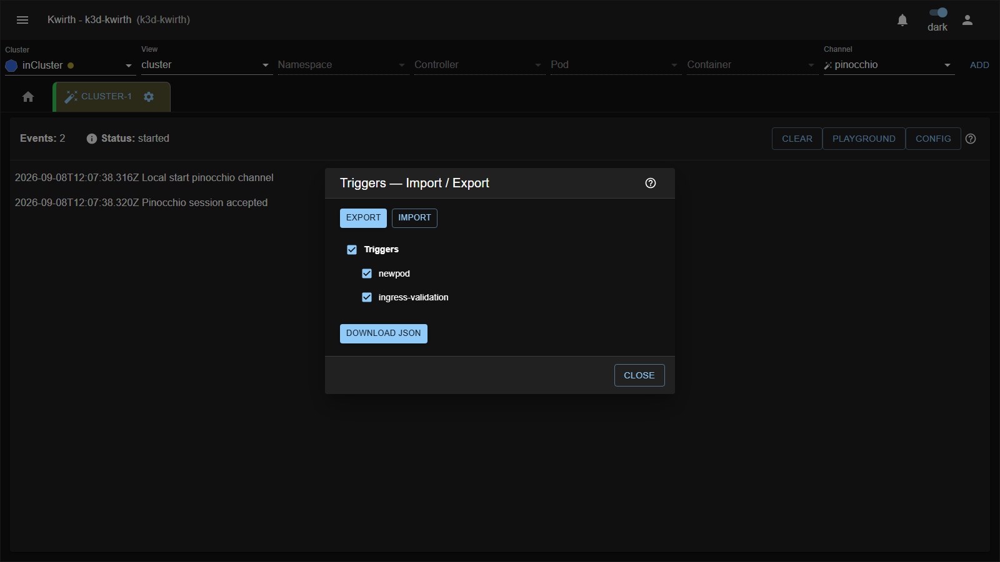

# Import / Export de triggers

**Config → Import / Export** abre un diálogo pequeño con dos modos. Sirve para mover triggers entre clústeres,
versionarlos en git, o repartir una configuración que funciona.

## Export

Lista todos tus triggers con una casilla cada uno, más una casilla maestra que marca y desmarca todo.
Selecciona los que quieras y pulsa **Download JSON**.



El fichero se llama `pinocchio-triggers-AAAA-MM-DD.json` y tiene esta forma:

```json
{
  "version": "1",
  "triggers": [
    {
      "id": "pss-deployments",
      "trigger": "artifact",
      "kind": "Deployment",
      "k8sEvent": "ADDED",
      "versions": [ ... ]
    }
  ]
}
```

**El export sólo lleva triggers.** No incluye providers, ni LLMs, ni el estado del Playground. Eso es
deliberado: los providers guardan **API keys**, y no tendría ningún sentido que salieran en un fichero que
vas a mandar por correo o a subir a un repositorio.

## Import

Pulsa **Upload JSON…**, elige el fichero y el diálogo te lista los triggers que contiene, con la misma
mecánica de casillas. Los que **ya existan** con ese id aparecen marcados con la etiqueta
*(overwrites existing)* en naranja.

Al pulsar **Import selected**, cada trigger seleccionado:

- **se sustituye entero** si ya existe uno con ese id — versiones incluidas, no se fusiona nada;
- **se añade** al final si no existe.

Los triggers que no hayas seleccionado se quedan exactamente como estaban.

El import **guarda directamente**: a diferencia del editor de triggers, aquí no hay un OK final que
confirme. En cuanto pulsas *Import selected*, la configuración viaja al backend.

## Qué pasa con las referencias a LLMs

Cada versión guarda el **id del LLM** que usa, no el modelo ni la clave. Si importas un trigger en otro
clúster donde ese id no existe, el trigger se instala sin problema pero **fallará al dispararse**, con un
mensaje de error visible en la pestaña:

```
Cannot find LLM with id 'gemini-flash'
```

Antes de importar en un clúster nuevo, asegúrate de que los ids de LLM coinciden: o creas allí un LLM con el
mismo id, o editas el campo `llm` de las versiones en el JSON antes de subirlo. Ver
[Providers y modelos de IA](../admin/02-ai-config.md).

## Compatibilidad de versiones

El campo `version` del fichero es `"1"`. Si intentas cargar un fichero con otro valor, o que no sea JSON
válido, el diálogo responde **"Invalid or unsupported file"** y no toca nada.

## No confundir con el Import/Export del Playground

Son cuatro cosas distintas y con el mismo nombre. El resumen:

| Dónde       | Botón     | Qué mueve                                                        |
|-------------|-----------|-------------------------------------------------------------------|
| Config      | Export    | Triggers completos → fichero JSON                                  |
| Config      | Import    | Fichero JSON → triggers completos                                  |
| Playground  | Import    | Un trigger existente → el Playground                               |
| Playground  | Export    | El Playground → un trigger nuevo o una versión nueva               |
| Playground  | Download  | La config del Playground → fichero JSON                            |
| Playground  | Upload    | Fichero JSON → la config del Playground                            |

Los ficheros de los dos sitios **no son intercambiables**: el de Config es una lista de triggers, el del
Playground es una configuración suelta.
